---
redirect_from:
  - "/14-pandas/edm-us-adult-census-income/solution"
interact_link: content/14_pandas/edm_us_adult_census_income/solution.ipynb
kernel_name: python3
has_widgets: false
title: 'Solution'
prev_page:
  url: /14_pandas/edm_us_adult_census_income/questions.html
  title: 'Questions'
next_page:
  url: 
  title: ''
comment: "***PROGRAMMATICALLY GENERATED, DO NOT EDIT. SEE ORIGINAL FILES IN /content***"
---
<a href="https://colab.research.google.com/github/aviadr1/learn-advanced-python/blob/master/content/14_pandas/edm_us_adult_census_income/solution.ipynb" target="_blank">

</a>


# income for adults from the 1994 census
This dataset was extracted  done by Barry Becker from the 1994 Census database. 
source: http://mlr.cs.umass.edu/ml/datasets/Adult

Listing of attributes:

* age: continuous.
* workclass: Private, Self-emp-not-inc, Self-emp-inc, Federal-gov, Local-gov, State-gov, Without-pay, Never-worked.
* fnlwgt: continuous.
* education: Bachelors, Some-college, 11th, HS-grad, Prof-school, Assoc-acdm, Assoc-voc, 9th, 7th-8th, 12th, Masters, 1st-4th, 10th, Doctorate, 5th-6th, Preschool.
* education-num: continuous.
* marital-status: Married-civ-spouse, Divorced, Never-married, Separated, Widowed, Married-spouse-absent, Married-AF-spouse.
* occupation: Tech-support, Craft-repair, Other-service, Sales, Exec-managerial, Prof-specialty, Handlers-cleaners, Machine-op-inspct, Adm-clerical, Farming-fishing, Transport-moving, Priv-house-serv, Protective-serv, Armed-Forces.
* relationship: Wife, Own-child, Husband, Not-in-family, Other-relative, Unmarried.
* race: White, Asian-Pac-Islander, Amer-Indian-Eskimo, Other, Black.
* sex: Female, Male.
* capital-gain: continuous.
* capital-loss: continuous.
* hours-per-week: continuous.
* native-country: United-States, Cambodia, England, Puerto-Rico, Canada, Germany, Outlying-US(Guam-USVI-etc), India, Japan, Greece, South, China, Cuba, Iran, Honduras, Philippines, Italy, Poland, Jamaica, Vietnam, Mexico, Portugal, Ireland, France, Dominican-Republic, Laos, Ecuador, Taiwan, Haiti, Columbia, Hungary, Guatemala, Nicaragua, Scotland, Thailand, Yugoslavia, El-Salvador, Trinadad&Tobago, Peru, Hong, Holand-Netherlands.
* income: >50K, <=50K.


<div markdown="1" class="cell code_cell">
<div class="input_area" markdown="1">
```python
import pandas as pd
from IPython.display import display
import matplotlib.pyplot as plt
import seaborn as sns
import numpy as np
%matplotlib inline
sns.set()

```
</div>

</div>


## 1. load the data
1. extract the column names from the description and read the csv while supplying the columns names
   - rename columns with a hyphen `-` to use underscores `_` insead. example: `capital-gain --> capital_gain`


<div markdown="1" class="cell code_cell">
<div class="input_area" markdown="1">
```python
description = """\
age: continuous.
workclass: Private, Self-emp-not-inc, Self-emp-inc, Federal-gov, Local-gov, State-gov, Without-pay, Never-worked.
fnlwgt: continuous.
education: Bachelors, Some-college, 11th, HS-grad, Prof-school, Assoc-acdm, Assoc-voc, 9th, 7th-8th, 12th, Masters, 1st-4th, 10th, Doctorate, 5th-6th, Preschool.
education-num: continuous.
marital-status: Married-civ-spouse, Divorced, Never-married, Separated, Widowed, Married-spouse-absent, Married-AF-spouse.
occupation: Tech-support, Craft-repair, Other-service, Sales, Exec-managerial, Prof-specialty, Handlers-cleaners, Machine-op-inspct, Adm-clerical, Farming-fishing, Transport-moving, Priv-house-serv, Protective-serv, Armed-Forces.
relationship: Wife, Own-child, Husband, Not-in-family, Other-relative, Unmarried.
race: White, Asian-Pac-Islander, Amer-Indian-Eskimo, Other, Black.
sex: Female, Male.
capital-gain: continuous.
capital-loss: continuous.
hours-per-week: continuous.
native-country: United-States, Cambodia, England, Puerto-Rico, Canada, Germany, Outlying-US(Guam-USVI-etc), India, Japan, Greece, South, China, Cuba, Iran, Honduras, Philippines, Italy, Poland, Jamaica, Vietnam, Mexico, Portugal, Ireland, France, Dominican-Republic, Laos, Ecuador, Taiwan, Haiti, Columbia, Hungary, Guatemala, Nicaragua, Scotland, Thailand, Yugoslavia, El-Salvador, Trinadad&Tobago, Peru, Hong, Holand-Netherlands.
"""

columns = [line.split(':')[0] for line in description.splitlines()] + ['income']
columns = [column.replace('-', '_') for column in columns]
columns

```
</div>

<div class="output_wrapper" markdown="1">
<div class="output_subarea" markdown="1">


{:.output_data_text}
```
['age',
 'workclass',
 'fnlwgt',
 'education',
 'education_num',
 'marital_status',
 'occupation',
 'relationship',
 'race',
 'sex',
 'capital_gain',
 'capital_loss',
 'hours_per_week',
 'native_country',
 'income']
```


</div>
</div>
</div>


<div markdown="1" class="cell code_cell">
<div class="input_area" markdown="1">
```python
df = pd.read_csv('adult.data', names=columns)
df.head()

```
</div>

<div class="output_wrapper" markdown="1">
<div class="output_subarea" markdown="1">


<div markdown="0" class="output output_html">
<div>
<style scoped>
    .dataframe tbody tr th:only-of-type {
        vertical-align: middle;
    }

    .dataframe tbody tr th {
        vertical-align: top;
    }

    .dataframe thead th {
        text-align: right;
    }
</style>
<table border="1" class="dataframe">
  <thead>
    <tr style="text-align: right;">
      <th></th>
      <th>age</th>
      <th>workclass</th>
      <th>fnlwgt</th>
      <th>education</th>
      <th>education_num</th>
      <th>marital_status</th>
      <th>occupation</th>
      <th>relationship</th>
      <th>race</th>
      <th>sex</th>
      <th>capital_gain</th>
      <th>capital_loss</th>
      <th>hours_per_week</th>
      <th>native_country</th>
      <th>income</th>
    </tr>
  </thead>
  <tbody>
    <tr>
      <td>0</td>
      <td>39</td>
      <td>State-gov</td>
      <td>77516</td>
      <td>Bachelors</td>
      <td>13</td>
      <td>Never-married</td>
      <td>Adm-clerical</td>
      <td>Not-in-family</td>
      <td>White</td>
      <td>Male</td>
      <td>2174</td>
      <td>0</td>
      <td>40</td>
      <td>United-States</td>
      <td>&lt;=50K</td>
    </tr>
    <tr>
      <td>1</td>
      <td>50</td>
      <td>Self-emp-not-inc</td>
      <td>83311</td>
      <td>Bachelors</td>
      <td>13</td>
      <td>Married-civ-spouse</td>
      <td>Exec-managerial</td>
      <td>Husband</td>
      <td>White</td>
      <td>Male</td>
      <td>0</td>
      <td>0</td>
      <td>13</td>
      <td>United-States</td>
      <td>&lt;=50K</td>
    </tr>
    <tr>
      <td>2</td>
      <td>38</td>
      <td>Private</td>
      <td>215646</td>
      <td>HS-grad</td>
      <td>9</td>
      <td>Divorced</td>
      <td>Handlers-cleaners</td>
      <td>Not-in-family</td>
      <td>White</td>
      <td>Male</td>
      <td>0</td>
      <td>0</td>
      <td>40</td>
      <td>United-States</td>
      <td>&lt;=50K</td>
    </tr>
    <tr>
      <td>3</td>
      <td>53</td>
      <td>Private</td>
      <td>234721</td>
      <td>11th</td>
      <td>7</td>
      <td>Married-civ-spouse</td>
      <td>Handlers-cleaners</td>
      <td>Husband</td>
      <td>Black</td>
      <td>Male</td>
      <td>0</td>
      <td>0</td>
      <td>40</td>
      <td>United-States</td>
      <td>&lt;=50K</td>
    </tr>
    <tr>
      <td>4</td>
      <td>28</td>
      <td>Private</td>
      <td>338409</td>
      <td>Bachelors</td>
      <td>13</td>
      <td>Married-civ-spouse</td>
      <td>Prof-specialty</td>
      <td>Wife</td>
      <td>Black</td>
      <td>Female</td>
      <td>0</td>
      <td>0</td>
      <td>40</td>
      <td>Cuba</td>
      <td>&lt;=50K</td>
    </tr>
  </tbody>
</table>
</div>
</div>


</div>
</div>
</div>


### 2. look at the head, info, dtype, check for nan values


<div markdown="1" class="cell code_cell">
<div class="input_area" markdown="1">
```python
df.info()

```
</div>

<div class="output_wrapper" markdown="1">
<div class="output_subarea" markdown="1">
{:.output_stream}
```
<class 'pandas.core.frame.DataFrame'>
RangeIndex: 32561 entries, 0 to 32560
Data columns (total 15 columns):
age               32561 non-null int64
workclass         32561 non-null object
fnlwgt            32561 non-null int64
education         32561 non-null object
education_num     32561 non-null int64
marital_status    32561 non-null object
occupation        32561 non-null object
relationship      32561 non-null object
race              32561 non-null object
sex               32561 non-null object
capital_gain      32561 non-null int64
capital_loss      32561 non-null int64
hours_per_week    32561 non-null int64
native_country    32561 non-null object
income            32561 non-null object
dtypes: int64(6), object(9)
memory usage: 2.6+ MB
```
</div>
</div>
</div>


#### > answer:
> no null values. yippee!


## 3. what are the value counts of the categorical variables: workclass, education, marital_status, occupation, relationship, race, sex, native_country, income?
   - do you notice the extra space ' ' at the beginning of each value?
   - remove the extra space


<div markdown="1" class="cell code_cell">
<div class="input_area" markdown="1">
```python
for column in "workclass education marital_status occupation relationship race sex native_country income".split():
    print(column, ':')
    print(df[column].value_counts())
    print()

```
</div>

<div class="output_wrapper" markdown="1">
<div class="output_subarea" markdown="1">
{:.output_stream}
```
workclass :
 Private             22696
 Self-emp-not-inc     2541
 Local-gov            2093
 ?                    1836
 State-gov            1298
 Self-emp-inc         1116
 Federal-gov           960
 Without-pay            14
 Never-worked            7
Name: workclass, dtype: int64

education :
 HS-grad         10501
 Some-college     7291
 Bachelors        5355
 Masters          1723
 Assoc-voc        1382
 11th             1175
 Assoc-acdm       1067
 10th              933
 7th-8th           646
 Prof-school       576
 9th               514
 12th              433
 Doctorate         413
 5th-6th           333
 1st-4th           168
 Preschool          51
Name: education, dtype: int64

marital_status :
 Married-civ-spouse       14976
 Never-married            10683
 Divorced                  4443
 Separated                 1025
 Widowed                    993
 Married-spouse-absent      418
 Married-AF-spouse           23
Name: marital_status, dtype: int64

occupation :
 Prof-specialty       4140
 Craft-repair         4099
 Exec-managerial      4066
 Adm-clerical         3770
 Sales                3650
 Other-service        3295
 Machine-op-inspct    2002
 ?                    1843
 Transport-moving     1597
 Handlers-cleaners    1370
 Farming-fishing       994
 Tech-support          928
 Protective-serv       649
 Priv-house-serv       149
 Armed-Forces            9
Name: occupation, dtype: int64

relationship :
 Husband           13193
 Not-in-family      8305
 Own-child          5068
 Unmarried          3446
 Wife               1568
 Other-relative      981
Name: relationship, dtype: int64

race :
 White                 27816
 Black                  3124
 Asian-Pac-Islander     1039
 Amer-Indian-Eskimo      311
 Other                   271
Name: race, dtype: int64

sex :
 Male      21790
 Female    10771
Name: sex, dtype: int64

native_country :
 United-States                 29170
 Mexico                          643
 ?                               583
 Philippines                     198
 Germany                         137
 Canada                          121
 Puerto-Rico                     114
 El-Salvador                     106
 India                           100
 Cuba                             95
 England                          90
 Jamaica                          81
 South                            80
 China                            75
 Italy                            73
 Dominican-Republic               70
 Vietnam                          67
 Guatemala                        64
 Japan                            62
 Poland                           60
 Columbia                         59
 Taiwan                           51
 Haiti                            44
 Iran                             43
 Portugal                         37
 Nicaragua                        34
 Peru                             31
 France                           29
 Greece                           29
 Ecuador                          28
 Ireland                          24
 Hong                             20
 Trinadad&Tobago                  19
 Cambodia                         19
 Laos                             18
 Thailand                         18
 Yugoslavia                       16
 Outlying-US(Guam-USVI-etc)       14
 Honduras                         13
 Hungary                          13
 Scotland                         12
 Holand-Netherlands                1
Name: native_country, dtype: int64

income :
 <=50K    24720
 >50K      7841
Name: income, dtype: int64

```
</div>
</div>
</div>


<div markdown="1" class="cell code_cell">
<div class="input_area" markdown="1">
```python
for column in "workclass education marital_status occupation relationship race sex native_country income".split():
    print(column, ':')
    df[column] = df[column].str.strip()
    print(df[column].value_counts())
    print()

```
</div>

<div class="output_wrapper" markdown="1">
<div class="output_subarea" markdown="1">
{:.output_stream}
```
workclass :
Private             22696
Self-emp-not-inc     2541
Local-gov            2093
?                    1836
State-gov            1298
Self-emp-inc         1116
Federal-gov           960
Without-pay            14
Never-worked            7
Name: workclass, dtype: int64

education :
HS-grad         10501
Some-college     7291
Bachelors        5355
Masters          1723
Assoc-voc        1382
11th             1175
Assoc-acdm       1067
10th              933
7th-8th           646
Prof-school       576
9th               514
12th              433
Doctorate         413
5th-6th           333
1st-4th           168
Preschool          51
Name: education, dtype: int64

marital_status :
Married-civ-spouse       14976
Never-married            10683
Divorced                  4443
Separated                 1025
Widowed                    993
Married-spouse-absent      418
Married-AF-spouse           23
Name: marital_status, dtype: int64

occupation :
Prof-specialty       4140
Craft-repair         4099
Exec-managerial      4066
Adm-clerical         3770
Sales                3650
Other-service        3295
Machine-op-inspct    2002
?                    1843
Transport-moving     1597
Handlers-cleaners    1370
Farming-fishing       994
Tech-support          928
Protective-serv       649
Priv-house-serv       149
Armed-Forces            9
Name: occupation, dtype: int64

relationship :
Husband           13193
Not-in-family      8305
Own-child          5068
Unmarried          3446
Wife               1568
Other-relative      981
Name: relationship, dtype: int64

race :
White                 27816
Black                  3124
Asian-Pac-Islander     1039
Amer-Indian-Eskimo      311
Other                   271
Name: race, dtype: int64

sex :
Male      21790
Female    10771
Name: sex, dtype: int64

native_country :
United-States                 29170
Mexico                          643
?                               583
Philippines                     198
Germany                         137
Canada                          121
Puerto-Rico                     114
El-Salvador                     106
India                           100
Cuba                             95
England                          90
Jamaica                          81
South                            80
China                            75
Italy                            73
Dominican-Republic               70
Vietnam                          67
Guatemala                        64
Japan                            62
Poland                           60
Columbia                         59
Taiwan                           51
Haiti                            44
Iran                             43
Portugal                         37
Nicaragua                        34
Peru                             31
Greece                           29
France                           29
Ecuador                          28
Ireland                          24
Hong                             20
Trinadad&Tobago                  19
Cambodia                         19
Laos                             18
Thailand                         18
Yugoslavia                       16
Outlying-US(Guam-USVI-etc)       14
Honduras                         13
Hungary                          13
Scotland                         12
Holand-Netherlands                1
Name: native_country, dtype: int64

income :
<=50K    24720
>50K      7841
Name: income, dtype: int64

```
</div>
</div>
</div>


## 4. turn 'sex' and 'income' into 0/1 fields
   - replace the categorical 'sex' column with a numerical 'female' column with value 1 for females and 0 for males
   - replace the categorical 'income' column with a numerical 'over50k' column with value 1 for '>50k' and 0 for '<50K'


<div markdown="1" class="cell code_cell">
<div class="input_area" markdown="1">
```python
df.rename(columns={'sex': 'female', 'income' : 'over50k'}, inplace=True)
df.replace({'female' : {'Male' : 0, 'Female' : 1 }, 'over50k' : {'>50K' : 1, '<=50K' : 0}}, inplace=True)
df.head(10)

```
</div>

<div class="output_wrapper" markdown="1">
<div class="output_subarea" markdown="1">


<div markdown="0" class="output output_html">
<div>
<style scoped>
    .dataframe tbody tr th:only-of-type {
        vertical-align: middle;
    }

    .dataframe tbody tr th {
        vertical-align: top;
    }

    .dataframe thead th {
        text-align: right;
    }
</style>
<table border="1" class="dataframe">
  <thead>
    <tr style="text-align: right;">
      <th></th>
      <th>age</th>
      <th>workclass</th>
      <th>fnlwgt</th>
      <th>education</th>
      <th>education_num</th>
      <th>marital_status</th>
      <th>occupation</th>
      <th>relationship</th>
      <th>race</th>
      <th>female</th>
      <th>capital_gain</th>
      <th>capital_loss</th>
      <th>hours_per_week</th>
      <th>native_country</th>
      <th>over50k</th>
    </tr>
  </thead>
  <tbody>
    <tr>
      <td>0</td>
      <td>39</td>
      <td>State-gov</td>
      <td>77516</td>
      <td>Bachelors</td>
      <td>13</td>
      <td>Never-married</td>
      <td>Adm-clerical</td>
      <td>Not-in-family</td>
      <td>White</td>
      <td>0</td>
      <td>2174</td>
      <td>0</td>
      <td>40</td>
      <td>United-States</td>
      <td>0</td>
    </tr>
    <tr>
      <td>1</td>
      <td>50</td>
      <td>Self-emp-not-inc</td>
      <td>83311</td>
      <td>Bachelors</td>
      <td>13</td>
      <td>Married-civ-spouse</td>
      <td>Exec-managerial</td>
      <td>Husband</td>
      <td>White</td>
      <td>0</td>
      <td>0</td>
      <td>0</td>
      <td>13</td>
      <td>United-States</td>
      <td>0</td>
    </tr>
    <tr>
      <td>2</td>
      <td>38</td>
      <td>Private</td>
      <td>215646</td>
      <td>HS-grad</td>
      <td>9</td>
      <td>Divorced</td>
      <td>Handlers-cleaners</td>
      <td>Not-in-family</td>
      <td>White</td>
      <td>0</td>
      <td>0</td>
      <td>0</td>
      <td>40</td>
      <td>United-States</td>
      <td>0</td>
    </tr>
    <tr>
      <td>3</td>
      <td>53</td>
      <td>Private</td>
      <td>234721</td>
      <td>11th</td>
      <td>7</td>
      <td>Married-civ-spouse</td>
      <td>Handlers-cleaners</td>
      <td>Husband</td>
      <td>Black</td>
      <td>0</td>
      <td>0</td>
      <td>0</td>
      <td>40</td>
      <td>United-States</td>
      <td>0</td>
    </tr>
    <tr>
      <td>4</td>
      <td>28</td>
      <td>Private</td>
      <td>338409</td>
      <td>Bachelors</td>
      <td>13</td>
      <td>Married-civ-spouse</td>
      <td>Prof-specialty</td>
      <td>Wife</td>
      <td>Black</td>
      <td>1</td>
      <td>0</td>
      <td>0</td>
      <td>40</td>
      <td>Cuba</td>
      <td>0</td>
    </tr>
    <tr>
      <td>5</td>
      <td>37</td>
      <td>Private</td>
      <td>284582</td>
      <td>Masters</td>
      <td>14</td>
      <td>Married-civ-spouse</td>
      <td>Exec-managerial</td>
      <td>Wife</td>
      <td>White</td>
      <td>1</td>
      <td>0</td>
      <td>0</td>
      <td>40</td>
      <td>United-States</td>
      <td>0</td>
    </tr>
    <tr>
      <td>6</td>
      <td>49</td>
      <td>Private</td>
      <td>160187</td>
      <td>9th</td>
      <td>5</td>
      <td>Married-spouse-absent</td>
      <td>Other-service</td>
      <td>Not-in-family</td>
      <td>Black</td>
      <td>1</td>
      <td>0</td>
      <td>0</td>
      <td>16</td>
      <td>Jamaica</td>
      <td>0</td>
    </tr>
    <tr>
      <td>7</td>
      <td>52</td>
      <td>Self-emp-not-inc</td>
      <td>209642</td>
      <td>HS-grad</td>
      <td>9</td>
      <td>Married-civ-spouse</td>
      <td>Exec-managerial</td>
      <td>Husband</td>
      <td>White</td>
      <td>0</td>
      <td>0</td>
      <td>0</td>
      <td>45</td>
      <td>United-States</td>
      <td>1</td>
    </tr>
    <tr>
      <td>8</td>
      <td>31</td>
      <td>Private</td>
      <td>45781</td>
      <td>Masters</td>
      <td>14</td>
      <td>Never-married</td>
      <td>Prof-specialty</td>
      <td>Not-in-family</td>
      <td>White</td>
      <td>1</td>
      <td>14084</td>
      <td>0</td>
      <td>50</td>
      <td>United-States</td>
      <td>1</td>
    </tr>
    <tr>
      <td>9</td>
      <td>42</td>
      <td>Private</td>
      <td>159449</td>
      <td>Bachelors</td>
      <td>13</td>
      <td>Married-civ-spouse</td>
      <td>Exec-managerial</td>
      <td>Husband</td>
      <td>White</td>
      <td>0</td>
      <td>5178</td>
      <td>0</td>
      <td>40</td>
      <td>United-States</td>
      <td>1</td>
    </tr>
  </tbody>
</table>
</div>
</div>


</div>
</div>
</div>


## 5. use `.describe()` function to get descriptive statistics for most columns
   - make sure that 'sex' and 'over50k' are now numerical fields


<div markdown="1" class="cell code_cell">
<div class="input_area" markdown="1">
```python
df.describe()

```
</div>

<div class="output_wrapper" markdown="1">
<div class="output_subarea" markdown="1">


<div markdown="0" class="output output_html">
<div>
<style scoped>
    .dataframe tbody tr th:only-of-type {
        vertical-align: middle;
    }

    .dataframe tbody tr th {
        vertical-align: top;
    }

    .dataframe thead th {
        text-align: right;
    }
</style>
<table border="1" class="dataframe">
  <thead>
    <tr style="text-align: right;">
      <th></th>
      <th>age</th>
      <th>fnlwgt</th>
      <th>education_num</th>
      <th>female</th>
      <th>capital_gain</th>
      <th>capital_loss</th>
      <th>hours_per_week</th>
      <th>over50k</th>
    </tr>
  </thead>
  <tbody>
    <tr>
      <td>count</td>
      <td>32561.000000</td>
      <td>3.256100e+04</td>
      <td>32561.000000</td>
      <td>32561.000000</td>
      <td>32561.000000</td>
      <td>32561.000000</td>
      <td>32561.000000</td>
      <td>32561.000000</td>
    </tr>
    <tr>
      <td>mean</td>
      <td>38.581647</td>
      <td>1.897784e+05</td>
      <td>10.080679</td>
      <td>0.330795</td>
      <td>1077.648844</td>
      <td>87.303830</td>
      <td>40.437456</td>
      <td>0.240810</td>
    </tr>
    <tr>
      <td>std</td>
      <td>13.640433</td>
      <td>1.055500e+05</td>
      <td>2.572720</td>
      <td>0.470506</td>
      <td>7385.292085</td>
      <td>402.960219</td>
      <td>12.347429</td>
      <td>0.427581</td>
    </tr>
    <tr>
      <td>min</td>
      <td>17.000000</td>
      <td>1.228500e+04</td>
      <td>1.000000</td>
      <td>0.000000</td>
      <td>0.000000</td>
      <td>0.000000</td>
      <td>1.000000</td>
      <td>0.000000</td>
    </tr>
    <tr>
      <td>25%</td>
      <td>28.000000</td>
      <td>1.178270e+05</td>
      <td>9.000000</td>
      <td>0.000000</td>
      <td>0.000000</td>
      <td>0.000000</td>
      <td>40.000000</td>
      <td>0.000000</td>
    </tr>
    <tr>
      <td>50%</td>
      <td>37.000000</td>
      <td>1.783560e+05</td>
      <td>10.000000</td>
      <td>0.000000</td>
      <td>0.000000</td>
      <td>0.000000</td>
      <td>40.000000</td>
      <td>0.000000</td>
    </tr>
    <tr>
      <td>75%</td>
      <td>48.000000</td>
      <td>2.370510e+05</td>
      <td>12.000000</td>
      <td>1.000000</td>
      <td>0.000000</td>
      <td>0.000000</td>
      <td>45.000000</td>
      <td>0.000000</td>
    </tr>
    <tr>
      <td>max</td>
      <td>90.000000</td>
      <td>1.484705e+06</td>
      <td>16.000000</td>
      <td>1.000000</td>
      <td>99999.000000</td>
      <td>4356.000000</td>
      <td>99.000000</td>
      <td>1.000000</td>
    </tr>
  </tbody>
</table>
</div>
</div>


</div>
</div>
</div>


## 2. explore capital gains / losses
### capital_gain
1. plot the histogram for capital gains
   - verbally describe what you see


<div markdown="1" class="cell code_cell">
<div class="input_area" markdown="1">
```python
sns.distplot(df.capital_gain, kde=False)

```
</div>

<div class="output_wrapper" markdown="1">
<div class="output_subarea" markdown="1">


{:.output_data_text}
```
<matplotlib.axes._subplots.AxesSubplot at 0xf13e770>
```


</div>
</div>
<div class="output_wrapper" markdown="1">
<div class="output_subarea" markdown="1">

{:.output_png}
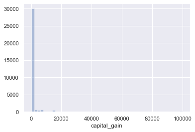

</div>
</div>
</div>


#### > answer:
> almost everyone has $capital\_gains=0$


### 2. for people who have `capital_gain > 0` - plot the histogram for capital gains


<div markdown="1" class="cell code_cell">
<div class="input_area" markdown="1">
```python
sns.distplot(df[df.capital_gain > 0].capital_gain, kde=False)

```
</div>

<div class="output_wrapper" markdown="1">
<div class="output_subarea" markdown="1">


{:.output_data_text}
```
<matplotlib.axes._subplots.AxesSubplot at 0xf240c50>
```


</div>
</div>
<div class="output_wrapper" markdown="1">
<div class="output_subarea" markdown="1">

{:.output_png}


</div>
</div>
</div>


#### > remark:
> what's this weird bump at $100K ?


### 3. how many people have capital gains over 25000?
   - use `value_counts()` to look at all the values of capital_gain over 25000. 
   - what's weird about the data?


<div markdown="1" class="cell code_cell">
<div class="input_area" markdown="1">
```python
df[df.capital_gain > 25000].capital_gain.value_counts()

```
</div>

<div class="output_wrapper" markdown="1">
<div class="output_subarea" markdown="1">


{:.output_data_text}
```
99999    159
27828     34
25236     11
34095      5
25124      4
41310      2
Name: capital_gain, dtype: int64
```


</div>
</div>
</div>


#### > answer:
> - the values seem oddly perscriptive... why do specific value repeat so much, and no values in between?
> - are the values here coding for something?
> - also 99999 is maybe a cap value of capital gains?


### 4. could the people who had capital_gain==25124 be related?


<div markdown="1" class="cell code_cell">
<div class="input_area" markdown="1">
```python
df[df.capital_gain == 25124]

```
</div>

<div class="output_wrapper" markdown="1">
<div class="output_subarea" markdown="1">


<div markdown="0" class="output output_html">
<div>
<style scoped>
    .dataframe tbody tr th:only-of-type {
        vertical-align: middle;
    }

    .dataframe tbody tr th {
        vertical-align: top;
    }

    .dataframe thead th {
        text-align: right;
    }
</style>
<table border="1" class="dataframe">
  <thead>
    <tr style="text-align: right;">
      <th></th>
      <th>age</th>
      <th>workclass</th>
      <th>fnlwgt</th>
      <th>education</th>
      <th>education_num</th>
      <th>marital_status</th>
      <th>occupation</th>
      <th>relationship</th>
      <th>race</th>
      <th>female</th>
      <th>capital_gain</th>
      <th>capital_loss</th>
      <th>hours_per_week</th>
      <th>native_country</th>
      <th>over50k</th>
    </tr>
  </thead>
  <tbody>
    <tr>
      <td>1562</td>
      <td>75</td>
      <td>?</td>
      <td>111177</td>
      <td>Bachelors</td>
      <td>13</td>
      <td>Widowed</td>
      <td>?</td>
      <td>Not-in-family</td>
      <td>White</td>
      <td>1</td>
      <td>25124</td>
      <td>0</td>
      <td>16</td>
      <td>United-States</td>
      <td>1</td>
    </tr>
    <tr>
      <td>18847</td>
      <td>73</td>
      <td>Private</td>
      <td>183213</td>
      <td>Assoc-voc</td>
      <td>11</td>
      <td>Widowed</td>
      <td>Prof-specialty</td>
      <td>Not-in-family</td>
      <td>White</td>
      <td>0</td>
      <td>25124</td>
      <td>0</td>
      <td>60</td>
      <td>United-States</td>
      <td>1</td>
    </tr>
    <tr>
      <td>21892</td>
      <td>65</td>
      <td>?</td>
      <td>224472</td>
      <td>Prof-school</td>
      <td>15</td>
      <td>Never-married</td>
      <td>?</td>
      <td>Not-in-family</td>
      <td>White</td>
      <td>0</td>
      <td>25124</td>
      <td>0</td>
      <td>80</td>
      <td>United-States</td>
      <td>1</td>
    </tr>
    <tr>
      <td>22462</td>
      <td>68</td>
      <td>Self-emp-inc</td>
      <td>52052</td>
      <td>Assoc-voc</td>
      <td>11</td>
      <td>Widowed</td>
      <td>Sales</td>
      <td>Not-in-family</td>
      <td>White</td>
      <td>1</td>
      <td>25124</td>
      <td>0</td>
      <td>50</td>
      <td>United-States</td>
      <td>1</td>
    </tr>
  </tbody>
</table>
</div>
</div>


</div>
</div>
</div>


#### > answer:

- very unlikely, 3 widows and 1 never-married are unlikely to share one household. 
- their "shared" capital_gain either codes for something, or is some kind of quantized property of a calculated field, or other fluke


### 5. does capital_gain over 50k mean income is over 50k?


<div markdown="1" class="cell code_cell">
<div class="input_area" markdown="1">
```python
df[df.capital_gain > 50000].over50k.mean()

```
</div>

<div class="output_wrapper" markdown="1">
<div class="output_subarea" markdown="1">


{:.output_data_text}
```
1.0
```


</div>
</div>
</div>


#### > answer:
- 100% of people who had capital_gain>50000 had income over 50k
- so inspite of the weirdness we saw in the values, we can probably keep and interpret this variable as intended


### capital_loss
1. plot the histogram of capital_loss


<div markdown="1" class="cell code_cell">
<div class="input_area" markdown="1">
```python
sns.distplot(df.capital_loss, kde=False)

```
</div>

<div class="output_wrapper" markdown="1">
<div class="output_subarea" markdown="1">


{:.output_data_text}
```
<matplotlib.axes._subplots.AxesSubplot at 0xf2a3f50>
```


</div>
</div>
<div class="output_wrapper" markdown="1">
<div class="output_subarea" markdown="1">

{:.output_png}
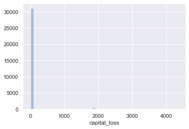

</div>
</div>
</div>


#### > remark
> again we see almost everybody having 0 capital losses


### 2. for people who have `capital_loss > 0`
   - plot the histogram for capital_loss


<div markdown="1" class="cell code_cell">
<div class="input_area" markdown="1">
```python
sns.distplot(df[df.capital_loss !=0].capital_loss, kde=False)

```
</div>

<div class="output_wrapper" markdown="1">
<div class="output_subarea" markdown="1">


{:.output_data_text}
```
<matplotlib.axes._subplots.AxesSubplot at 0xf48ebb0>
```


</div>
</div>
<div class="output_wrapper" markdown="1">
<div class="output_subarea" markdown="1">

{:.output_png}


</div>
</div>
</div>


### 3. how many people had both capital_gain>0 and capital_loss>0 ?


<div markdown="1" class="cell code_cell">
<div class="input_area" markdown="1">
```python
len(df[(df.capital_gain > 0) & (df.capital_loss >0)])

```
</div>

<div class="output_wrapper" markdown="1">
<div class="output_subarea" markdown="1">


{:.output_data_text}
```
0
```


</div>
</div>
</div>


### 4. who can afford to lose money on capital investments?
- what percent of people overall had over 50K income?
- what percent of people with 0 capital_loss? with capital_loss>0?


<div markdown="1" class="cell code_cell">
<div class="input_area" markdown="1">
```python
print("proportion of people who earn over 50K:\n{}".format(df.over50k.mean()))
print()
print("proportion of people who earn over 50K, by capital_loss > 0:")
print(df.groupby(df.capital_loss >0).over50k.mean())

```
</div>

<div class="output_wrapper" markdown="1">
<div class="output_subarea" markdown="1">
{:.output_stream}
```
proportion of people who earn over 50K:
0.2408095574460244

proportion of people who earn over 50K, by capital_loss > 0:
capital_loss
False    0.227692
True     0.508887
Name: over50k, dtype: float64
```
</div>
</div>
</div>


<div markdown="1" class="cell code_cell">
<div class="input_area" markdown="1">
```python
sns.barplot(x="lost_capital", y="over50k", data=df.assign(lost_capital=df.capital_loss >0))
plt.axhline(y=df.over50k.mean(), linestyle="--")

```
</div>

<div class="output_wrapper" markdown="1">
<div class="output_subarea" markdown="1">


{:.output_data_text}
```
<matplotlib.lines.Line2D at 0xf4f7030>
```


</div>
</div>
<div class="output_wrapper" markdown="1">
<div class="output_subarea" markdown="1">

{:.output_png}


</div>
</div>
</div>


#### > answer:
- having capital_loss > 0 is correlated with earning more than 50K.
- in fact, the proportion of over50k **is twice as large** in capital losers than in the general population


### combining and binning
1. create a new capital_change column that equals capital_gain - capital_loss


<div markdown="1" class="cell code_cell">
<div class="input_area" markdown="1">
```python
df = df.assign(capital_change=df.capital_gain - df.capital_loss)
df.head()

```
</div>

<div class="output_wrapper" markdown="1">
<div class="output_subarea" markdown="1">


<div markdown="0" class="output output_html">
<div>
<style scoped>
    .dataframe tbody tr th:only-of-type {
        vertical-align: middle;
    }

    .dataframe tbody tr th {
        vertical-align: top;
    }

    .dataframe thead th {
        text-align: right;
    }
</style>
<table border="1" class="dataframe">
  <thead>
    <tr style="text-align: right;">
      <th></th>
      <th>age</th>
      <th>workclass</th>
      <th>fnlwgt</th>
      <th>education</th>
      <th>education_num</th>
      <th>marital_status</th>
      <th>occupation</th>
      <th>relationship</th>
      <th>race</th>
      <th>female</th>
      <th>capital_gain</th>
      <th>capital_loss</th>
      <th>hours_per_week</th>
      <th>native_country</th>
      <th>over50k</th>
      <th>capital_change</th>
    </tr>
  </thead>
  <tbody>
    <tr>
      <td>0</td>
      <td>39</td>
      <td>State-gov</td>
      <td>77516</td>
      <td>Bachelors</td>
      <td>13</td>
      <td>Never-married</td>
      <td>Adm-clerical</td>
      <td>Not-in-family</td>
      <td>White</td>
      <td>0</td>
      <td>2174</td>
      <td>0</td>
      <td>40</td>
      <td>United-States</td>
      <td>0</td>
      <td>2174</td>
    </tr>
    <tr>
      <td>1</td>
      <td>50</td>
      <td>Self-emp-not-inc</td>
      <td>83311</td>
      <td>Bachelors</td>
      <td>13</td>
      <td>Married-civ-spouse</td>
      <td>Exec-managerial</td>
      <td>Husband</td>
      <td>White</td>
      <td>0</td>
      <td>0</td>
      <td>0</td>
      <td>13</td>
      <td>United-States</td>
      <td>0</td>
      <td>0</td>
    </tr>
    <tr>
      <td>2</td>
      <td>38</td>
      <td>Private</td>
      <td>215646</td>
      <td>HS-grad</td>
      <td>9</td>
      <td>Divorced</td>
      <td>Handlers-cleaners</td>
      <td>Not-in-family</td>
      <td>White</td>
      <td>0</td>
      <td>0</td>
      <td>0</td>
      <td>40</td>
      <td>United-States</td>
      <td>0</td>
      <td>0</td>
    </tr>
    <tr>
      <td>3</td>
      <td>53</td>
      <td>Private</td>
      <td>234721</td>
      <td>11th</td>
      <td>7</td>
      <td>Married-civ-spouse</td>
      <td>Handlers-cleaners</td>
      <td>Husband</td>
      <td>Black</td>
      <td>0</td>
      <td>0</td>
      <td>0</td>
      <td>40</td>
      <td>United-States</td>
      <td>0</td>
      <td>0</td>
    </tr>
    <tr>
      <td>4</td>
      <td>28</td>
      <td>Private</td>
      <td>338409</td>
      <td>Bachelors</td>
      <td>13</td>
      <td>Married-civ-spouse</td>
      <td>Prof-specialty</td>
      <td>Wife</td>
      <td>Black</td>
      <td>1</td>
      <td>0</td>
      <td>0</td>
      <td>40</td>
      <td>Cuba</td>
      <td>0</td>
      <td>0</td>
    </tr>
  </tbody>
</table>
</div>
</div>


</div>
</div>
</div>


<div markdown="1" class="cell code_cell">
<div class="input_area" markdown="1">
```python
sns.barplot(
    y="has_capital_change", 
    x="over50k", 
    data=df.assign(has_capital_change=df.capital_change.abs() > 0)
    )

```
</div>

<div class="output_wrapper" markdown="1">
<div class="output_subarea" markdown="1">


{:.output_data_text}
```
<matplotlib.axes._subplots.AxesSubplot at 0xf562990>
```


</div>
</div>
<div class="output_wrapper" markdown="1">
<div class="output_subarea" markdown="1">

{:.output_png}


</div>
</div>
</div>


### 2. use the qcut function to quantize/bin/cut capital_change into a new columns called capital_change_bin with 10 bins of equal proportions.
   1. do not bin capital_change==0 values as there are too many of them
   1. to simplify using this column later, use the left side of the interval created as the label
   1. label rows with capital_change==0 as having capital_change_bin=0
   1. make sure you have no null values for capital_change_bin


<div markdown="1" class="cell code_cell">
<div class="input_area" markdown="1">
```python
# do not bin capital_change==-0
capital_change_bins = pd.qcut(df[df.capital_change !=0].capital_change, 10) 

# use left side of interval as label
capital_change_bins = capital_change_bins.apply(lambda interval: interval.left) 

# add capital_change_bin to df
df['capital_change_bin'] = capital_change_bins

# look at the last 4 columns
df.iloc[:, -4:].head()

```
</div>

<div class="output_wrapper" markdown="1">
<div class="output_subarea" markdown="1">


<div markdown="0" class="output output_html">
<div>
<style scoped>
    .dataframe tbody tr th:only-of-type {
        vertical-align: middle;
    }

    .dataframe tbody tr th {
        vertical-align: top;
    }

    .dataframe thead th {
        text-align: right;
    }
</style>
<table border="1" class="dataframe">
  <thead>
    <tr style="text-align: right;">
      <th></th>
      <th>native_country</th>
      <th>over50k</th>
      <th>capital_change</th>
      <th>capital_change_bin</th>
    </tr>
  </thead>
  <tbody>
    <tr>
      <td>0</td>
      <td>United-States</td>
      <td>0</td>
      <td>2174</td>
      <td>-1594.0</td>
    </tr>
    <tr>
      <td>1</td>
      <td>United-States</td>
      <td>0</td>
      <td>0</td>
      <td>NaN</td>
    </tr>
    <tr>
      <td>2</td>
      <td>United-States</td>
      <td>0</td>
      <td>0</td>
      <td>NaN</td>
    </tr>
    <tr>
      <td>3</td>
      <td>United-States</td>
      <td>0</td>
      <td>0</td>
      <td>NaN</td>
    </tr>
    <tr>
      <td>4</td>
      <td>Cuba</td>
      <td>0</td>
      <td>0</td>
      <td>NaN</td>
    </tr>
  </tbody>
</table>
</div>
</div>


</div>
</div>
</div>


<div markdown="1" class="cell code_cell">
<div class="input_area" markdown="1">
```python
# label rows with capital_change==0 as having capital_change_bin=0
df.replace({'capital_change_bin' : {np.nan : 0}}, inplace=True)

# look at the last 4 columns
df.iloc[:, -4:].head()

```
</div>

<div class="output_wrapper" markdown="1">
<div class="output_subarea" markdown="1">


<div markdown="0" class="output output_html">
<div>
<style scoped>
    .dataframe tbody tr th:only-of-type {
        vertical-align: middle;
    }

    .dataframe tbody tr th {
        vertical-align: top;
    }

    .dataframe thead th {
        text-align: right;
    }
</style>
<table border="1" class="dataframe">
  <thead>
    <tr style="text-align: right;">
      <th></th>
      <th>native_country</th>
      <th>over50k</th>
      <th>capital_change</th>
      <th>capital_change_bin</th>
    </tr>
  </thead>
  <tbody>
    <tr>
      <td>0</td>
      <td>United-States</td>
      <td>0</td>
      <td>2174</td>
      <td>-1594</td>
    </tr>
    <tr>
      <td>1</td>
      <td>United-States</td>
      <td>0</td>
      <td>0</td>
      <td>0</td>
    </tr>
    <tr>
      <td>2</td>
      <td>United-States</td>
      <td>0</td>
      <td>0</td>
      <td>0</td>
    </tr>
    <tr>
      <td>3</td>
      <td>United-States</td>
      <td>0</td>
      <td>0</td>
      <td>0</td>
    </tr>
    <tr>
      <td>4</td>
      <td>Cuba</td>
      <td>0</td>
      <td>0</td>
      <td>0</td>
    </tr>
  </tbody>
</table>
</div>
</div>


</div>
</div>
</div>


<div markdown="1" class="cell code_cell">
<div class="input_area" markdown="1">
```python
# make sure you have no null values for capital_change_bin
df.capital_change_bin.isnull().sum()

```
</div>

<div class="output_wrapper" markdown="1">
<div class="output_subarea" markdown="1">


{:.output_data_text}
```
0
```


</div>
</div>
</div>


### 3. how many people have a non-zero capital_change?
- lets call this 'has_capital_change'
- plot 'has_capital_change' over 'over50k'
- what do you learn from this diagram?


<div markdown="1" class="cell code_cell">
<div class="input_area" markdown="1">
```python
sns.barplot(
    y="has_capital_change", 
    x="over50k", 
    data=df.assign(has_capital_change=df.capital_change.abs() > 0)
    )
plt.grid(True)

```
</div>

<div class="output_wrapper" markdown="1">
<div class="output_subarea" markdown="1">

{:.output_png}


</div>
</div>
</div>


#### > answer:
> - for people earning less than 50K, only ~7.5% try to have "money work for them" in terms of capital gain/loss
> - for people earning above 50K, over 30% have non-zero capital change


### 4. plot `capital_change` by `over50k`
- what do you learn from this diagram


<div markdown="1" class="cell code_cell">
<div class="input_area" markdown="1">
```python
sns.barplot(x='over50k', y='capital_change', data=df)

```
</div>

<div class="output_wrapper" markdown="1">
<div class="output_subarea" markdown="1">


{:.output_data_text}
```
<matplotlib.axes._subplots.AxesSubplot at 0xf670fb0>
```


</div>
</div>
<div class="output_wrapper" markdown="1">
<div class="output_subarea" markdown="1">

{:.output_png}
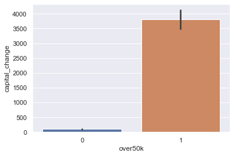

</div>
</div>
</div>


#### > answer:
> - people earning over50k had the means/knowledge/opportunity to invest in capital, and earned a mean ~3500$ from capital


### 5. plot `over50k` by `capital_change_bin`
- what can you learn from this diagram?


<div markdown="1" class="cell code_cell">
<div class="input_area" markdown="1">
```python
bars = sns.lineplot(x='capital_change_bin', y='over50k', data=df)
plt.setp(bars.get_xticklabels(), rotation=90);

```
</div>

<div class="output_wrapper" markdown="1">
<div class="output_subarea" markdown="1">

{:.output_png}


</div>
</div>
</div>


#### > answer:
> - among people that has lost/earned roughly 2500\$ or under in capital_change, there is very minor difference in proportion of over50K earnings relative to the general population
> - however, among those that have earned or lost in excess of ~2500\$ there is a sharp increase in the proportion of over50K earners 


### education
1. what is the mean education_num by education?
    - sort the education categories by the mean_values. does it make sense?
    - check out other descriptive statistics to see if anything falls out of place
    - turn education into a categorical ordered type
    - plot education VS education_num
    - what have we learned?


<div markdown="1" class="cell code_cell">
<div class="input_area" markdown="1">
```python
# - what is the mean education_num by education?
# - sort the education categories by the mean_values. does it make sense?
df.groupby('education').education_num.mean().sort_values()

```
</div>

<div class="output_wrapper" markdown="1">
<div class="output_subarea" markdown="1">


{:.output_data_text}
```
education
Preschool        1
1st-4th          2
5th-6th          3
7th-8th          4
9th              5
10th             6
11th             7
12th             8
HS-grad          9
Some-college    10
Assoc-voc       11
Assoc-acdm      12
Bachelors       13
Masters         14
Prof-school     15
Doctorate       16
Name: education_num, dtype: int64
```


</div>
</div>
</div>


#### > answer:
> yes, makes sense. looks like `education_num` is a numerical encoding for `education`


<div markdown="1" class="cell code_cell">
<div class="input_area" markdown="1">
```python
# - check out other descriptive statistics to see if anything falls out of place
df.groupby('education').education_num.describe()

```
</div>

<div class="output_wrapper" markdown="1">
<div class="output_subarea" markdown="1">


<div markdown="0" class="output output_html">
<div>
<style scoped>
    .dataframe tbody tr th:only-of-type {
        vertical-align: middle;
    }

    .dataframe tbody tr th {
        vertical-align: top;
    }

    .dataframe thead th {
        text-align: right;
    }
</style>
<table border="1" class="dataframe">
  <thead>
    <tr style="text-align: right;">
      <th></th>
      <th>count</th>
      <th>mean</th>
      <th>std</th>
      <th>min</th>
      <th>25%</th>
      <th>50%</th>
      <th>75%</th>
      <th>max</th>
    </tr>
    <tr>
      <th>education</th>
      <th></th>
      <th></th>
      <th></th>
      <th></th>
      <th></th>
      <th></th>
      <th></th>
      <th></th>
    </tr>
  </thead>
  <tbody>
    <tr>
      <td>10th</td>
      <td>933.0</td>
      <td>6.0</td>
      <td>0.0</td>
      <td>6.0</td>
      <td>6.0</td>
      <td>6.0</td>
      <td>6.0</td>
      <td>6.0</td>
    </tr>
    <tr>
      <td>11th</td>
      <td>1175.0</td>
      <td>7.0</td>
      <td>0.0</td>
      <td>7.0</td>
      <td>7.0</td>
      <td>7.0</td>
      <td>7.0</td>
      <td>7.0</td>
    </tr>
    <tr>
      <td>12th</td>
      <td>433.0</td>
      <td>8.0</td>
      <td>0.0</td>
      <td>8.0</td>
      <td>8.0</td>
      <td>8.0</td>
      <td>8.0</td>
      <td>8.0</td>
    </tr>
    <tr>
      <td>1st-4th</td>
      <td>168.0</td>
      <td>2.0</td>
      <td>0.0</td>
      <td>2.0</td>
      <td>2.0</td>
      <td>2.0</td>
      <td>2.0</td>
      <td>2.0</td>
    </tr>
    <tr>
      <td>5th-6th</td>
      <td>333.0</td>
      <td>3.0</td>
      <td>0.0</td>
      <td>3.0</td>
      <td>3.0</td>
      <td>3.0</td>
      <td>3.0</td>
      <td>3.0</td>
    </tr>
    <tr>
      <td>7th-8th</td>
      <td>646.0</td>
      <td>4.0</td>
      <td>0.0</td>
      <td>4.0</td>
      <td>4.0</td>
      <td>4.0</td>
      <td>4.0</td>
      <td>4.0</td>
    </tr>
    <tr>
      <td>9th</td>
      <td>514.0</td>
      <td>5.0</td>
      <td>0.0</td>
      <td>5.0</td>
      <td>5.0</td>
      <td>5.0</td>
      <td>5.0</td>
      <td>5.0</td>
    </tr>
    <tr>
      <td>Assoc-acdm</td>
      <td>1067.0</td>
      <td>12.0</td>
      <td>0.0</td>
      <td>12.0</td>
      <td>12.0</td>
      <td>12.0</td>
      <td>12.0</td>
      <td>12.0</td>
    </tr>
    <tr>
      <td>Assoc-voc</td>
      <td>1382.0</td>
      <td>11.0</td>
      <td>0.0</td>
      <td>11.0</td>
      <td>11.0</td>
      <td>11.0</td>
      <td>11.0</td>
      <td>11.0</td>
    </tr>
    <tr>
      <td>Bachelors</td>
      <td>5355.0</td>
      <td>13.0</td>
      <td>0.0</td>
      <td>13.0</td>
      <td>13.0</td>
      <td>13.0</td>
      <td>13.0</td>
      <td>13.0</td>
    </tr>
    <tr>
      <td>Doctorate</td>
      <td>413.0</td>
      <td>16.0</td>
      <td>0.0</td>
      <td>16.0</td>
      <td>16.0</td>
      <td>16.0</td>
      <td>16.0</td>
      <td>16.0</td>
    </tr>
    <tr>
      <td>HS-grad</td>
      <td>10501.0</td>
      <td>9.0</td>
      <td>0.0</td>
      <td>9.0</td>
      <td>9.0</td>
      <td>9.0</td>
      <td>9.0</td>
      <td>9.0</td>
    </tr>
    <tr>
      <td>Masters</td>
      <td>1723.0</td>
      <td>14.0</td>
      <td>0.0</td>
      <td>14.0</td>
      <td>14.0</td>
      <td>14.0</td>
      <td>14.0</td>
      <td>14.0</td>
    </tr>
    <tr>
      <td>Preschool</td>
      <td>51.0</td>
      <td>1.0</td>
      <td>0.0</td>
      <td>1.0</td>
      <td>1.0</td>
      <td>1.0</td>
      <td>1.0</td>
      <td>1.0</td>
    </tr>
    <tr>
      <td>Prof-school</td>
      <td>576.0</td>
      <td>15.0</td>
      <td>0.0</td>
      <td>15.0</td>
      <td>15.0</td>
      <td>15.0</td>
      <td>15.0</td>
      <td>15.0</td>
    </tr>
    <tr>
      <td>Some-college</td>
      <td>7291.0</td>
      <td>10.0</td>
      <td>0.0</td>
      <td>10.0</td>
      <td>10.0</td>
      <td>10.0</td>
      <td>10.0</td>
      <td>10.0</td>
    </tr>
  </tbody>
</table>
</div>
</div>


</div>
</div>
</div>


#### > answer
> - yes, we see that std is 0 and min=max. 
> - that means there are no deviations or wrong encodings in the data.
> yippee!


<div markdown="1" class="cell code_cell">
<div class="input_area" markdown="1">
```python
#   - turn education into a categorical ordered type
sorted_education = df.groupby('education').education_num.mean().sort_values().index.values
print(sorted_education)
df.education = df.education.astype(pd.CategoricalDtype(sorted_education, ordered=True))

#   - plot education VS education_num
bars = sns.barplot(x='education', y='education_num', data=df)
plt.setp(bars.get_xticklabels(), rotation=90);
plt.grid(True)

#   - what have we learned?

```
</div>

<div class="output_wrapper" markdown="1">
<div class="output_subarea" markdown="1">
{:.output_stream}
```
['Preschool' '1st-4th' '5th-6th' '7th-8th' '9th' '10th' '11th' '12th'
 'HS-grad' 'Some-college' 'Assoc-voc' 'Assoc-acdm' 'Bachelors' 'Masters'
 'Prof-school' 'Doctorate']
```
</div>
</div>
<div class="output_wrapper" markdown="1">
<div class="output_subarea" markdown="1">

{:.output_png}


</div>
</div>
</div>


#### > answer:
we can now interchangably use either `education_num` or `education` in our graphs,
depending if we want to emphasize the categorical name of the education or numerical size


### 2. plot the distribution for education


<div markdown="1" class="cell code_cell">
<div class="input_area" markdown="1">
```python
bars = sns.countplot(df.education)
plt.setp(bars.get_xticklabels(), rotation=90);

```
</div>

<div class="output_wrapper" markdown="1">
<div class="output_subarea" markdown="1">

{:.output_png}


</div>
</div>
</div>


### 3. plot over50k by education
- what do we learn?


<div markdown="1" class="cell code_cell">
<div class="input_area" markdown="1">
```python
bars = sns.barplot(y='over50k', x='education', data=df)
plt.setp(bars.get_xticklabels(), rotation=90);

```
</div>

<div class="output_wrapper" markdown="1">
<div class="output_subarea" markdown="1">

{:.output_png}
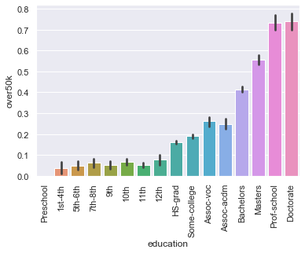

</div>
</div>
</div>


#### > answer:
> - over50k seems to be stringly correlated with education, 
> - with significant improvements to outcomes at High School, Bachelors, Masters and Proffesional/Doctorate attainment levels


### 4. plot hours_per_week by education
1. what can we learn?
2. now use the hue="over50k" of seaborn to see hours_per_week by education/over50k.
   - learn anything else?


<div markdown="1" class="cell code_cell">
<div class="input_area" markdown="1">
```python
bars = sns.lineplot(y='hours_per_week', x='education', ci="sd", data=df)
plt.setp(bars.get_xticklabels(), rotation=90);

```
</div>

<div class="output_wrapper" markdown="1">
<div class="output_subarea" markdown="1">

{:.output_png}
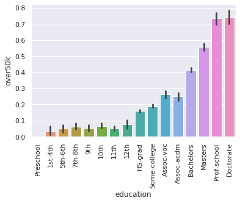

</div>
</div>
</div>


#### > answer:
> - we observe High-School gradues to have roughly a 40-hour work week
> - with education above highschool, we see a strong trend for more hours-per-week as education increases, above and beyond 40 hours
> - we see a sharp decline in work hours for highschool dropouts (9th-12th grade education). perhaps indicative of physical/mental health issues or life circumstances that make work difficult.
> - for education up until 8th grade we see a positive trend that more education allows for more work, reaching almost 40 hour weeks of full employment


<div markdown="1" class="cell code_cell">
<div class="input_area" markdown="1">
```python
bars = sns.lineplot(y='hours_per_week', x='education', hue='over50k', ci="sd", data=df)
plt.setp(bars.get_xticklabels(), rotation=90);

```
</div>

<div class="output_wrapper" markdown="1">
<div class="output_subarea" markdown="1">

{:.output_png}
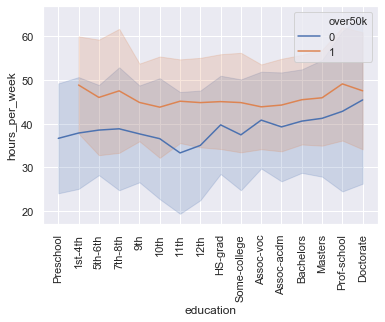

</div>
</div>
</div>


#### > answer:
> - those that earn above 50K work approx 45 hours per week across most education levels. 
    with exceptions being at low education levels (where sample sizes are small so confidence intervals are large) 
    and for "Prof-School" education (doctors?), where the mean is closer to ~50 hour weeks.
> - those that earn under 50K work less hours across almost all education levels, mostly around 40 hour weeks at above high-school level education (except perhaps those with Doctorates where sample sizes are small) 

#### > note for later:
> look further at relationship between hours worked and over50k


### 5. plot education_num by occupation
- sort by mean education_num


<div markdown="1" class="cell code_cell">
<div class="input_area" markdown="1">
```python
occupation_by_education = df.groupby("occupation").education_num.mean().sort_values().index.values
bars = sns.boxplot(
    x="occupation", 
    y='education_num', 
    order=occupation_by_education, 
    data=df,
    # medianprops={"color":"white"},
    showfliers=False, 
    showmeans=True
    )
_ = plt.setp(bars.get_xticklabels(), rotation=90)

```
</div>

<div class="output_wrapper" markdown="1">
<div class="output_subarea" markdown="1">

{:.output_png}
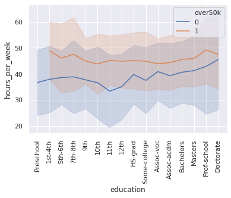

</div>
</div>
</div>


#### > remark:
> clearly there seems like 5 cluster of jobs by education level:
> 1. "Priv-house-serv" (servants)
> 2. "Machine-op-inspect" to "Arned forced" (blue collar)
> 3. "Adm-clerical" to "sales" (white collar)
> 4. "Tech-support" - "Exec-managerial" (tech / management)
> 5. "Prof-specialty" (doctors/lawyers/proffesionals)


### 6. plot education_num by workclass
- sort by mean education_num


<div markdown="1" class="cell code_cell">
<div class="input_area" markdown="1">
```python
workclass_by_education = df.groupby("workclass").education_num.mean().sort_values().index.values
bars = sns.boxplot(x="workclass", y='education_num', order=workclass_by_education,  showfliers=False, data=df)
_ = plt.setp(bars.get_xticklabels(), rotation=90)

```
</div>

<div class="output_wrapper" markdown="1">
<div class="output_subarea" markdown="1">

{:.output_png}
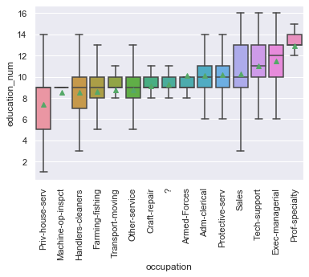

</div>
</div>
</div>


### 7. create a crosstab or a pivot_table of education VS occupation.
   - normalize it by the education rows 
     (each row X shows the conditional probability of having occupation Y by education level X) 
   - create a heatmap that shows which occpupations are most likely for each education level
   - verbally describe what you've learned


<div markdown="1" class="cell code_cell">
<div class="input_area" markdown="1">
```python
occ_by_edu_df = pd.crosstab(
    df.education, 
    df.occupation.astype(pd.CategoricalDtype(occupation_by_education, ordered=True)), 
    normalize='index')

fig, ax = plt.subplots(figsize=(7,7))

sns.heatmap(
    occ_by_edu_df
    , robust = True
    , ax=ax
    , cmap="Oranges"
    , linewidths=.75
);


```
</div>

<div class="output_wrapper" markdown="1">
<div class="output_subarea" markdown="1">

{:.output_png}


</div>
</div>
</div>


#### > answer:
the heatmap shows for each education/row, which occupations are most likely to be taken by individuals with that education attainment.

> - for the very lower end of education, "machine-op-inspect" or "farming-fishing" is likely
> - Those with high-school or below attainment, are likely to find themselves in the large "Other-service", "Craft-repair" or "transport-moving" occupations, since these are large overall.
> - mid-level education "some-college" to "assoc-acdm" find a wide range of horizontal occuptions
> - for Bachelor and above education "Exec-managerial" and "Prof-specialty" are highly likely


### 8.  create a crosstab or a pivot_table of education VS workclass.
   - normalize it by the education rows 
     (each row X shows the conditional probability of having workclass Y by education level X) 
   - create a heatmap that shows which workclass is most likely for each education level
   - verbally describe what you've learned
   - re-run this analysis without the private sector
   


<div markdown="1" class="cell code_cell">
<div class="input_area" markdown="1">
```python
class_by_edu_df = pd.crosstab(
    df.education, 
    df.workclass.astype(pd.CategoricalDtype(workclass_by_education, ordered=True)), 
    normalize='index')

fig, ax = plt.subplots(figsize=(7,7))

sns.heatmap(
    class_by_edu_df
    , robust = True
    , ax=ax
    , cmap="Oranges"
    , linewidths=.75
);

```
</div>

<div class="output_wrapper" markdown="1">
<div class="output_subarea" markdown="1">

{:.output_png}
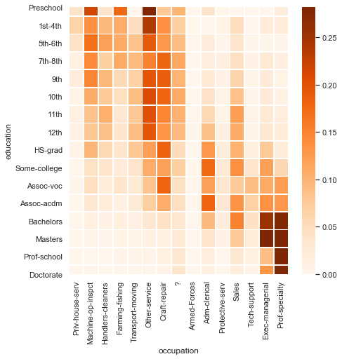

</div>
</div>
</div>


#### > answer:
almost everyone, regardless of education, works in the private sector. yippee!


<div markdown="1" class="cell code_cell">
<div class="input_area" markdown="1">
```python
non_private_df = df[df.workclass != 'Private']

class_by_edu_df = pd.crosstab(
    non_private_df.education, 
    non_private_df.workclass.astype(pd.CategoricalDtype(workclass_by_education, ordered=True)), 
    normalize='index')

fig, ax = plt.subplots(figsize=(7,7))

sns.heatmap(
    class_by_edu_df
    , robust = True
    , ax=ax
    , cmap="Oranges"
    , linewidths=.75
);

```
</div>

<div class="output_wrapper" markdown="1">
<div class="output_subarea" markdown="1">

{:.output_png}
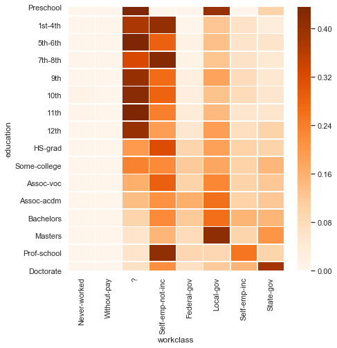

</div>
</div>
</div>


#### > answer:
outside the private sector:
> - those with lowest education, mostly are unclassified by workclass, or are self-employed
> - high scool grads tend to be self-employed
> - mid-level education tend to be self-employed or local-government
> - people with masters degree tend to be employed by local goverment
> - people with prof-school tend to be self-employed
> - people with doctorates tend to be employed by state-government


### 9. plot "race" vs "education_num


<div markdown="1" class="cell code_cell">
<div class="input_area" markdown="1">
```python
race_by_education = df.groupby('race').education_num.mean().sort_values().index.values
bars = sns.boxplot(x="race", y="education_num",  order=race_by_education, data=df)
_ = plt.setp(bars.get_xticklabels(), rotation=90)


```
</div>

<div class="output_wrapper" markdown="1">
<div class="output_subarea" markdown="1">

{:.output_png}
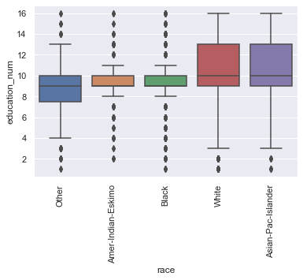

</div>
</div>
</div>


### 10. plot "relationship" vs "education_num


<div markdown="1" class="cell code_cell">
<div class="input_area" markdown="1">
```python
rel_by_education = df.groupby('relationship').education_num.mean().sort_values().index.values
bars = sns.boxplot(x="relationship", y="education_num",  order=rel_by_education, data=df)
_ = plt.setp(bars.get_xticklabels(), rotation=90)


```
</div>

<div class="output_wrapper" markdown="1">
<div class="output_subarea" markdown="1">

{:.output_png}


</div>
</div>
</div>


## occupation / workclass
1. how many levels of occupation?


<div markdown="1" class="cell code_cell">
<div class="input_area" markdown="1">
```python
print(df.occupation.nunique())
print(df.occupation.unique())

```
</div>

<div class="output_wrapper" markdown="1">
<div class="output_subarea" markdown="1">
{:.output_stream}
```
15
['Adm-clerical' 'Exec-managerial' 'Handlers-cleaners' 'Prof-specialty'
 'Other-service' 'Sales' 'Craft-repair' 'Transport-moving'
 'Farming-fishing' 'Machine-op-inspct' 'Tech-support' '?'
 'Protective-serv' 'Armed-Forces' 'Priv-house-serv']
```
</div>
</div>
</div>


### 2. how many levels of worklass?


<div markdown="1" class="cell code_cell">
<div class="input_area" markdown="1">
```python
print(df.workclass.nunique())
print(df.workclass.unique())

```
</div>

<div class="output_wrapper" markdown="1">
<div class="output_subarea" markdown="1">
{:.output_stream}
```
9
['State-gov' 'Self-emp-not-inc' 'Private' 'Federal-gov' 'Local-gov' '?'
 'Self-emp-inc' 'Without-pay' 'Never-worked']
```
</div>
</div>
</div>


### 3. how many combinations? potential? actual?


<div markdown="1" class="cell code_cell">
<div class="input_area" markdown="1">
```python
print("potential:", df.workclass.nunique() * df.occupation.nunique())
print("actual:", len(df.groupby(['occupation', 'workclass'])))

```
</div>

<div class="output_wrapper" markdown="1">
<div class="output_subarea" markdown="1">
{:.output_stream}
```
potential: 135
actual: 83
```
</div>
</div>
</div>


### 4. plot over50k by occupation
- sort by mean over50k
- compare this to over50k by education. which variable more strongly predicts income?
- compare tjos to education_num by occupation. are the highest paying jobs correlated with highest earning education?


<div markdown="1" class="cell code_cell">
<div class="input_area" markdown="1">
```python
fig, axs = plt.subplots(ncols=2, sharey=True, figsize=(12,6))
occ_by_50k = df.groupby('occupation').over50k.mean().sort_values().index.values
bars = sns.barplot(x='occupation', y='over50k', order=occ_by_50k, data=df, ax=axs[0])
plt.setp(bars.get_xticklabels(), rotation=90);

bars = sns.barplot(x='education', y='over50k', data=df, ax=axs[1])
plt.setp(bars.get_xticklabels(), rotation=90);

```
</div>

<div class="output_wrapper" markdown="1">
<div class="output_subarea" markdown="1">

{:.output_png}
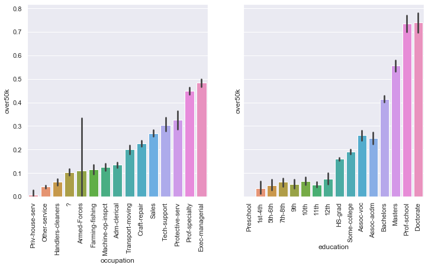

</div>
</div>
</div>


<div markdown="1" class="cell code_cell">
<div class="input_area" markdown="1">
```python
fig, axs = plt.subplots(ncols=2, sharex=True, figsize=(12,6))
bars = sns.barplot(x='occupation', y='over50k', order=occ_by_50k, data=df, ax=axs[0])
plt.setp(bars.get_xticklabels(), rotation=90);

bars = sns.barplot(x='occupation', y='education_num', ci="sd", order=occ_by_50k, data=df, ax=axs[1])
plt.setp(bars.get_xticklabels(), rotation=90);

```
</div>

<div class="output_wrapper" markdown="1">
<div class="output_subarea" markdown="1">

{:.output_png}


</div>
</div>
</div>


#### > answer:
> - education looks like a stronger indicator of income, because disparities in income are higher when grouped by education than when grouped by occupation
> - the highest paying occupations are not the same as the occupations requiring highest education.
>   perhaps this is due to education needs varying wildly within occupations


### 5. plot `over50k` by `workclass`


<div markdown="1" class="cell code_cell">
<div class="input_area" markdown="1">
```python
class_by_50k = df.groupby('workclass').over50k.mean().sort_values().index.values
bars = sns.barplot(x='workclass', y='over50k', order=class_by_50k, data=df)
plt.setp(bars.get_xticklabels(), rotation=90);

```
</div>

<div class="output_wrapper" markdown="1">
<div class="output_subarea" markdown="1">

{:.output_png}
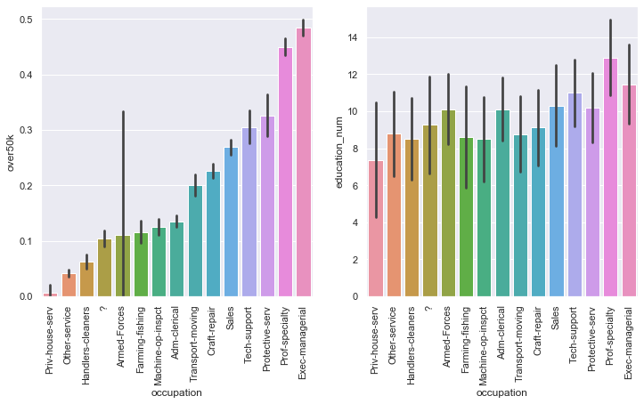

</div>
</div>
</div>


### 6. look at combinations of occupation / workclass
   1. what are the top combinations in terms of earning over50k? how many people in that category?


<div markdown="1" class="cell code_cell">
<div class="input_area" markdown="1">
```python
occupation_class = df.groupby(['occupation', 'workclass']) \
    .over50k.agg(["mean", "count"]) \
    .sort_values(by="mean", ascending=False)

occupation_class.head(10)

```
</div>

<div class="output_wrapper" markdown="1">
<div class="output_subarea" markdown="1">


<div markdown="0" class="output output_html">
<div>
<style scoped>
    .dataframe tbody tr th:only-of-type {
        vertical-align: middle;
    }

    .dataframe tbody tr th {
        vertical-align: top;
    }

    .dataframe thead th {
        text-align: right;
    }
</style>
<table border="1" class="dataframe">
  <thead>
    <tr style="text-align: right;">
      <th></th>
      <th></th>
      <th>mean</th>
      <th>count</th>
    </tr>
    <tr>
      <th>occupation</th>
      <th>workclass</th>
      <th></th>
      <th></th>
    </tr>
  </thead>
  <tbody>
    <tr>
      <td>Prof-specialty</td>
      <td>Self-emp-inc</td>
      <td>0.756250</td>
      <td>160</td>
    </tr>
    <tr>
      <td>Tech-support</td>
      <td>Self-emp-inc</td>
      <td>0.666667</td>
      <td>3</td>
    </tr>
    <tr>
      <td>Exec-managerial</td>
      <td>Self-emp-inc</td>
      <td>0.635000</td>
      <td>400</td>
    </tr>
    <tr>
      <td>Prof-specialty</td>
      <td>Self-emp-not-inc</td>
      <td>0.563003</td>
      <td>373</td>
    </tr>
    <tr>
      <td>Sales</td>
      <td>Self-emp-inc</td>
      <td>0.549828</td>
      <td>291</td>
    </tr>
    <tr>
      <td>Prof-specialty</td>
      <td>Federal-gov</td>
      <td>0.542857</td>
      <td>175</td>
    </tr>
    <tr>
      <td>Exec-managerial</td>
      <td>Federal-gov</td>
      <td>0.511111</td>
      <td>180</td>
    </tr>
    <tr>
      <td>Protective-serv</td>
      <td>Federal-gov</td>
      <td>0.500000</td>
      <td>28</td>
    </tr>
    <tr>
      <td rowspan="2" valign="top">Exec-managerial</td>
      <td>Private</td>
      <td>0.481234</td>
      <td>2691</td>
    </tr>
    <tr>
      <td>Local-gov</td>
      <td>0.476636</td>
      <td>214</td>
    </tr>
  </tbody>
</table>
</div>
</div>


</div>
</div>
</div>


### 2. how many of these combinations have more than 100 people?


<div markdown="1" class="cell code_cell">
<div class="input_area" markdown="1">
```python
occupation_class = occupation_class[occupation_class['count'] > 100]
print(len(occupation_class))
occupation_class.head(10)

```
</div>

<div class="output_wrapper" markdown="1">
<div class="output_subarea" markdown="1">
{:.output_stream}
```
40
```
</div>
</div>
<div class="output_wrapper" markdown="1">
<div class="output_subarea" markdown="1">


<div markdown="0" class="output output_html">
<div>
<style scoped>
    .dataframe tbody tr th:only-of-type {
        vertical-align: middle;
    }

    .dataframe tbody tr th {
        vertical-align: top;
    }

    .dataframe thead th {
        text-align: right;
    }
</style>
<table border="1" class="dataframe">
  <thead>
    <tr style="text-align: right;">
      <th></th>
      <th></th>
      <th>mean</th>
      <th>count</th>
    </tr>
    <tr>
      <th>occupation</th>
      <th>workclass</th>
      <th></th>
      <th></th>
    </tr>
  </thead>
  <tbody>
    <tr>
      <td>Prof-specialty</td>
      <td>Self-emp-inc</td>
      <td>0.756250</td>
      <td>160</td>
    </tr>
    <tr>
      <td>Exec-managerial</td>
      <td>Self-emp-inc</td>
      <td>0.635000</td>
      <td>400</td>
    </tr>
    <tr>
      <td>Prof-specialty</td>
      <td>Self-emp-not-inc</td>
      <td>0.563003</td>
      <td>373</td>
    </tr>
    <tr>
      <td>Sales</td>
      <td>Self-emp-inc</td>
      <td>0.549828</td>
      <td>291</td>
    </tr>
    <tr>
      <td>Prof-specialty</td>
      <td>Federal-gov</td>
      <td>0.542857</td>
      <td>175</td>
    </tr>
    <tr>
      <td rowspan="3" valign="top">Exec-managerial</td>
      <td>Federal-gov</td>
      <td>0.511111</td>
      <td>180</td>
    </tr>
    <tr>
      <td>Private</td>
      <td>0.481234</td>
      <td>2691</td>
    </tr>
    <tr>
      <td>Local-gov</td>
      <td>0.476636</td>
      <td>214</td>
    </tr>
    <tr>
      <td>Protective-serv</td>
      <td>Local-gov</td>
      <td>0.444079</td>
      <td>304</td>
    </tr>
    <tr>
      <td>Prof-specialty</td>
      <td>Private</td>
      <td>0.435798</td>
      <td>2313</td>
    </tr>
  </tbody>
</table>
</div>
</div>


</div>
</div>
</div>


### 3. show a heatmap
of the mean over50k of occupation-vs-worklass for combinations with more than 100 people. center the heatmap at the populations mean over50k for increased effect. what conclusions can you draw?


<div markdown="1" class="cell code_cell">
<div class="input_area" markdown="1">
```python
sns.heatmap(
    occupation_class['mean'].unstack(1)
    , center=df.over50k.mean()
    , robust = True
    , linewidths=.75)

```
</div>

<div class="output_wrapper" markdown="1">
<div class="output_subarea" markdown="1">


{:.output_data_text}
```
<matplotlib.axes._subplots.AxesSubplot at 0x10bce230>
```


</div>
</div>
<div class="output_wrapper" markdown="1">
<div class="output_subarea" markdown="1">

{:.output_png}
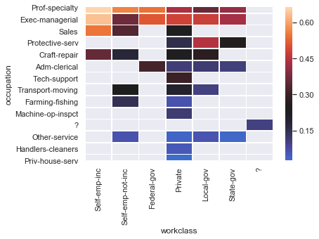

</div>
</div>
</div>


#### > answer:
> 1. Prof-speciality and Exec managerial lead the earners across all work classes.
> 2. Self-employed-inc (having your own firm incorporated) is great
> 3. the private sector often has worse over50k mean than other sectors for the same occupations
> 4. Protective-serv (police/firemen) working for local-gov is a sweet deal


### 7. create a numerical encoding for occupation / workclass pairs
   - create a new column called "occ_class" that combines the string of the occupation and workclass
   - use the library [category_encoders](http://contrib.scikit-learn.org/categorical-encoding/), here's an [intro](https://towardsdatascience.com/smarter-ways-to-encode-categorical-data-for-machine-learning-part-1-of-3-6dca2f71b159) how to do it
   - use the weight of evidence encoder `ce.woe.WOEEncoder` here's an [article](https://towardsdatascience.com/all-about-categorical-variable-encoding-305f3361fd02#targetText=Weight%20of%20Evidence%20Encoding,-Weight%20of%20Evidence&targetText=Weight%20of%20evidence%20(WOE)%20is%20a%20measure%20of%20how%20much,P(Bads)%20%3D%201.) explaining it
   - add the encoded occ_class as a new column called `occ_class_woe` to your dataframe
      


<div markdown="1" class="cell code_cell">
<div class="input_area" markdown="1">
```python
# pip install category_encoders
import category_encoders as ce

def get_occupation_workclass(person):
    occupation, workclass = person['occupation'], person['workclass']
    if (occupation, workclass) in occupation_class.index:
        return f"{occupation}|{workclass}"
    else:
        return "other"

df['occ_class'] = df.apply(get_occupation_workclass, axis=1)
ce_target = ce.woe.WOEEncoder(cols = ['occ_class'])
ce_target.fit(df["occ_class"], df['over50k'])
df["occ_class_woe" ] = ce_target.transform(df["occ_class"], df['over50k'])

# show the encoding
df.groupby("occ_class")['occ_class_woe'].max().sort_values()

```
</div>

<div class="output_wrapper" markdown="1">
<div class="output_subarea" markdown="1">


{:.output_data_text}
```
occ_class
Priv-house-serv|Private             -3.162727
Other-service|Private               -2.115720
Other-service|State-gov             -2.038281
Handlers-cleaners|Private           -1.638773
Other-service|Local-gov             -1.490985
Farming-fishing|Private             -1.472380
Other-service|Self-emp-not-inc      -1.386845
?|?                                 -1.000536
Adm-clerical|State-gov              -0.944673
Transport-moving|Local-gov          -0.931369
Adm-clerical|Private                -0.906609
Machine-op-inspct|Private           -0.863285
Adm-clerical|Local-gov              -0.851020
Farming-fishing|Self-emp-not-inc    -0.582902
Protective-serv|Private             -0.499345
Craft-repair|Self-emp-not-inc       -0.367513
Transport-moving|Private            -0.231336
Craft-repair|Private                -0.083898
Sales|Private                       -0.045187
Transport-moving|Self-emp-not-inc    0.005975
Protective-serv|State-gov            0.071933
other                                0.108300
Craft-repair|Local-gov               0.188815
Tech-support|Private                 0.304643
Adm-clerical|Federal-gov             0.393148
Sales|Self-emp-not-inc               0.454925
Prof-specialty|Local-gov             0.575653
Craft-repair|Self-emp-inc            0.577527
Exec-managerial|Self-emp-not-inc     0.607353
Prof-specialty|State-gov             0.798398
Exec-managerial|State-gov            0.863443
Prof-specialty|Private               0.890063
Protective-serv|Local-gov            0.924929
Exec-managerial|Local-gov            1.055413
Exec-managerial|Private              1.073028
Exec-managerial|Federal-gov          1.192035
Prof-specialty|Federal-gov           1.317971
Sales|Self-emp-inc                   1.346675
Prof-specialty|Self-emp-not-inc      1.400064
Exec-managerial|Self-emp-inc         1.698903
Prof-specialty|Self-emp-inc          2.263214
Name: occ_class_woe, dtype: float64
```


</div>
</div>
</div>


## correlations
1. which features are most important, which correlate?
    - compute the correction matrix of features with themselves

    


<div markdown="1" class="cell code_cell">
<div class="input_area" markdown="1">
```python
corr = df.corr()
corr.head()

```
</div>

<div class="output_wrapper" markdown="1">
<div class="output_subarea" markdown="1">


<div markdown="0" class="output output_html">
<div>
<style scoped>
    .dataframe tbody tr th:only-of-type {
        vertical-align: middle;
    }

    .dataframe tbody tr th {
        vertical-align: top;
    }

    .dataframe thead th {
        text-align: right;
    }
</style>
<table border="1" class="dataframe">
  <thead>
    <tr style="text-align: right;">
      <th></th>
      <th>age</th>
      <th>fnlwgt</th>
      <th>education_num</th>
      <th>female</th>
      <th>capital_gain</th>
      <th>capital_loss</th>
      <th>hours_per_week</th>
      <th>over50k</th>
      <th>capital_change</th>
      <th>capital_change_bin</th>
      <th>occ_class_woe</th>
    </tr>
  </thead>
  <tbody>
    <tr>
      <td>age</td>
      <td>1.000000</td>
      <td>-0.076646</td>
      <td>0.036527</td>
      <td>-0.088832</td>
      <td>0.077674</td>
      <td>0.057775</td>
      <td>0.068756</td>
      <td>0.234037</td>
      <td>0.074284</td>
      <td>0.099866</td>
      <td>0.162277</td>
    </tr>
    <tr>
      <td>fnlwgt</td>
      <td>-0.076646</td>
      <td>1.000000</td>
      <td>-0.043195</td>
      <td>-0.026858</td>
      <td>0.000432</td>
      <td>-0.010252</td>
      <td>-0.018768</td>
      <td>-0.009463</td>
      <td>0.000988</td>
      <td>0.000334</td>
      <td>-0.026165</td>
    </tr>
    <tr>
      <td>education_num</td>
      <td>0.036527</td>
      <td>-0.043195</td>
      <td>1.000000</td>
      <td>-0.012280</td>
      <td>0.122630</td>
      <td>0.079923</td>
      <td>0.148123</td>
      <td>0.335154</td>
      <td>0.117891</td>
      <td>0.131408</td>
      <td>0.442328</td>
    </tr>
    <tr>
      <td>female</td>
      <td>-0.088832</td>
      <td>-0.026858</td>
      <td>-0.012280</td>
      <td>1.000000</td>
      <td>-0.048480</td>
      <td>-0.045567</td>
      <td>-0.229309</td>
      <td>-0.215980</td>
      <td>-0.045846</td>
      <td>-0.055595</td>
      <td>-0.157328</td>
    </tr>
    <tr>
      <td>capital_gain</td>
      <td>0.077674</td>
      <td>0.000432</td>
      <td>0.122630</td>
      <td>-0.048480</td>
      <td>1.000000</td>
      <td>-0.031615</td>
      <td>0.078409</td>
      <td>0.223329</td>
      <td>0.998521</td>
      <td>0.731770</td>
      <td>0.120792</td>
    </tr>
  </tbody>
</table>
</div>
</div>


</div>
</div>
</div>


### 2. draw a clustermap of this correlation
   - center the cluster at 0
   - annotate the plot with the correlation values


<div markdown="1" class="cell code_cell">
<div class="input_area" markdown="1">
```python
sns.clustermap(corr, 
               linewidths=.75,
               annot=True,
               fmt=".2f",
               center=0
               )

```
</div>

<div class="output_wrapper" markdown="1">
<div class="output_subarea" markdown="1">


{:.output_data_text}
```
<seaborn.matrix.ClusterGrid at 0xf267a70>
```


</div>
</div>
<div class="output_wrapper" markdown="1">
<div class="output_subarea" markdown="1">

{:.output_png}


</div>
</div>
</div>


### 3. look at the strongest correlations and draw some conclusions.


#### > answer:
we obviously ignore the diagonal where variables have 100% correlation with themselves
> 1. a strong .44 correlation between `education_num` and `occ_class_woe` is especially interesting because we encoded occupation/class toward the `over50k` variable, but received a stronger correlation with education than with income (at a smaller .36). this shows that education is a super strong determinant of occupation/class, and that occupation/class determines income
> 2. at a slighly lower .34, `education_num` is still very strongly correlated with `over50k`, showing education is key for higher incomes
> 3. at .28 `capital_change_bin` is strongly correlated with `over50k`. it is my belief that here causality goes backwards - higher incomes create capital investments, rather than the opposite. perhpas an indication for that is that capital_change_bin is not strongly correlated with anything but `over50k`
> 4. at .25 `occ_class_woe` is strongly correlated with `hours_per_week`. stronger than the .15 correlation of `education_num` with `hours_per_week`, and we've seen analysis that with higher education people work more hours. it appears that higher education enables higher paying jobs, with require more hours.
> 5. at .23 `hours_per_week` is strongly correlated with `over50k`. this is probably explained by the previous item. better jobs require more hours, rather than the more obvious more hours worked creating higher salary. 
> 5. at -0.23 `hours_per_week` is strongly negatively correlated with being `female`. so women work less hours. this is only slightly more negative than the -0.22 correlation women have with `over50k`. are women earning less because they are not willing to work as many hours? there is no definitive answer here, but it is interesting to also note the -0.16 negative correlation of `occ_class_woe` with being female, so they might be choosing lower paying jobs with shorter hours. lastly, it is interesting to note the correlation of `female` and `education_num` is a negligble -0.01, that is women have the same levels of education as men. 
> 1. the strongest correlation is `capital_change_bin` and `capital_gain` but that is an artifact of how we built that variable.


