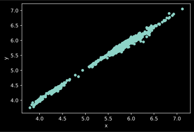
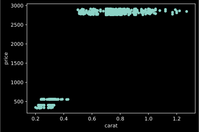
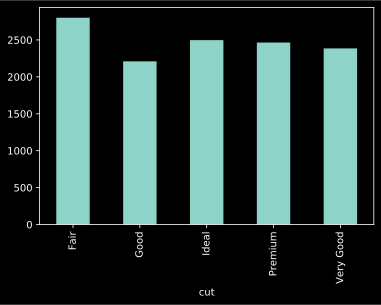
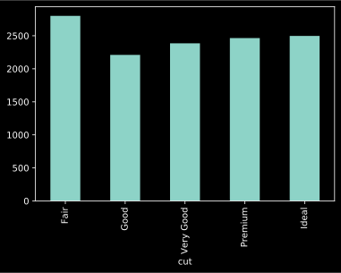
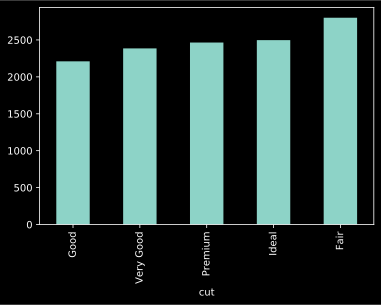

---
redirect_from:
  - "/14-pandas/pandas-a-quick-tour"
interact_link: content/14_pandas/pandas_a_quick_tour.ipynb
kernel_name: 
has_widgets: false
title: 'Pandas A Quick Tour'
prev_page:
  url: /14_pandas/pandas_a_quick_tour.html
  title: '14 pandas'
next_page:
  url: /14_pandas/edm_us_adult_census_income/questions.html
  title: 'edm us adult census income'
comment: "***PROGRAMMATICALLY GENERATED, DO NOT EDIT. SEE ORIGINAL FILES IN /content***"
---
<a href="https://colab.research.google.com/github/aviadr1/learn-advanced-python/blob/master/content/14_pandas/pandas_a_quick_tour.ipynb" target="_blank">

</a>


<div markdown="1" class="cell code_cell">
<div class="input_area" markdown="1">
```python
x=0

```
</div>

</div>


<div markdown="1" class="cell code_cell">
<div class="input_area" markdown="1">
```python
import pandas as pd

```
</div>

</div>


<div markdown="1" class="cell code_cell">
<div class="input_area" markdown="1">
```python
df = pd.read_csv('diamonds.csv')

```
</div>

</div>


<div markdown="1" class="cell code_cell">
<div class="input_area" markdown="1">
```python
type(df)

```
</div>

<div class="output_wrapper" markdown="1">
<div class="output_subarea" markdown="1">


{:.output_data_text}
```
pandas.core.frame.DataFrame
```


</div>
</div>
</div>


<div markdown="1" class="cell code_cell">
<div class="input_area" markdown="1">
```python
# df.head() 
df.head(10) 


```
</div>

<div class="output_wrapper" markdown="1">
<div class="output_subarea" markdown="1">


<div markdown="0" class="output output_html">
<div>
<style scoped>
    .dataframe tbody tr th:only-of-type {
        vertical-align: middle;
    }

    .dataframe tbody tr th {
        vertical-align: top;
    }

    .dataframe thead th {
        text-align: right;
    }
</style>
<table border="1" class="dataframe">
  <thead>
    <tr style="text-align: right;">
      <th></th>
      <th>#</th>
      <th>carat</th>
      <th>cut</th>
      <th>color</th>
      <th>clarity</th>
      <th>depth</th>
      <th>table</th>
      <th>price</th>
      <th>x</th>
      <th>y</th>
      <th>z</th>
    </tr>
  </thead>
  <tbody>
    <tr>
      <td>0</td>
      <td>1</td>
      <td>0.23</td>
      <td>Ideal</td>
      <td>E</td>
      <td>SI2</td>
      <td>61.5</td>
      <td>55.0</td>
      <td>326</td>
      <td>3.95</td>
      <td>3.98</td>
      <td>2.43</td>
    </tr>
    <tr>
      <td>1</td>
      <td>2</td>
      <td>0.21</td>
      <td>Premium</td>
      <td>E</td>
      <td>SI1</td>
      <td>59.8</td>
      <td>61.0</td>
      <td>326</td>
      <td>3.89</td>
      <td>3.84</td>
      <td>2.31</td>
    </tr>
    <tr>
      <td>2</td>
      <td>3</td>
      <td>0.23</td>
      <td>Good</td>
      <td>E</td>
      <td>VS1</td>
      <td>56.9</td>
      <td>65.0</td>
      <td>327</td>
      <td>4.05</td>
      <td>4.07</td>
      <td>2.31</td>
    </tr>
    <tr>
      <td>3</td>
      <td>4</td>
      <td>0.29</td>
      <td>Premium</td>
      <td>I</td>
      <td>VS2</td>
      <td>62.4</td>
      <td>58.0</td>
      <td>334</td>
      <td>4.20</td>
      <td>4.23</td>
      <td>2.63</td>
    </tr>
    <tr>
      <td>4</td>
      <td>5</td>
      <td>0.31</td>
      <td>Good</td>
      <td>J</td>
      <td>SI2</td>
      <td>63.3</td>
      <td>58.0</td>
      <td>335</td>
      <td>4.34</td>
      <td>4.35</td>
      <td>2.75</td>
    </tr>
    <tr>
      <td>5</td>
      <td>6</td>
      <td>0.24</td>
      <td>Very Good</td>
      <td>J</td>
      <td>VVS2</td>
      <td>62.8</td>
      <td>57.0</td>
      <td>336</td>
      <td>3.94</td>
      <td>3.96</td>
      <td>2.48</td>
    </tr>
    <tr>
      <td>6</td>
      <td>7</td>
      <td>0.24</td>
      <td>Very Good</td>
      <td>I</td>
      <td>VVS1</td>
      <td>62.3</td>
      <td>57.0</td>
      <td>336</td>
      <td>3.95</td>
      <td>3.98</td>
      <td>2.47</td>
    </tr>
    <tr>
      <td>7</td>
      <td>8</td>
      <td>0.26</td>
      <td>Very Good</td>
      <td>H</td>
      <td>SI1</td>
      <td>61.9</td>
      <td>55.0</td>
      <td>337</td>
      <td>4.07</td>
      <td>4.11</td>
      <td>2.53</td>
    </tr>
    <tr>
      <td>8</td>
      <td>9</td>
      <td>0.22</td>
      <td>Fair</td>
      <td>E</td>
      <td>VS2</td>
      <td>65.1</td>
      <td>61.0</td>
      <td>337</td>
      <td>3.87</td>
      <td>3.78</td>
      <td>2.49</td>
    </tr>
    <tr>
      <td>9</td>
      <td>10</td>
      <td>0.23</td>
      <td>Very Good</td>
      <td>H</td>
      <td>VS1</td>
      <td>59.4</td>
      <td>61.0</td>
      <td>338</td>
      <td>4.00</td>
      <td>4.05</td>
      <td>2.39</td>
    </tr>
  </tbody>
</table>
</div>
</div>


</div>
</div>
</div>


<div markdown="1" class="cell code_cell">
<div class="input_area" markdown="1">
```python
df.tail()

```
</div>

<div class="output_wrapper" markdown="1">
<div class="output_subarea" markdown="1">


<div markdown="0" class="output output_html">
<div>
<style scoped>
    .dataframe tbody tr th:only-of-type {
        vertical-align: middle;
    }

    .dataframe tbody tr th {
        vertical-align: top;
    }

    .dataframe thead th {
        text-align: right;
    }
</style>
<table border="1" class="dataframe">
  <thead>
    <tr style="text-align: right;">
      <th></th>
      <th>#</th>
      <th>carat</th>
      <th>cut</th>
      <th>color</th>
      <th>clarity</th>
      <th>depth</th>
      <th>table</th>
      <th>price</th>
      <th>x</th>
      <th>y</th>
      <th>z</th>
    </tr>
  </thead>
  <tbody>
    <tr>
      <td>1106</td>
      <td>1107</td>
      <td>0.91</td>
      <td>Premium</td>
      <td>I</td>
      <td>SI2</td>
      <td>62.0</td>
      <td>59.0</td>
      <td>2913</td>
      <td>6.18</td>
      <td>6.23</td>
      <td>3.85</td>
    </tr>
    <tr>
      <td>1107</td>
      <td>1108</td>
      <td>0.83</td>
      <td>Premium</td>
      <td>E</td>
      <td>SI1</td>
      <td>62.2</td>
      <td>59.0</td>
      <td>2913</td>
      <td>6.05</td>
      <td>5.97</td>
      <td>3.74</td>
    </tr>
    <tr>
      <td>1108</td>
      <td>1109</td>
      <td>0.85</td>
      <td>Ideal</td>
      <td>G</td>
      <td>SI2</td>
      <td>62.0</td>
      <td>57.0</td>
      <td>2913</td>
      <td>6.10</td>
      <td>6.02</td>
      <td>3.76</td>
    </tr>
    <tr>
      <td>1109</td>
      <td>1110</td>
      <td>0.80</td>
      <td>Very Good</td>
      <td>F</td>
      <td>SI1</td>
      <td>63.5</td>
      <td>55.0</td>
      <td>2914</td>
      <td>5.86</td>
      <td>5.89</td>
      <td>3.73</td>
    </tr>
    <tr>
      <td>1110</td>
      <td>1111</td>
      <td>0.73</td>
      <td>Ideal</td>
      <td>E</td>
      <td>SI1</td>
      <td>61.4</td>
      <td>58.0</td>
      <td>2914</td>
      <td>5.76</td>
      <td>5.80</td>
      <td>3.55</td>
    </tr>
  </tbody>
</table>
</div>
</div>


</div>
</div>
</div>


<div markdown="1" class="cell code_cell">
<div class="input_area" markdown="1">
```python
df.info()

```
</div>

<div class="output_wrapper" markdown="1">
<div class="output_subarea" markdown="1">
{:.output_stream}
```
<class 'pandas.core.frame.DataFrame'>
RangeIndex: 1111 entries, 0 to 1110
Data columns (total 11 columns):
#          1111 non-null int64
carat      1111 non-null float64
cut        1111 non-null object
color      1111 non-null object
clarity    1111 non-null object
depth      1111 non-null float64
table      1111 non-null float64
price      1111 non-null int64
x          1111 non-null float64
y          1111 non-null float64
z          1111 non-null float64
dtypes: float64(6), int64(2), object(3)
memory usage: 82.5+ KB
```
</div>
</div>
</div>


<div markdown="1" class="cell code_cell">
<div class="input_area" markdown="1">
```python
df.describe()

```
</div>

<div class="output_wrapper" markdown="1">
<div class="output_subarea" markdown="1">


<div markdown="0" class="output output_html">
<div>
<style scoped>
    .dataframe tbody tr th:only-of-type {
        vertical-align: middle;
    }

    .dataframe tbody tr th {
        vertical-align: top;
    }

    .dataframe thead th {
        text-align: right;
    }
</style>
<table border="1" class="dataframe">
  <thead>
    <tr style="text-align: right;">
      <th></th>
      <th>#</th>
      <th>carat</th>
      <th>depth</th>
      <th>table</th>
      <th>price</th>
      <th>x</th>
      <th>y</th>
      <th>z</th>
    </tr>
  </thead>
  <tbody>
    <tr>
      <td>count</td>
      <td>1111.00000</td>
      <td>1111.000000</td>
      <td>1111.000000</td>
      <td>1111.000000</td>
      <td>1111.000000</td>
      <td>1111.000000</td>
      <td>1111.000000</td>
      <td>1111.000000</td>
    </tr>
    <tr>
      <td>mean</td>
      <td>556.00000</td>
      <td>0.684086</td>
      <td>61.735914</td>
      <td>57.708731</td>
      <td>2456.058506</td>
      <td>5.588587</td>
      <td>5.581683</td>
      <td>3.447642</td>
    </tr>
    <tr>
      <td>std</td>
      <td>320.86238</td>
      <td>0.198297</td>
      <td>1.731228</td>
      <td>2.430179</td>
      <td>864.254630</td>
      <td>0.634599</td>
      <td>0.623776</td>
      <td>0.396959</td>
    </tr>
    <tr>
      <td>min</td>
      <td>1.00000</td>
      <td>0.200000</td>
      <td>53.000000</td>
      <td>52.000000</td>
      <td>326.000000</td>
      <td>3.790000</td>
      <td>3.750000</td>
      <td>2.270000</td>
    </tr>
    <tr>
      <td>25%</td>
      <td>278.50000</td>
      <td>0.700000</td>
      <td>60.900000</td>
      <td>56.000000</td>
      <td>2777.000000</td>
      <td>5.620000</td>
      <td>5.610000</td>
      <td>3.440000</td>
    </tr>
    <tr>
      <td>50%</td>
      <td>556.00000</td>
      <td>0.710000</td>
      <td>61.800000</td>
      <td>57.000000</td>
      <td>2822.000000</td>
      <td>5.760000</td>
      <td>5.760000</td>
      <td>3.550000</td>
    </tr>
    <tr>
      <td>75%</td>
      <td>833.50000</td>
      <td>0.790000</td>
      <td>62.600000</td>
      <td>59.000000</td>
      <td>2862.500000</td>
      <td>5.910000</td>
      <td>5.910000</td>
      <td>3.640000</td>
    </tr>
    <tr>
      <td>max</td>
      <td>1111.00000</td>
      <td>1.270000</td>
      <td>69.500000</td>
      <td>70.000000</td>
      <td>2914.000000</td>
      <td>7.120000</td>
      <td>7.050000</td>
      <td>4.330000</td>
    </tr>
  </tbody>
</table>
</div>
</div>


</div>
</div>
</div>


<div markdown="1" class="cell code_cell">
<div class="input_area" markdown="1">
```python
df['carat'].head()

```
</div>

<div class="output_wrapper" markdown="1">
<div class="output_subarea" markdown="1">


{:.output_data_text}
```
0    0.23
1    0.21
2    0.23
3    0.29
4    0.31
Name: carat, dtype: float64
```


</div>
</div>
</div>


<div markdown="1" class="cell code_cell">
<div class="input_area" markdown="1">
```python
df[['carat', 'price']].head()
# df[  ['carat', 'price']  ].head()

```
</div>

<div class="output_wrapper" markdown="1">
<div class="output_subarea" markdown="1">


<div markdown="0" class="output output_html">
<div>
<style scoped>
    .dataframe tbody tr th:only-of-type {
        vertical-align: middle;
    }

    .dataframe tbody tr th {
        vertical-align: top;
    }

    .dataframe thead th {
        text-align: right;
    }
</style>
<table border="1" class="dataframe">
  <thead>
    <tr style="text-align: right;">
      <th></th>
      <th>carat</th>
      <th>price</th>
    </tr>
  </thead>
  <tbody>
    <tr>
      <td>0</td>
      <td>0.23</td>
      <td>326</td>
    </tr>
    <tr>
      <td>1</td>
      <td>0.21</td>
      <td>326</td>
    </tr>
    <tr>
      <td>2</td>
      <td>0.23</td>
      <td>327</td>
    </tr>
    <tr>
      <td>3</td>
      <td>0.29</td>
      <td>334</td>
    </tr>
    <tr>
      <td>4</td>
      <td>0.31</td>
      <td>335</td>
    </tr>
  </tbody>
</table>
</div>
</div>


</div>
</div>
</div>


<div markdown="1" class="cell code_cell">
<div class="input_area" markdown="1">
```python
df.iloc[0]

```
</div>

<div class="output_wrapper" markdown="1">
<div class="output_subarea" markdown="1">


{:.output_data_text}
```
#              1
carat       0.23
cut        Ideal
color          E
clarity      SI2
depth       61.5
table         55
price        326
x           3.95
y           3.98
z           2.43
Name: 0, dtype: object
```


</div>
</div>
</div>


<div markdown="1" class="cell code_cell">
<div class="input_area" markdown="1">
```python
# df.iloc[0]['carat']
df.iloc[0][['carat', 'price']]

```
</div>

<div class="output_wrapper" markdown="1">
<div class="output_subarea" markdown="1">


{:.output_data_text}
```
carat    0.23
price     326
Name: 0, dtype: object
```


</div>
</div>
</div>


<div markdown="1" class="cell code_cell">
<div class="input_area" markdown="1">
```python
df.iloc[:10]

```
</div>

<div class="output_wrapper" markdown="1">
<div class="output_subarea" markdown="1">


<div markdown="0" class="output output_html">
<div>
<style scoped>
    .dataframe tbody tr th:only-of-type {
        vertical-align: middle;
    }

    .dataframe tbody tr th {
        vertical-align: top;
    }

    .dataframe thead th {
        text-align: right;
    }
</style>
<table border="1" class="dataframe">
  <thead>
    <tr style="text-align: right;">
      <th></th>
      <th>#</th>
      <th>carat</th>
      <th>cut</th>
      <th>color</th>
      <th>clarity</th>
      <th>depth</th>
      <th>table</th>
      <th>price</th>
      <th>x</th>
      <th>y</th>
      <th>z</th>
    </tr>
  </thead>
  <tbody>
    <tr>
      <td>0</td>
      <td>1</td>
      <td>0.23</td>
      <td>Ideal</td>
      <td>E</td>
      <td>SI2</td>
      <td>61.5</td>
      <td>55.0</td>
      <td>326</td>
      <td>3.95</td>
      <td>3.98</td>
      <td>2.43</td>
    </tr>
    <tr>
      <td>1</td>
      <td>2</td>
      <td>0.21</td>
      <td>Premium</td>
      <td>E</td>
      <td>SI1</td>
      <td>59.8</td>
      <td>61.0</td>
      <td>326</td>
      <td>3.89</td>
      <td>3.84</td>
      <td>2.31</td>
    </tr>
    <tr>
      <td>2</td>
      <td>3</td>
      <td>0.23</td>
      <td>Good</td>
      <td>E</td>
      <td>VS1</td>
      <td>56.9</td>
      <td>65.0</td>
      <td>327</td>
      <td>4.05</td>
      <td>4.07</td>
      <td>2.31</td>
    </tr>
    <tr>
      <td>3</td>
      <td>4</td>
      <td>0.29</td>
      <td>Premium</td>
      <td>I</td>
      <td>VS2</td>
      <td>62.4</td>
      <td>58.0</td>
      <td>334</td>
      <td>4.20</td>
      <td>4.23</td>
      <td>2.63</td>
    </tr>
    <tr>
      <td>4</td>
      <td>5</td>
      <td>0.31</td>
      <td>Good</td>
      <td>J</td>
      <td>SI2</td>
      <td>63.3</td>
      <td>58.0</td>
      <td>335</td>
      <td>4.34</td>
      <td>4.35</td>
      <td>2.75</td>
    </tr>
    <tr>
      <td>5</td>
      <td>6</td>
      <td>0.24</td>
      <td>Very Good</td>
      <td>J</td>
      <td>VVS2</td>
      <td>62.8</td>
      <td>57.0</td>
      <td>336</td>
      <td>3.94</td>
      <td>3.96</td>
      <td>2.48</td>
    </tr>
    <tr>
      <td>6</td>
      <td>7</td>
      <td>0.24</td>
      <td>Very Good</td>
      <td>I</td>
      <td>VVS1</td>
      <td>62.3</td>
      <td>57.0</td>
      <td>336</td>
      <td>3.95</td>
      <td>3.98</td>
      <td>2.47</td>
    </tr>
    <tr>
      <td>7</td>
      <td>8</td>
      <td>0.26</td>
      <td>Very Good</td>
      <td>H</td>
      <td>SI1</td>
      <td>61.9</td>
      <td>55.0</td>
      <td>337</td>
      <td>4.07</td>
      <td>4.11</td>
      <td>2.53</td>
    </tr>
    <tr>
      <td>8</td>
      <td>9</td>
      <td>0.22</td>
      <td>Fair</td>
      <td>E</td>
      <td>VS2</td>
      <td>65.1</td>
      <td>61.0</td>
      <td>337</td>
      <td>3.87</td>
      <td>3.78</td>
      <td>2.49</td>
    </tr>
    <tr>
      <td>9</td>
      <td>10</td>
      <td>0.23</td>
      <td>Very Good</td>
      <td>H</td>
      <td>VS1</td>
      <td>59.4</td>
      <td>61.0</td>
      <td>338</td>
      <td>4.00</td>
      <td>4.05</td>
      <td>2.39</td>
    </tr>
  </tbody>
</table>
</div>
</div>


</div>
</div>
</div>


<div markdown="1" class="cell code_cell">
<div class="input_area" markdown="1">
```python
df.iloc[ [0, 2, 1, 0] ]

```
</div>

<div class="output_wrapper" markdown="1">
<div class="output_subarea" markdown="1">


<div markdown="0" class="output output_html">
<div>
<style scoped>
    .dataframe tbody tr th:only-of-type {
        vertical-align: middle;
    }

    .dataframe tbody tr th {
        vertical-align: top;
    }

    .dataframe thead th {
        text-align: right;
    }
</style>
<table border="1" class="dataframe">
  <thead>
    <tr style="text-align: right;">
      <th></th>
      <th>#</th>
      <th>carat</th>
      <th>cut</th>
      <th>color</th>
      <th>clarity</th>
      <th>depth</th>
      <th>table</th>
      <th>price</th>
      <th>x</th>
      <th>y</th>
      <th>z</th>
    </tr>
  </thead>
  <tbody>
    <tr>
      <td>0</td>
      <td>1</td>
      <td>0.23</td>
      <td>Ideal</td>
      <td>E</td>
      <td>SI2</td>
      <td>61.5</td>
      <td>55.0</td>
      <td>326</td>
      <td>3.95</td>
      <td>3.98</td>
      <td>2.43</td>
    </tr>
    <tr>
      <td>2</td>
      <td>3</td>
      <td>0.23</td>
      <td>Good</td>
      <td>E</td>
      <td>VS1</td>
      <td>56.9</td>
      <td>65.0</td>
      <td>327</td>
      <td>4.05</td>
      <td>4.07</td>
      <td>2.31</td>
    </tr>
    <tr>
      <td>1</td>
      <td>2</td>
      <td>0.21</td>
      <td>Premium</td>
      <td>E</td>
      <td>SI1</td>
      <td>59.8</td>
      <td>61.0</td>
      <td>326</td>
      <td>3.89</td>
      <td>3.84</td>
      <td>2.31</td>
    </tr>
    <tr>
      <td>0</td>
      <td>1</td>
      <td>0.23</td>
      <td>Ideal</td>
      <td>E</td>
      <td>SI2</td>
      <td>61.5</td>
      <td>55.0</td>
      <td>326</td>
      <td>3.95</td>
      <td>3.98</td>
      <td>2.43</td>
    </tr>
  </tbody>
</table>
</div>
</div>


</div>
</div>
</div>


<div markdown="1" class="cell code_cell">
<div class="input_area" markdown="1">
```python
row0 = df.iloc[0]
row0

```
</div>

<div class="output_wrapper" markdown="1">
<div class="output_subarea" markdown="1">


{:.output_data_text}
```
#              1
carat       0.23
cut        Ideal
color          E
clarity      SI2
depth       61.5
table         55
price        326
x           3.95
y           3.98
z           2.43
Name: 0, dtype: object
```


</div>
</div>
</div>


<div markdown="1" class="cell code_cell">
<div class="input_area" markdown="1">
```python
row0['price']

```
</div>

<div class="output_wrapper" markdown="1">
<div class="output_subarea" markdown="1">


{:.output_data_text}
```
326
```


</div>
</div>
</div>


<div markdown="1" class="cell code_cell">
<div class="input_area" markdown="1">
```python
row0.iloc[1]

```
</div>

<div class="output_wrapper" markdown="1">
<div class="output_subarea" markdown="1">


{:.output_data_text}
```
0.23
```


</div>
</div>
</div>


<div markdown="1" class="cell code_cell">
<div class="input_area" markdown="1">
```python
row0.loc['price']

```
</div>

<div class="output_wrapper" markdown="1">
<div class="output_subarea" markdown="1">


{:.output_data_text}
```
326
```


</div>
</div>
</div>


<div markdown="1" class="cell code_cell">
<div class="input_area" markdown="1">
```python
carats = df.set_index('carat')
carats.head()

```
</div>

<div class="output_wrapper" markdown="1">
<div class="output_subarea" markdown="1">


<div markdown="0" class="output output_html">
<div>
<style scoped>
    .dataframe tbody tr th:only-of-type {
        vertical-align: middle;
    }

    .dataframe tbody tr th {
        vertical-align: top;
    }

    .dataframe thead th {
        text-align: right;
    }
</style>
<table border="1" class="dataframe">
  <thead>
    <tr style="text-align: right;">
      <th></th>
      <th>#</th>
      <th>cut</th>
      <th>color</th>
      <th>clarity</th>
      <th>depth</th>
      <th>table</th>
      <th>price</th>
      <th>x</th>
      <th>y</th>
      <th>z</th>
    </tr>
    <tr>
      <th>carat</th>
      <th></th>
      <th></th>
      <th></th>
      <th></th>
      <th></th>
      <th></th>
      <th></th>
      <th></th>
      <th></th>
      <th></th>
    </tr>
  </thead>
  <tbody>
    <tr>
      <td>0.23</td>
      <td>1</td>
      <td>Ideal</td>
      <td>E</td>
      <td>SI2</td>
      <td>61.5</td>
      <td>55.0</td>
      <td>326</td>
      <td>3.95</td>
      <td>3.98</td>
      <td>2.43</td>
    </tr>
    <tr>
      <td>0.21</td>
      <td>2</td>
      <td>Premium</td>
      <td>E</td>
      <td>SI1</td>
      <td>59.8</td>
      <td>61.0</td>
      <td>326</td>
      <td>3.89</td>
      <td>3.84</td>
      <td>2.31</td>
    </tr>
    <tr>
      <td>0.23</td>
      <td>3</td>
      <td>Good</td>
      <td>E</td>
      <td>VS1</td>
      <td>56.9</td>
      <td>65.0</td>
      <td>327</td>
      <td>4.05</td>
      <td>4.07</td>
      <td>2.31</td>
    </tr>
    <tr>
      <td>0.29</td>
      <td>4</td>
      <td>Premium</td>
      <td>I</td>
      <td>VS2</td>
      <td>62.4</td>
      <td>58.0</td>
      <td>334</td>
      <td>4.20</td>
      <td>4.23</td>
      <td>2.63</td>
    </tr>
    <tr>
      <td>0.31</td>
      <td>5</td>
      <td>Good</td>
      <td>J</td>
      <td>SI2</td>
      <td>63.3</td>
      <td>58.0</td>
      <td>335</td>
      <td>4.34</td>
      <td>4.35</td>
      <td>2.75</td>
    </tr>
  </tbody>
</table>
</div>
</div>


</div>
</div>
</div>


<div markdown="1" class="cell code_cell">
<div class="input_area" markdown="1">
```python
carats.loc[0.21]

```
</div>

<div class="output_wrapper" markdown="1">
<div class="output_subarea" markdown="1">


{:.output_data_text}
```
#                2
cut        Premium
color            E
clarity        SI1
depth         59.8
table           61
price          326
x             3.89
y             3.84
z             2.31
Name: 0.21, dtype: object
```


</div>
</div>
</div>


<div markdown="1" class="cell code_cell">
<div class="input_area" markdown="1">
```python
carats.info()

```
</div>

<div class="output_wrapper" markdown="1">
<div class="output_subarea" markdown="1">
{:.output_stream}
```
<class 'pandas.core.frame.DataFrame'>
Float64Index: 1111 entries, 0.23 to 0.73
Data columns (total 10 columns):
#          1111 non-null int64
cut        1111 non-null object
color      1111 non-null object
clarity    1111 non-null object
depth      1111 non-null float64
table      1111 non-null float64
price      1111 non-null int64
x          1111 non-null float64
y          1111 non-null float64
z          1111 non-null float64
dtypes: float64(5), int64(2), object(3)
memory usage: 114.5+ KB
```
</div>
</div>
</div>


<div markdown="1" class="cell code_cell">
<div class="input_area" markdown="1">
```python
carats.reset_index()

```
</div>

<div class="output_wrapper" markdown="1">
<div class="output_subarea" markdown="1">


<div markdown="0" class="output output_html">
<div>
<style scoped>
    .dataframe tbody tr th:only-of-type {
        vertical-align: middle;
    }

    .dataframe tbody tr th {
        vertical-align: top;
    }

    .dataframe thead th {
        text-align: right;
    }
</style>
<table border="1" class="dataframe">
  <thead>
    <tr style="text-align: right;">
      <th></th>
      <th>carat</th>
      <th>#</th>
      <th>cut</th>
      <th>color</th>
      <th>clarity</th>
      <th>depth</th>
      <th>table</th>
      <th>price</th>
      <th>x</th>
      <th>y</th>
      <th>z</th>
    </tr>
  </thead>
  <tbody>
    <tr>
      <td>0</td>
      <td>0.23</td>
      <td>1</td>
      <td>Ideal</td>
      <td>E</td>
      <td>SI2</td>
      <td>61.5</td>
      <td>55.0</td>
      <td>326</td>
      <td>3.95</td>
      <td>3.98</td>
      <td>2.43</td>
    </tr>
    <tr>
      <td>1</td>
      <td>0.21</td>
      <td>2</td>
      <td>Premium</td>
      <td>E</td>
      <td>SI1</td>
      <td>59.8</td>
      <td>61.0</td>
      <td>326</td>
      <td>3.89</td>
      <td>3.84</td>
      <td>2.31</td>
    </tr>
    <tr>
      <td>2</td>
      <td>0.23</td>
      <td>3</td>
      <td>Good</td>
      <td>E</td>
      <td>VS1</td>
      <td>56.9</td>
      <td>65.0</td>
      <td>327</td>
      <td>4.05</td>
      <td>4.07</td>
      <td>2.31</td>
    </tr>
    <tr>
      <td>3</td>
      <td>0.29</td>
      <td>4</td>
      <td>Premium</td>
      <td>I</td>
      <td>VS2</td>
      <td>62.4</td>
      <td>58.0</td>
      <td>334</td>
      <td>4.20</td>
      <td>4.23</td>
      <td>2.63</td>
    </tr>
    <tr>
      <td>4</td>
      <td>0.31</td>
      <td>5</td>
      <td>Good</td>
      <td>J</td>
      <td>SI2</td>
      <td>63.3</td>
      <td>58.0</td>
      <td>335</td>
      <td>4.34</td>
      <td>4.35</td>
      <td>2.75</td>
    </tr>
    <tr>
      <td>...</td>
      <td>...</td>
      <td>...</td>
      <td>...</td>
      <td>...</td>
      <td>...</td>
      <td>...</td>
      <td>...</td>
      <td>...</td>
      <td>...</td>
      <td>...</td>
      <td>...</td>
    </tr>
    <tr>
      <td>1106</td>
      <td>0.91</td>
      <td>1107</td>
      <td>Premium</td>
      <td>I</td>
      <td>SI2</td>
      <td>62.0</td>
      <td>59.0</td>
      <td>2913</td>
      <td>6.18</td>
      <td>6.23</td>
      <td>3.85</td>
    </tr>
    <tr>
      <td>1107</td>
      <td>0.83</td>
      <td>1108</td>
      <td>Premium</td>
      <td>E</td>
      <td>SI1</td>
      <td>62.2</td>
      <td>59.0</td>
      <td>2913</td>
      <td>6.05</td>
      <td>5.97</td>
      <td>3.74</td>
    </tr>
    <tr>
      <td>1108</td>
      <td>0.85</td>
      <td>1109</td>
      <td>Ideal</td>
      <td>G</td>
      <td>SI2</td>
      <td>62.0</td>
      <td>57.0</td>
      <td>2913</td>
      <td>6.10</td>
      <td>6.02</td>
      <td>3.76</td>
    </tr>
    <tr>
      <td>1109</td>
      <td>0.80</td>
      <td>1110</td>
      <td>Very Good</td>
      <td>F</td>
      <td>SI1</td>
      <td>63.5</td>
      <td>55.0</td>
      <td>2914</td>
      <td>5.86</td>
      <td>5.89</td>
      <td>3.73</td>
    </tr>
    <tr>
      <td>1110</td>
      <td>0.73</td>
      <td>1111</td>
      <td>Ideal</td>
      <td>E</td>
      <td>SI1</td>
      <td>61.4</td>
      <td>58.0</td>
      <td>2914</td>
      <td>5.76</td>
      <td>5.80</td>
      <td>3.55</td>
    </tr>
  </tbody>
</table>
<p>1111 rows × 11 columns</p>
</div>
</div>


</div>
</div>
</div>


<div markdown="1" class="cell code_cell">
<div class="input_area" markdown="1">
```python
df.head()

```
</div>

<div class="output_wrapper" markdown="1">
<div class="output_subarea" markdown="1">


<div markdown="0" class="output output_html">
<div>
<style scoped>
    .dataframe tbody tr th:only-of-type {
        vertical-align: middle;
    }

    .dataframe tbody tr th {
        vertical-align: top;
    }

    .dataframe thead th {
        text-align: right;
    }
</style>
<table border="1" class="dataframe">
  <thead>
    <tr style="text-align: right;">
      <th></th>
      <th>#</th>
      <th>carat</th>
      <th>cut</th>
      <th>color</th>
      <th>clarity</th>
      <th>depth</th>
      <th>table</th>
      <th>price</th>
      <th>x</th>
      <th>y</th>
      <th>z</th>
    </tr>
  </thead>
  <tbody>
    <tr>
      <td>0</td>
      <td>1</td>
      <td>0.23</td>
      <td>Ideal</td>
      <td>E</td>
      <td>SI2</td>
      <td>61.5</td>
      <td>55.0</td>
      <td>326</td>
      <td>3.95</td>
      <td>3.98</td>
      <td>2.43</td>
    </tr>
    <tr>
      <td>1</td>
      <td>2</td>
      <td>0.21</td>
      <td>Premium</td>
      <td>E</td>
      <td>SI1</td>
      <td>59.8</td>
      <td>61.0</td>
      <td>326</td>
      <td>3.89</td>
      <td>3.84</td>
      <td>2.31</td>
    </tr>
    <tr>
      <td>2</td>
      <td>3</td>
      <td>0.23</td>
      <td>Good</td>
      <td>E</td>
      <td>VS1</td>
      <td>56.9</td>
      <td>65.0</td>
      <td>327</td>
      <td>4.05</td>
      <td>4.07</td>
      <td>2.31</td>
    </tr>
    <tr>
      <td>3</td>
      <td>4</td>
      <td>0.29</td>
      <td>Premium</td>
      <td>I</td>
      <td>VS2</td>
      <td>62.4</td>
      <td>58.0</td>
      <td>334</td>
      <td>4.20</td>
      <td>4.23</td>
      <td>2.63</td>
    </tr>
    <tr>
      <td>4</td>
      <td>5</td>
      <td>0.31</td>
      <td>Good</td>
      <td>J</td>
      <td>SI2</td>
      <td>63.3</td>
      <td>58.0</td>
      <td>335</td>
      <td>4.34</td>
      <td>4.35</td>
      <td>2.75</td>
    </tr>
  </tbody>
</table>
</div>
</div>


</div>
</div>
</div>


<div markdown="1" class="cell code_cell">
<div class="input_area" markdown="1">
```python
df.head() *2

```
</div>

<div class="output_wrapper" markdown="1">
<div class="output_subarea" markdown="1">


<div markdown="0" class="output output_html">
<div>
<style scoped>
    .dataframe tbody tr th:only-of-type {
        vertical-align: middle;
    }

    .dataframe tbody tr th {
        vertical-align: top;
    }

    .dataframe thead th {
        text-align: right;
    }
</style>
<table border="1" class="dataframe">
  <thead>
    <tr style="text-align: right;">
      <th></th>
      <th>#</th>
      <th>carat</th>
      <th>cut</th>
      <th>color</th>
      <th>clarity</th>
      <th>depth</th>
      <th>table</th>
      <th>price</th>
      <th>x</th>
      <th>y</th>
      <th>z</th>
    </tr>
  </thead>
  <tbody>
    <tr>
      <td>0</td>
      <td>2</td>
      <td>0.46</td>
      <td>IdealIdeal</td>
      <td>EE</td>
      <td>SI2SI2</td>
      <td>123.0</td>
      <td>110.0</td>
      <td>652</td>
      <td>7.90</td>
      <td>7.96</td>
      <td>4.86</td>
    </tr>
    <tr>
      <td>1</td>
      <td>4</td>
      <td>0.42</td>
      <td>PremiumPremium</td>
      <td>EE</td>
      <td>SI1SI1</td>
      <td>119.6</td>
      <td>122.0</td>
      <td>652</td>
      <td>7.78</td>
      <td>7.68</td>
      <td>4.62</td>
    </tr>
    <tr>
      <td>2</td>
      <td>6</td>
      <td>0.46</td>
      <td>GoodGood</td>
      <td>EE</td>
      <td>VS1VS1</td>
      <td>113.8</td>
      <td>130.0</td>
      <td>654</td>
      <td>8.10</td>
      <td>8.14</td>
      <td>4.62</td>
    </tr>
    <tr>
      <td>3</td>
      <td>8</td>
      <td>0.58</td>
      <td>PremiumPremium</td>
      <td>II</td>
      <td>VS2VS2</td>
      <td>124.8</td>
      <td>116.0</td>
      <td>668</td>
      <td>8.40</td>
      <td>8.46</td>
      <td>5.26</td>
    </tr>
    <tr>
      <td>4</td>
      <td>10</td>
      <td>0.62</td>
      <td>GoodGood</td>
      <td>JJ</td>
      <td>SI2SI2</td>
      <td>126.6</td>
      <td>116.0</td>
      <td>670</td>
      <td>8.68</td>
      <td>8.70</td>
      <td>5.50</td>
    </tr>
  </tbody>
</table>
</div>
</div>


</div>
</div>
</div>


<div markdown="1" class="cell code_cell">
<div class="input_area" markdown="1">
```python
(df['carat'] + 1).head()

```
</div>

<div class="output_wrapper" markdown="1">
<div class="output_subarea" markdown="1">


{:.output_data_text}
```
0    1.23
1    1.21
2    1.23
3    1.29
4    1.31
Name: carat, dtype: float64
```


</div>
</div>
</div>


<div markdown="1" class="cell code_cell">
<div class="input_area" markdown="1">
```python
df['expensive'] = df['price'] > 1000
df.head()

```
</div>

<div class="output_wrapper" markdown="1">
<div class="output_subarea" markdown="1">


<div markdown="0" class="output output_html">
<div>
<style scoped>
    .dataframe tbody tr th:only-of-type {
        vertical-align: middle;
    }

    .dataframe tbody tr th {
        vertical-align: top;
    }

    .dataframe thead th {
        text-align: right;
    }
</style>
<table border="1" class="dataframe">
  <thead>
    <tr style="text-align: right;">
      <th></th>
      <th>#</th>
      <th>carat</th>
      <th>cut</th>
      <th>color</th>
      <th>clarity</th>
      <th>depth</th>
      <th>table</th>
      <th>price</th>
      <th>x</th>
      <th>y</th>
      <th>z</th>
      <th>expensive</th>
    </tr>
  </thead>
  <tbody>
    <tr>
      <td>0</td>
      <td>1</td>
      <td>0.23</td>
      <td>Ideal</td>
      <td>E</td>
      <td>SI2</td>
      <td>61.5</td>
      <td>55.0</td>
      <td>326</td>
      <td>3.95</td>
      <td>3.98</td>
      <td>2.43</td>
      <td>False</td>
    </tr>
    <tr>
      <td>1</td>
      <td>2</td>
      <td>0.21</td>
      <td>Premium</td>
      <td>E</td>
      <td>SI1</td>
      <td>59.8</td>
      <td>61.0</td>
      <td>326</td>
      <td>3.89</td>
      <td>3.84</td>
      <td>2.31</td>
      <td>False</td>
    </tr>
    <tr>
      <td>2</td>
      <td>3</td>
      <td>0.23</td>
      <td>Good</td>
      <td>E</td>
      <td>VS1</td>
      <td>56.9</td>
      <td>65.0</td>
      <td>327</td>
      <td>4.05</td>
      <td>4.07</td>
      <td>2.31</td>
      <td>False</td>
    </tr>
    <tr>
      <td>3</td>
      <td>4</td>
      <td>0.29</td>
      <td>Premium</td>
      <td>I</td>
      <td>VS2</td>
      <td>62.4</td>
      <td>58.0</td>
      <td>334</td>
      <td>4.20</td>
      <td>4.23</td>
      <td>2.63</td>
      <td>False</td>
    </tr>
    <tr>
      <td>4</td>
      <td>5</td>
      <td>0.31</td>
      <td>Good</td>
      <td>J</td>
      <td>SI2</td>
      <td>63.3</td>
      <td>58.0</td>
      <td>335</td>
      <td>4.34</td>
      <td>4.35</td>
      <td>2.75</td>
      <td>False</td>
    </tr>
  </tbody>
</table>
</div>
</div>


</div>
</div>
</div>


<div markdown="1" class="cell code_cell">
<div class="input_area" markdown="1">
```python
df.tail()

```
</div>

<div class="output_wrapper" markdown="1">
<div class="output_subarea" markdown="1">


<div markdown="0" class="output output_html">
<div>
<style scoped>
    .dataframe tbody tr th:only-of-type {
        vertical-align: middle;
    }

    .dataframe tbody tr th {
        vertical-align: top;
    }

    .dataframe thead th {
        text-align: right;
    }
</style>
<table border="1" class="dataframe">
  <thead>
    <tr style="text-align: right;">
      <th></th>
      <th>#</th>
      <th>carat</th>
      <th>cut</th>
      <th>color</th>
      <th>clarity</th>
      <th>depth</th>
      <th>table</th>
      <th>price</th>
      <th>x</th>
      <th>y</th>
      <th>z</th>
      <th>expensive</th>
    </tr>
  </thead>
  <tbody>
    <tr>
      <td>1106</td>
      <td>1107</td>
      <td>0.91</td>
      <td>Premium</td>
      <td>I</td>
      <td>SI2</td>
      <td>62.0</td>
      <td>59.0</td>
      <td>2913</td>
      <td>6.18</td>
      <td>6.23</td>
      <td>3.85</td>
      <td>True</td>
    </tr>
    <tr>
      <td>1107</td>
      <td>1108</td>
      <td>0.83</td>
      <td>Premium</td>
      <td>E</td>
      <td>SI1</td>
      <td>62.2</td>
      <td>59.0</td>
      <td>2913</td>
      <td>6.05</td>
      <td>5.97</td>
      <td>3.74</td>
      <td>True</td>
    </tr>
    <tr>
      <td>1108</td>
      <td>1109</td>
      <td>0.85</td>
      <td>Ideal</td>
      <td>G</td>
      <td>SI2</td>
      <td>62.0</td>
      <td>57.0</td>
      <td>2913</td>
      <td>6.10</td>
      <td>6.02</td>
      <td>3.76</td>
      <td>True</td>
    </tr>
    <tr>
      <td>1109</td>
      <td>1110</td>
      <td>0.80</td>
      <td>Very Good</td>
      <td>F</td>
      <td>SI1</td>
      <td>63.5</td>
      <td>55.0</td>
      <td>2914</td>
      <td>5.86</td>
      <td>5.89</td>
      <td>3.73</td>
      <td>True</td>
    </tr>
    <tr>
      <td>1110</td>
      <td>1111</td>
      <td>0.73</td>
      <td>Ideal</td>
      <td>E</td>
      <td>SI1</td>
      <td>61.4</td>
      <td>58.0</td>
      <td>2914</td>
      <td>5.76</td>
      <td>5.80</td>
      <td>3.55</td>
      <td>True</td>
    </tr>
  </tbody>
</table>
</div>
</div>


</div>
</div>
</div>


<div markdown="1" class="cell code_cell">
<div class="input_area" markdown="1">
```python
def is_large(row):
    vol = row['x'] * row['y'] * row['z']
    if vol > 20:
        return "big"

    else:
        return "small"

```
</div>

</div>


<div markdown="1" class="cell code_cell">
<div class="input_area" markdown="1">
```python
df['volume_label'] = df.apply(is_large, axis=1)
df.head()

```
</div>

<div class="output_wrapper" markdown="1">
<div class="output_subarea" markdown="1">


<div markdown="0" class="output output_html">
<div>
<style scoped>
    .dataframe tbody tr th:only-of-type {
        vertical-align: middle;
    }

    .dataframe tbody tr th {
        vertical-align: top;
    }

    .dataframe thead th {
        text-align: right;
    }
</style>
<table border="1" class="dataframe">
  <thead>
    <tr style="text-align: right;">
      <th></th>
      <th>#</th>
      <th>carat</th>
      <th>cut</th>
      <th>color</th>
      <th>clarity</th>
      <th>depth</th>
      <th>table</th>
      <th>price</th>
      <th>x</th>
      <th>y</th>
      <th>z</th>
      <th>expensive</th>
      <th>volume_label</th>
    </tr>
  </thead>
  <tbody>
    <tr>
      <td>0</td>
      <td>1</td>
      <td>0.23</td>
      <td>Ideal</td>
      <td>E</td>
      <td>SI2</td>
      <td>61.5</td>
      <td>55.0</td>
      <td>326</td>
      <td>3.95</td>
      <td>3.98</td>
      <td>2.43</td>
      <td>False</td>
      <td>big</td>
    </tr>
    <tr>
      <td>1</td>
      <td>2</td>
      <td>0.21</td>
      <td>Premium</td>
      <td>E</td>
      <td>SI1</td>
      <td>59.8</td>
      <td>61.0</td>
      <td>326</td>
      <td>3.89</td>
      <td>3.84</td>
      <td>2.31</td>
      <td>False</td>
      <td>big</td>
    </tr>
    <tr>
      <td>2</td>
      <td>3</td>
      <td>0.23</td>
      <td>Good</td>
      <td>E</td>
      <td>VS1</td>
      <td>56.9</td>
      <td>65.0</td>
      <td>327</td>
      <td>4.05</td>
      <td>4.07</td>
      <td>2.31</td>
      <td>False</td>
      <td>big</td>
    </tr>
    <tr>
      <td>3</td>
      <td>4</td>
      <td>0.29</td>
      <td>Premium</td>
      <td>I</td>
      <td>VS2</td>
      <td>62.4</td>
      <td>58.0</td>
      <td>334</td>
      <td>4.20</td>
      <td>4.23</td>
      <td>2.63</td>
      <td>False</td>
      <td>big</td>
    </tr>
    <tr>
      <td>4</td>
      <td>5</td>
      <td>0.31</td>
      <td>Good</td>
      <td>J</td>
      <td>SI2</td>
      <td>63.3</td>
      <td>58.0</td>
      <td>335</td>
      <td>4.34</td>
      <td>4.35</td>
      <td>2.75</td>
      <td>False</td>
      <td>big</td>
    </tr>
  </tbody>
</table>
</div>
</div>


</div>
</div>
</div>


<div markdown="1" class="cell code_cell">
<div class="input_area" markdown="1">
```python
df['expensive'].replace({True: 'yes!', False: 'no...'})

```
</div>

<div class="output_wrapper" markdown="1">
<div class="output_subarea" markdown="1">


{:.output_data_text}
```
0       no...
1       no...
2       no...
3       no...
4       no...
        ...  
1106     yes!
1107     yes!
1108     yes!
1109     yes!
1110     yes!
Name: expensive, Length: 1111, dtype: object
```


</div>
</div>
</div>


<div markdown="1" class="cell code_cell">
<div class="input_area" markdown="1">
```python
def depth_as_inch(row):
    inch = row['depth'] / 3
    row.drop('depth')
    return row

df.apply(depth_as_inch, axis=1)

```
</div>

<div class="output_wrapper" markdown="1">
<div class="output_subarea" markdown="1">


<div markdown="0" class="output output_html">
<div>
<style scoped>
    .dataframe tbody tr th:only-of-type {
        vertical-align: middle;
    }

    .dataframe tbody tr th {
        vertical-align: top;
    }

    .dataframe thead th {
        text-align: right;
    }
</style>
<table border="1" class="dataframe">
  <thead>
    <tr style="text-align: right;">
      <th></th>
      <th>#</th>
      <th>carat</th>
      <th>cut</th>
      <th>color</th>
      <th>clarity</th>
      <th>depth</th>
      <th>table</th>
      <th>price</th>
      <th>x</th>
      <th>y</th>
      <th>z</th>
      <th>expensive</th>
      <th>volume_label</th>
    </tr>
  </thead>
  <tbody>
    <tr>
      <td>0</td>
      <td>1</td>
      <td>0.23</td>
      <td>Ideal</td>
      <td>E</td>
      <td>SI2</td>
      <td>61.5</td>
      <td>55.0</td>
      <td>326</td>
      <td>3.95</td>
      <td>3.98</td>
      <td>2.43</td>
      <td>False</td>
      <td>big</td>
    </tr>
    <tr>
      <td>1</td>
      <td>2</td>
      <td>0.21</td>
      <td>Premium</td>
      <td>E</td>
      <td>SI1</td>
      <td>59.8</td>
      <td>61.0</td>
      <td>326</td>
      <td>3.89</td>
      <td>3.84</td>
      <td>2.31</td>
      <td>False</td>
      <td>big</td>
    </tr>
    <tr>
      <td>2</td>
      <td>3</td>
      <td>0.23</td>
      <td>Good</td>
      <td>E</td>
      <td>VS1</td>
      <td>56.9</td>
      <td>65.0</td>
      <td>327</td>
      <td>4.05</td>
      <td>4.07</td>
      <td>2.31</td>
      <td>False</td>
      <td>big</td>
    </tr>
    <tr>
      <td>3</td>
      <td>4</td>
      <td>0.29</td>
      <td>Premium</td>
      <td>I</td>
      <td>VS2</td>
      <td>62.4</td>
      <td>58.0</td>
      <td>334</td>
      <td>4.20</td>
      <td>4.23</td>
      <td>2.63</td>
      <td>False</td>
      <td>big</td>
    </tr>
    <tr>
      <td>4</td>
      <td>5</td>
      <td>0.31</td>
      <td>Good</td>
      <td>J</td>
      <td>SI2</td>
      <td>63.3</td>
      <td>58.0</td>
      <td>335</td>
      <td>4.34</td>
      <td>4.35</td>
      <td>2.75</td>
      <td>False</td>
      <td>big</td>
    </tr>
    <tr>
      <td>...</td>
      <td>...</td>
      <td>...</td>
      <td>...</td>
      <td>...</td>
      <td>...</td>
      <td>...</td>
      <td>...</td>
      <td>...</td>
      <td>...</td>
      <td>...</td>
      <td>...</td>
      <td>...</td>
      <td>...</td>
    </tr>
    <tr>
      <td>1106</td>
      <td>1107</td>
      <td>0.91</td>
      <td>Premium</td>
      <td>I</td>
      <td>SI2</td>
      <td>62.0</td>
      <td>59.0</td>
      <td>2913</td>
      <td>6.18</td>
      <td>6.23</td>
      <td>3.85</td>
      <td>True</td>
      <td>big</td>
    </tr>
    <tr>
      <td>1107</td>
      <td>1108</td>
      <td>0.83</td>
      <td>Premium</td>
      <td>E</td>
      <td>SI1</td>
      <td>62.2</td>
      <td>59.0</td>
      <td>2913</td>
      <td>6.05</td>
      <td>5.97</td>
      <td>3.74</td>
      <td>True</td>
      <td>big</td>
    </tr>
    <tr>
      <td>1108</td>
      <td>1109</td>
      <td>0.85</td>
      <td>Ideal</td>
      <td>G</td>
      <td>SI2</td>
      <td>62.0</td>
      <td>57.0</td>
      <td>2913</td>
      <td>6.10</td>
      <td>6.02</td>
      <td>3.76</td>
      <td>True</td>
      <td>big</td>
    </tr>
    <tr>
      <td>1109</td>
      <td>1110</td>
      <td>0.80</td>
      <td>Very Good</td>
      <td>F</td>
      <td>SI1</td>
      <td>63.5</td>
      <td>55.0</td>
      <td>2914</td>
      <td>5.86</td>
      <td>5.89</td>
      <td>3.73</td>
      <td>True</td>
      <td>big</td>
    </tr>
    <tr>
      <td>1110</td>
      <td>1111</td>
      <td>0.73</td>
      <td>Ideal</td>
      <td>E</td>
      <td>SI1</td>
      <td>61.4</td>
      <td>58.0</td>
      <td>2914</td>
      <td>5.76</td>
      <td>5.80</td>
      <td>3.55</td>
      <td>True</td>
      <td>big</td>
    </tr>
  </tbody>
</table>
<p>1111 rows × 13 columns</p>
</div>
</div>


</div>
</div>
</div>


<div markdown="1" class="cell code_cell">
<div class="input_area" markdown="1">
```python
df['carat'] + 1

```
</div>

<div class="output_wrapper" markdown="1">
<div class="output_subarea" markdown="1">


{:.output_data_text}
```
0       1.23
1       1.21
2       1.23
3       1.29
4       1.31
        ... 
1106    1.91
1107    1.83
1108    1.85
1109    1.80
1110    1.73
Name: carat, Length: 1111, dtype: float64
```


</div>
</div>
</div>


<div markdown="1" class="cell code_cell">
<div class="input_area" markdown="1">
```python
df

```
</div>

<div class="output_wrapper" markdown="1">
<div class="output_subarea" markdown="1">


<div markdown="0" class="output output_html">
<div>
<style scoped>
    .dataframe tbody tr th:only-of-type {
        vertical-align: middle;
    }

    .dataframe tbody tr th {
        vertical-align: top;
    }

    .dataframe thead th {
        text-align: right;
    }
</style>
<table border="1" class="dataframe">
  <thead>
    <tr style="text-align: right;">
      <th></th>
      <th>#</th>
      <th>carat</th>
      <th>cut</th>
      <th>color</th>
      <th>clarity</th>
      <th>depth</th>
      <th>table</th>
      <th>price</th>
      <th>x</th>
      <th>y</th>
      <th>z</th>
      <th>expensive</th>
      <th>volume_label</th>
    </tr>
  </thead>
  <tbody>
    <tr>
      <td>0</td>
      <td>1</td>
      <td>0.23</td>
      <td>Ideal</td>
      <td>E</td>
      <td>SI2</td>
      <td>61.5</td>
      <td>55.0</td>
      <td>326</td>
      <td>3.95</td>
      <td>3.98</td>
      <td>2.43</td>
      <td>False</td>
      <td>big</td>
    </tr>
    <tr>
      <td>1</td>
      <td>2</td>
      <td>0.21</td>
      <td>Premium</td>
      <td>E</td>
      <td>SI1</td>
      <td>59.8</td>
      <td>61.0</td>
      <td>326</td>
      <td>3.89</td>
      <td>3.84</td>
      <td>2.31</td>
      <td>False</td>
      <td>big</td>
    </tr>
    <tr>
      <td>2</td>
      <td>3</td>
      <td>0.23</td>
      <td>Good</td>
      <td>E</td>
      <td>VS1</td>
      <td>56.9</td>
      <td>65.0</td>
      <td>327</td>
      <td>4.05</td>
      <td>4.07</td>
      <td>2.31</td>
      <td>False</td>
      <td>big</td>
    </tr>
    <tr>
      <td>3</td>
      <td>4</td>
      <td>0.29</td>
      <td>Premium</td>
      <td>I</td>
      <td>VS2</td>
      <td>62.4</td>
      <td>58.0</td>
      <td>334</td>
      <td>4.20</td>
      <td>4.23</td>
      <td>2.63</td>
      <td>False</td>
      <td>big</td>
    </tr>
    <tr>
      <td>4</td>
      <td>5</td>
      <td>0.31</td>
      <td>Good</td>
      <td>J</td>
      <td>SI2</td>
      <td>63.3</td>
      <td>58.0</td>
      <td>335</td>
      <td>4.34</td>
      <td>4.35</td>
      <td>2.75</td>
      <td>False</td>
      <td>big</td>
    </tr>
    <tr>
      <td>...</td>
      <td>...</td>
      <td>...</td>
      <td>...</td>
      <td>...</td>
      <td>...</td>
      <td>...</td>
      <td>...</td>
      <td>...</td>
      <td>...</td>
      <td>...</td>
      <td>...</td>
      <td>...</td>
      <td>...</td>
    </tr>
    <tr>
      <td>1106</td>
      <td>1107</td>
      <td>0.91</td>
      <td>Premium</td>
      <td>I</td>
      <td>SI2</td>
      <td>62.0</td>
      <td>59.0</td>
      <td>2913</td>
      <td>6.18</td>
      <td>6.23</td>
      <td>3.85</td>
      <td>True</td>
      <td>big</td>
    </tr>
    <tr>
      <td>1107</td>
      <td>1108</td>
      <td>0.83</td>
      <td>Premium</td>
      <td>E</td>
      <td>SI1</td>
      <td>62.2</td>
      <td>59.0</td>
      <td>2913</td>
      <td>6.05</td>
      <td>5.97</td>
      <td>3.74</td>
      <td>True</td>
      <td>big</td>
    </tr>
    <tr>
      <td>1108</td>
      <td>1109</td>
      <td>0.85</td>
      <td>Ideal</td>
      <td>G</td>
      <td>SI2</td>
      <td>62.0</td>
      <td>57.0</td>
      <td>2913</td>
      <td>6.10</td>
      <td>6.02</td>
      <td>3.76</td>
      <td>True</td>
      <td>big</td>
    </tr>
    <tr>
      <td>1109</td>
      <td>1110</td>
      <td>0.80</td>
      <td>Very Good</td>
      <td>F</td>
      <td>SI1</td>
      <td>63.5</td>
      <td>55.0</td>
      <td>2914</td>
      <td>5.86</td>
      <td>5.89</td>
      <td>3.73</td>
      <td>True</td>
      <td>big</td>
    </tr>
    <tr>
      <td>1110</td>
      <td>1111</td>
      <td>0.73</td>
      <td>Ideal</td>
      <td>E</td>
      <td>SI1</td>
      <td>61.4</td>
      <td>58.0</td>
      <td>2914</td>
      <td>5.76</td>
      <td>5.80</td>
      <td>3.55</td>
      <td>True</td>
      <td>big</td>
    </tr>
  </tbody>
</table>
<p>1111 rows × 13 columns</p>
</div>
</div>


</div>
</div>
</div>


<div markdown="1" class="cell code_cell">
<div class="input_area" markdown="1">
```python
df.groupby('cut').mean()

```
</div>

<div class="output_wrapper" markdown="1">
<div class="output_subarea" markdown="1">


<div markdown="0" class="output output_html">
<div>
<style scoped>
    .dataframe tbody tr th:only-of-type {
        vertical-align: middle;
    }

    .dataframe tbody tr th {
        vertical-align: top;
    }

    .dataframe thead th {
        text-align: right;
    }
</style>
<table border="1" class="dataframe">
  <thead>
    <tr style="text-align: right;">
      <th></th>
      <th>#</th>
      <th>carat</th>
      <th>depth</th>
      <th>table</th>
      <th>price</th>
      <th>x</th>
      <th>y</th>
      <th>z</th>
      <th>expensive</th>
    </tr>
    <tr>
      <th>cut</th>
      <th></th>
      <th></th>
      <th></th>
      <th></th>
      <th></th>
      <th></th>
      <th></th>
      <th></th>
      <th></th>
    </tr>
  </thead>
  <tbody>
    <tr>
      <td>Fair</td>
      <td>606.666667</td>
      <td>0.902424</td>
      <td>63.457576</td>
      <td>60.242424</td>
      <td>2800.636364</td>
      <td>6.105909</td>
      <td>6.026667</td>
      <td>3.847273</td>
      <td>0.984848</td>
    </tr>
    <tr>
      <td>Good</td>
      <td>507.020202</td>
      <td>0.649394</td>
      <td>62.322222</td>
      <td>58.426263</td>
      <td>2210.737374</td>
      <td>5.421313</td>
      <td>5.433535</td>
      <td>3.381111</td>
      <td>0.737374</td>
    </tr>
    <tr>
      <td>Ideal</td>
      <td>586.541333</td>
      <td>0.664773</td>
      <td>61.695200</td>
      <td>55.973067</td>
      <td>2497.981333</td>
      <td>5.559173</td>
      <td>5.569333</td>
      <td>3.432240</td>
      <td>0.853333</td>
    </tr>
    <tr>
      <td>Premium</td>
      <td>567.831804</td>
      <td>0.690979</td>
      <td>61.223853</td>
      <td>58.776758</td>
      <td>2464.987768</td>
      <td>5.640826</td>
      <td>5.597248</td>
      <td>3.439205</td>
      <td>0.840979</td>
    </tr>
    <tr>
      <td>Very Good</td>
      <td>499.372951</td>
      <td>0.659549</td>
      <td>61.781148</td>
      <td>57.968443</td>
      <td>2385.991803</td>
      <td>5.491721</td>
      <td>5.519549</td>
      <td>3.401516</td>
      <td>0.811475</td>
    </tr>
  </tbody>
</table>
</div>
</div>


</div>
</div>
</div>


<div markdown="1" class="cell code_cell">
<div class="input_area" markdown="1">
```python
df.groupby('cut')[['price', 'carat']].mean()

```
</div>

<div class="output_wrapper" markdown="1">
<div class="output_subarea" markdown="1">


<div markdown="0" class="output output_html">
<div>
<style scoped>
    .dataframe tbody tr th:only-of-type {
        vertical-align: middle;
    }

    .dataframe tbody tr th {
        vertical-align: top;
    }

    .dataframe thead th {
        text-align: right;
    }
</style>
<table border="1" class="dataframe">
  <thead>
    <tr style="text-align: right;">
      <th></th>
      <th>price</th>
      <th>carat</th>
    </tr>
    <tr>
      <th>cut</th>
      <th></th>
      <th></th>
    </tr>
  </thead>
  <tbody>
    <tr>
      <td>Fair</td>
      <td>2800.636364</td>
      <td>0.902424</td>
    </tr>
    <tr>
      <td>Good</td>
      <td>2210.737374</td>
      <td>0.649394</td>
    </tr>
    <tr>
      <td>Ideal</td>
      <td>2497.981333</td>
      <td>0.664773</td>
    </tr>
    <tr>
      <td>Premium</td>
      <td>2464.987768</td>
      <td>0.690979</td>
    </tr>
    <tr>
      <td>Very Good</td>
      <td>2385.991803</td>
      <td>0.659549</td>
    </tr>
  </tbody>
</table>
</div>
</div>


</div>
</div>
</div>


<div markdown="1" class="cell code_cell">
<div class="input_area" markdown="1">
```python
clarity_cut = df.groupby(['cut', 'clarity'])[['price', 'carat']].mean()
clarity_cut.head()

```
</div>

<div class="output_wrapper" markdown="1">
<div class="output_subarea" markdown="1">


<div markdown="0" class="output output_html">
<div>
<style scoped>
    .dataframe tbody tr th:only-of-type {
        vertical-align: middle;
    }

    .dataframe tbody tr th {
        vertical-align: top;
    }

    .dataframe thead th {
        text-align: right;
    }
</style>
<table border="1" class="dataframe">
  <thead>
    <tr style="text-align: right;">
      <th></th>
      <th></th>
      <th>price</th>
      <th>carat</th>
    </tr>
    <tr>
      <th>cut</th>
      <th>clarity</th>
      <th></th>
      <th></th>
    </tr>
  </thead>
  <tbody>
    <tr>
      <td rowspan="5" valign="top">Fair</td>
      <td>I1</td>
      <td>2824.250000</td>
      <td>1.100000</td>
    </tr>
    <tr>
      <td>IF</td>
      <td>2861.000000</td>
      <td>0.620000</td>
    </tr>
    <tr>
      <td>SI1</td>
      <td>2855.562500</td>
      <td>0.925625</td>
    </tr>
    <tr>
      <td>SI2</td>
      <td>2835.172414</td>
      <td>0.956207</td>
    </tr>
    <tr>
      <td>VS1</td>
      <td>2853.250000</td>
      <td>0.807500</td>
    </tr>
  </tbody>
</table>
</div>
</div>


</div>
</div>
</div>


<div markdown="1" class="cell code_cell">
<div class="input_area" markdown="1">
```python
clarity_cut['price'].sort_values(ascending = False)

```
</div>

<div class="output_wrapper" markdown="1">
<div class="output_subarea" markdown="1">


{:.output_data_text}
```
cut        clarity
Fair       IF         2861.000000
           SI1        2855.562500
           VS1        2853.250000
Ideal      I1         2846.428571
Good       I1         2845.000000
Very Good  IF         2841.750000
Premium    IF         2837.000000
Fair       SI2        2835.172414
Good       VVS2       2827.333333
Fair       I1         2824.250000
Ideal      IF         2814.428571
Fair       VVS1       2801.000000
Ideal      VVS2       2725.631579
Very Good  SI2        2665.965517
Premium    VVS2       2664.076923
           I1         2630.166667
Ideal      SI1        2592.385246
           VS2        2577.722222
Good       VS2        2577.107143
Fair       VS2        2576.000000
Premium    VS1        2571.245283
           VS2        2559.631579
Very Good  VS2        2468.000000
           SI1        2405.694444
Premium    SI1        2374.200000
           SI2        2360.282051
Ideal      VVS1       2353.363636
           SI2        2303.129032
Very Good  VS1        2295.511111
           I1         2268.750000
Ideal      VS1        2261.923077
Good       VS1        2152.277778
           VVS1       2110.000000
           SI2        2092.076923
Very Good  VVS1       2061.333333
           VVS2       1961.687500
Good       SI1        1883.250000
Premium    VVS1       1674.875000
Name: price, dtype: float64
```


</div>
</div>
</div>


<div markdown="1" class="cell code_cell">
<div class="input_area" markdown="1">
```python
df['cut'].value_counts()

```
</div>

<div class="output_wrapper" markdown="1">
<div class="output_subarea" markdown="1">


{:.output_data_text}
```
Ideal        375
Premium      327
Very Good    244
Good          99
Fair          66
Name: cut, dtype: int64
```


</div>
</div>
</div>


<div markdown="1" class="cell code_cell">
<div class="input_area" markdown="1">
```python
df['cut'].unique()

```
</div>

<div class="output_wrapper" markdown="1">
<div class="output_subarea" markdown="1">


{:.output_data_text}
```
array(['Ideal', 'Premium', 'Good', 'Very Good', 'Fair'], dtype=object)
```


</div>
</div>
</div>


<div markdown="1" class="cell code_cell">
<div class="input_area" markdown="1">
```python
df.head()

```
</div>

<div class="output_wrapper" markdown="1">
<div class="output_subarea" markdown="1">


<div markdown="0" class="output output_html">
<div>
<style scoped>
    .dataframe tbody tr th:only-of-type {
        vertical-align: middle;
    }

    .dataframe tbody tr th {
        vertical-align: top;
    }

    .dataframe thead th {
        text-align: right;
    }
</style>
<table border="1" class="dataframe">
  <thead>
    <tr style="text-align: right;">
      <th></th>
      <th>#</th>
      <th>carat</th>
      <th>cut</th>
      <th>color</th>
      <th>clarity</th>
      <th>depth</th>
      <th>table</th>
      <th>price</th>
      <th>x</th>
      <th>y</th>
      <th>z</th>
      <th>expensive</th>
      <th>volume_label</th>
    </tr>
  </thead>
  <tbody>
    <tr>
      <td>0</td>
      <td>1</td>
      <td>0.23</td>
      <td>Ideal</td>
      <td>E</td>
      <td>SI2</td>
      <td>61.5</td>
      <td>55.0</td>
      <td>326</td>
      <td>3.95</td>
      <td>3.98</td>
      <td>2.43</td>
      <td>False</td>
      <td>big</td>
    </tr>
    <tr>
      <td>1</td>
      <td>2</td>
      <td>0.21</td>
      <td>Premium</td>
      <td>E</td>
      <td>SI1</td>
      <td>59.8</td>
      <td>61.0</td>
      <td>326</td>
      <td>3.89</td>
      <td>3.84</td>
      <td>2.31</td>
      <td>False</td>
      <td>big</td>
    </tr>
    <tr>
      <td>2</td>
      <td>3</td>
      <td>0.23</td>
      <td>Good</td>
      <td>E</td>
      <td>VS1</td>
      <td>56.9</td>
      <td>65.0</td>
      <td>327</td>
      <td>4.05</td>
      <td>4.07</td>
      <td>2.31</td>
      <td>False</td>
      <td>big</td>
    </tr>
    <tr>
      <td>3</td>
      <td>4</td>
      <td>0.29</td>
      <td>Premium</td>
      <td>I</td>
      <td>VS2</td>
      <td>62.4</td>
      <td>58.0</td>
      <td>334</td>
      <td>4.20</td>
      <td>4.23</td>
      <td>2.63</td>
      <td>False</td>
      <td>big</td>
    </tr>
    <tr>
      <td>4</td>
      <td>5</td>
      <td>0.31</td>
      <td>Good</td>
      <td>J</td>
      <td>SI2</td>
      <td>63.3</td>
      <td>58.0</td>
      <td>335</td>
      <td>4.34</td>
      <td>4.35</td>
      <td>2.75</td>
      <td>False</td>
      <td>big</td>
    </tr>
  </tbody>
</table>
</div>
</div>


</div>
</div>
</div>


<div markdown="1" class="cell code_cell">
<div class="input_area" markdown="1">
```python
df.plot.scatter(x='x', y='y')

```
</div>

<div class="output_wrapper" markdown="1">
<div class="output_subarea" markdown="1">


{:.output_data_text}
```
<matplotlib.axes._subplots.AxesSubplot at 0xc57e130>
```


</div>
</div>
<div class="output_wrapper" markdown="1">
<div class="output_subarea" markdown="1">



</div>
</div>
</div>


<div markdown="1" class="cell code_cell">
<div class="input_area" markdown="1">
```python
df.plot.scatter(x='carat', y='price')

```
</div>

<div class="output_wrapper" markdown="1">
<div class="output_subarea" markdown="1">


{:.output_data_text}
```
<matplotlib.axes._subplots.AxesSubplot at 0xc562cf0>
```


</div>
</div>
<div class="output_wrapper" markdown="1">
<div class="output_subarea" markdown="1">



</div>
</div>
</div>


<div markdown="1" class="cell code_cell">
<div class="input_area" markdown="1">
```python
df.groupby('cut')['price'].mean().plot.bar()

```
</div>

<div class="output_wrapper" markdown="1">
<div class="output_subarea" markdown="1">


{:.output_data_text}
```
<matplotlib.axes._subplots.AxesSubplot at 0xc6b53d0>
```


</div>
</div>
<div class="output_wrapper" markdown="1">
<div class="output_subarea" markdown="1">



</div>
</div>
</div>


<div markdown="1" class="cell code_cell">
<div class="input_area" markdown="1">
```python

df['cut'] = df['cut'].astype(pd.CategoricalDtype(['Fair', 'Good', 'Very Good', 'Premium', 'Ideal'], ordered=True))


```
</div>

</div>


<div markdown="1" class="cell code_cell">
<div class="input_area" markdown="1">
```python
df.info()

```
</div>

<div class="output_wrapper" markdown="1">
<div class="output_subarea" markdown="1">
{:.output_stream}
```
<class 'pandas.core.frame.DataFrame'>
RangeIndex: 1111 entries, 0 to 1110
Data columns (total 13 columns):
#               1111 non-null int64
carat           1111 non-null float64
cut             1111 non-null category
color           1111 non-null object
clarity         1111 non-null object
depth           1111 non-null float64
table           1111 non-null float64
price           1111 non-null int64
x               1111 non-null float64
y               1111 non-null float64
z               1111 non-null float64
expensive       1111 non-null bool
volume_label    1111 non-null object
dtypes: bool(1), category(1), float64(6), int64(2), object(3)
memory usage: 84.8+ KB
```
</div>
</div>
</div>


<div markdown="1" class="cell code_cell">
<div class="input_area" markdown="1">
```python
df.groupby('cut')['price'].mean().plot.bar()

```
</div>

<div class="output_wrapper" markdown="1">
<div class="output_subarea" markdown="1">


{:.output_data_text}
```
<matplotlib.axes._subplots.AxesSubplot at 0xc51cd70>
```


</div>
</div>
<div class="output_wrapper" markdown="1">
<div class="output_subarea" markdown="1">



</div>
</div>
</div>


<div markdown="1" class="cell code_cell">
<div class="input_area" markdown="1">
```python
df.groupby('cut')['price'].mean().sort_values().plot.bar()

```
</div>

<div class="output_wrapper" markdown="1">
<div class="output_subarea" markdown="1">


{:.output_data_text}
```
<matplotlib.axes._subplots.AxesSubplot at 0xdd60cd0>
```


</div>
</div>
<div class="output_wrapper" markdown="1">
<div class="output_subarea" markdown="1">



</div>
</div>
</div>


<div markdown="1" class="cell code_cell">
<div class="input_area" markdown="1">
```python
mask = df['cut'] == "Ideal"
df[mask].head()

```
</div>

<div class="output_wrapper" markdown="1">
<div class="output_subarea" markdown="1">


<div markdown="0" class="output output_html">
<div>
<style scoped>
    .dataframe tbody tr th:only-of-type {
        vertical-align: middle;
    }

    .dataframe tbody tr th {
        vertical-align: top;
    }

    .dataframe thead th {
        text-align: right;
    }
</style>
<table border="1" class="dataframe">
  <thead>
    <tr style="text-align: right;">
      <th></th>
      <th>#</th>
      <th>carat</th>
      <th>cut</th>
      <th>color</th>
      <th>clarity</th>
      <th>depth</th>
      <th>table</th>
      <th>price</th>
      <th>x</th>
      <th>y</th>
      <th>z</th>
      <th>expensive</th>
      <th>volume_label</th>
    </tr>
  </thead>
  <tbody>
    <tr>
      <td>0</td>
      <td>1</td>
      <td>0.23</td>
      <td>Ideal</td>
      <td>E</td>
      <td>SI2</td>
      <td>61.5</td>
      <td>55.0</td>
      <td>326</td>
      <td>3.95</td>
      <td>3.98</td>
      <td>2.43</td>
      <td>False</td>
      <td>big</td>
    </tr>
    <tr>
      <td>11</td>
      <td>12</td>
      <td>0.23</td>
      <td>Ideal</td>
      <td>J</td>
      <td>VS1</td>
      <td>62.8</td>
      <td>56.0</td>
      <td>340</td>
      <td>3.93</td>
      <td>3.90</td>
      <td>2.46</td>
      <td>False</td>
      <td>big</td>
    </tr>
    <tr>
      <td>13</td>
      <td>14</td>
      <td>0.31</td>
      <td>Ideal</td>
      <td>J</td>
      <td>SI2</td>
      <td>62.2</td>
      <td>54.0</td>
      <td>344</td>
      <td>4.35</td>
      <td>4.37</td>
      <td>2.71</td>
      <td>False</td>
      <td>big</td>
    </tr>
    <tr>
      <td>16</td>
      <td>17</td>
      <td>0.30</td>
      <td>Ideal</td>
      <td>I</td>
      <td>SI2</td>
      <td>62.0</td>
      <td>54.0</td>
      <td>348</td>
      <td>4.31</td>
      <td>4.34</td>
      <td>2.68</td>
      <td>False</td>
      <td>big</td>
    </tr>
    <tr>
      <td>39</td>
      <td>40</td>
      <td>0.33</td>
      <td>Ideal</td>
      <td>I</td>
      <td>SI2</td>
      <td>61.8</td>
      <td>55.0</td>
      <td>403</td>
      <td>4.49</td>
      <td>4.51</td>
      <td>2.78</td>
      <td>False</td>
      <td>big</td>
    </tr>
  </tbody>
</table>
</div>
</div>


</div>
</div>
</div>


<div markdown="1" class="cell code_cell">
<div class="input_area" markdown="1">
```python
mask = (df['cut'] == "Ideal") & (df['color'] == 'J')
df[mask].head()

```
</div>

<div class="output_wrapper" markdown="1">
<div class="output_subarea" markdown="1">


<div markdown="0" class="output output_html">
<div>
<style scoped>
    .dataframe tbody tr th:only-of-type {
        vertical-align: middle;
    }

    .dataframe tbody tr th {
        vertical-align: top;
    }

    .dataframe thead th {
        text-align: right;
    }
</style>
<table border="1" class="dataframe">
  <thead>
    <tr style="text-align: right;">
      <th></th>
      <th>#</th>
      <th>carat</th>
      <th>cut</th>
      <th>color</th>
      <th>clarity</th>
      <th>depth</th>
      <th>table</th>
      <th>price</th>
      <th>x</th>
      <th>y</th>
      <th>z</th>
      <th>expensive</th>
      <th>volume_label</th>
    </tr>
  </thead>
  <tbody>
    <tr>
      <td>11</td>
      <td>12</td>
      <td>0.23</td>
      <td>Ideal</td>
      <td>J</td>
      <td>VS1</td>
      <td>62.8</td>
      <td>56.0</td>
      <td>340</td>
      <td>3.93</td>
      <td>3.90</td>
      <td>2.46</td>
      <td>False</td>
      <td>big</td>
    </tr>
    <tr>
      <td>13</td>
      <td>14</td>
      <td>0.31</td>
      <td>Ideal</td>
      <td>J</td>
      <td>SI2</td>
      <td>62.2</td>
      <td>54.0</td>
      <td>344</td>
      <td>4.35</td>
      <td>4.37</td>
      <td>2.71</td>
      <td>False</td>
      <td>big</td>
    </tr>
    <tr>
      <td>41</td>
      <td>42</td>
      <td>0.33</td>
      <td>Ideal</td>
      <td>J</td>
      <td>SI1</td>
      <td>61.1</td>
      <td>56.0</td>
      <td>403</td>
      <td>4.49</td>
      <td>4.55</td>
      <td>2.76</td>
      <td>False</td>
      <td>big</td>
    </tr>
    <tr>
      <td>460</td>
      <td>461</td>
      <td>0.90</td>
      <td>Ideal</td>
      <td>J</td>
      <td>VS2</td>
      <td>62.8</td>
      <td>55.0</td>
      <td>2817</td>
      <td>6.20</td>
      <td>6.16</td>
      <td>3.88</td>
      <td>True</td>
      <td>big</td>
    </tr>
    <tr>
      <td>681</td>
      <td>682</td>
      <td>0.75</td>
      <td>Ideal</td>
      <td>J</td>
      <td>SI1</td>
      <td>61.5</td>
      <td>56.0</td>
      <td>2850</td>
      <td>5.83</td>
      <td>5.87</td>
      <td>3.60</td>
      <td>True</td>
      <td>big</td>
    </tr>
  </tbody>
</table>
</div>
</div>


</div>
</div>
</div>


<div markdown="1" class="cell code_cell">
<div class="input_area" markdown="1">
```python
df[   (df['cut'] == "Ideal") & (df['color'] == 'J')  ].head()

```
</div>

<div class="output_wrapper" markdown="1">
<div class="output_subarea" markdown="1">


<div markdown="0" class="output output_html">
<div>
<style scoped>
    .dataframe tbody tr th:only-of-type {
        vertical-align: middle;
    }

    .dataframe tbody tr th {
        vertical-align: top;
    }

    .dataframe thead th {
        text-align: right;
    }
</style>
<table border="1" class="dataframe">
  <thead>
    <tr style="text-align: right;">
      <th></th>
      <th>#</th>
      <th>carat</th>
      <th>cut</th>
      <th>color</th>
      <th>clarity</th>
      <th>depth</th>
      <th>table</th>
      <th>price</th>
      <th>x</th>
      <th>y</th>
      <th>z</th>
      <th>expensive</th>
      <th>volume_label</th>
    </tr>
  </thead>
  <tbody>
    <tr>
      <td>11</td>
      <td>12</td>
      <td>0.23</td>
      <td>Ideal</td>
      <td>J</td>
      <td>VS1</td>
      <td>62.8</td>
      <td>56.0</td>
      <td>340</td>
      <td>3.93</td>
      <td>3.90</td>
      <td>2.46</td>
      <td>False</td>
      <td>big</td>
    </tr>
    <tr>
      <td>13</td>
      <td>14</td>
      <td>0.31</td>
      <td>Ideal</td>
      <td>J</td>
      <td>SI2</td>
      <td>62.2</td>
      <td>54.0</td>
      <td>344</td>
      <td>4.35</td>
      <td>4.37</td>
      <td>2.71</td>
      <td>False</td>
      <td>big</td>
    </tr>
    <tr>
      <td>41</td>
      <td>42</td>
      <td>0.33</td>
      <td>Ideal</td>
      <td>J</td>
      <td>SI1</td>
      <td>61.1</td>
      <td>56.0</td>
      <td>403</td>
      <td>4.49</td>
      <td>4.55</td>
      <td>2.76</td>
      <td>False</td>
      <td>big</td>
    </tr>
    <tr>
      <td>460</td>
      <td>461</td>
      <td>0.90</td>
      <td>Ideal</td>
      <td>J</td>
      <td>VS2</td>
      <td>62.8</td>
      <td>55.0</td>
      <td>2817</td>
      <td>6.20</td>
      <td>6.16</td>
      <td>3.88</td>
      <td>True</td>
      <td>big</td>
    </tr>
    <tr>
      <td>681</td>
      <td>682</td>
      <td>0.75</td>
      <td>Ideal</td>
      <td>J</td>
      <td>SI1</td>
      <td>61.5</td>
      <td>56.0</td>
      <td>2850</td>
      <td>5.83</td>
      <td>5.87</td>
      <td>3.60</td>
      <td>True</td>
      <td>big</td>
    </tr>
  </tbody>
</table>
</div>
</div>


</div>
</div>
</div>


<div markdown="1" class="cell code_cell">
<div class="input_area" markdown="1">
```python
df[df['price'] > 1000].head()

```
</div>

<div class="output_wrapper" markdown="1">
<div class="output_subarea" markdown="1">


<div markdown="0" class="output output_html">
<div>
<style scoped>
    .dataframe tbody tr th:only-of-type {
        vertical-align: middle;
    }

    .dataframe tbody tr th {
        vertical-align: top;
    }

    .dataframe thead th {
        text-align: right;
    }
</style>
<table border="1" class="dataframe">
  <thead>
    <tr style="text-align: right;">
      <th></th>
      <th>#</th>
      <th>carat</th>
      <th>cut</th>
      <th>color</th>
      <th>clarity</th>
      <th>depth</th>
      <th>table</th>
      <th>price</th>
      <th>x</th>
      <th>y</th>
      <th>z</th>
      <th>expensive</th>
      <th>volume_label</th>
    </tr>
  </thead>
  <tbody>
    <tr>
      <td>90</td>
      <td>91</td>
      <td>0.70</td>
      <td>Ideal</td>
      <td>E</td>
      <td>SI1</td>
      <td>62.5</td>
      <td>57.0</td>
      <td>2757</td>
      <td>5.70</td>
      <td>5.72</td>
      <td>3.57</td>
      <td>True</td>
      <td>big</td>
    </tr>
    <tr>
      <td>91</td>
      <td>92</td>
      <td>0.86</td>
      <td>Fair</td>
      <td>E</td>
      <td>SI2</td>
      <td>55.1</td>
      <td>69.0</td>
      <td>2757</td>
      <td>6.45</td>
      <td>6.33</td>
      <td>3.52</td>
      <td>True</td>
      <td>big</td>
    </tr>
    <tr>
      <td>92</td>
      <td>93</td>
      <td>0.70</td>
      <td>Ideal</td>
      <td>G</td>
      <td>VS2</td>
      <td>61.6</td>
      <td>56.0</td>
      <td>2757</td>
      <td>5.70</td>
      <td>5.67</td>
      <td>3.50</td>
      <td>True</td>
      <td>big</td>
    </tr>
    <tr>
      <td>93</td>
      <td>94</td>
      <td>0.71</td>
      <td>Very Good</td>
      <td>E</td>
      <td>VS2</td>
      <td>62.4</td>
      <td>57.0</td>
      <td>2759</td>
      <td>5.68</td>
      <td>5.73</td>
      <td>3.56</td>
      <td>True</td>
      <td>big</td>
    </tr>
    <tr>
      <td>94</td>
      <td>95</td>
      <td>0.78</td>
      <td>Very Good</td>
      <td>G</td>
      <td>SI2</td>
      <td>63.8</td>
      <td>56.0</td>
      <td>2759</td>
      <td>5.81</td>
      <td>5.85</td>
      <td>3.72</td>
      <td>True</td>
      <td>big</td>
    </tr>
  </tbody>
</table>
</div>
</div>


</div>
</div>
</div>


<div markdown="1" class="cell code_cell">
<div class="input_area" markdown="1">
```python
df.loc[[90, 91]]

```
</div>

<div class="output_wrapper" markdown="1">
<div class="output_subarea" markdown="1">


<div markdown="0" class="output output_html">
<div>
<style scoped>
    .dataframe tbody tr th:only-of-type {
        vertical-align: middle;
    }

    .dataframe tbody tr th {
        vertical-align: top;
    }

    .dataframe thead th {
        text-align: right;
    }
</style>
<table border="1" class="dataframe">
  <thead>
    <tr style="text-align: right;">
      <th></th>
      <th>#</th>
      <th>carat</th>
      <th>cut</th>
      <th>color</th>
      <th>clarity</th>
      <th>depth</th>
      <th>table</th>
      <th>price</th>
      <th>x</th>
      <th>y</th>
      <th>z</th>
      <th>expensive</th>
      <th>volume_label</th>
    </tr>
  </thead>
  <tbody>
    <tr>
      <td>90</td>
      <td>91</td>
      <td>0.70</td>
      <td>Ideal</td>
      <td>E</td>
      <td>SI1</td>
      <td>62.5</td>
      <td>57.0</td>
      <td>2757</td>
      <td>5.70</td>
      <td>5.72</td>
      <td>3.57</td>
      <td>True</td>
      <td>big</td>
    </tr>
    <tr>
      <td>91</td>
      <td>92</td>
      <td>0.86</td>
      <td>Fair</td>
      <td>E</td>
      <td>SI2</td>
      <td>55.1</td>
      <td>69.0</td>
      <td>2757</td>
      <td>6.45</td>
      <td>6.33</td>
      <td>3.52</td>
      <td>True</td>
      <td>big</td>
    </tr>
  </tbody>
</table>
</div>
</div>


</div>
</div>
</div>

