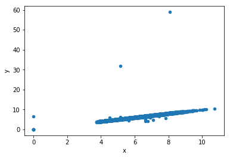
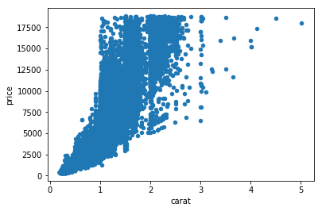
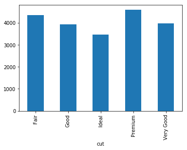
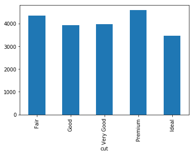
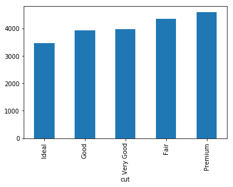
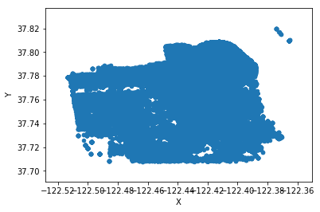

---
redirect_from:
  - "/14-pandas/pandas-a-quick-tour"
interact_link: content/14_pandas/pandas_a_quick_tour.ipynb
kernel_name: python3
has_widgets: false
title: '14 pandas'
prev_page:
  url: /13_complex_comprehensions/exercise/solutions.html
  title: 'Solutions'
next_page:
  url: /14_pandas/pandas_a_quick_tour.html
  title: 'Pandas A Quick Tour'
comment: "***PROGRAMMATICALLY GENERATED, DO NOT EDIT. SEE ORIGINAL FILES IN /content***"
---
<a href="https://colab.research.google.com/github/aviadr1/learn-advanced-python/blob/master/content/14_pandas/pandas_a_quick_tour.ipynb" target="_blank">

</a>


<div markdown="1" class="cell code_cell">
<div class="input_area" markdown="1">
```x=0

```
</div>

</div>


<div markdown="1" class="cell code_cell">
<div class="input_area" markdown="1">
```import pandas as pd

```
</div>

</div>


<div markdown="1" class="cell code_cell">
<div class="input_area" markdown="1">
```df = pd.read_csv('diamonds.csv')

```
</div>

</div>


<div markdown="1" class="cell code_cell">
<div class="input_area" markdown="1">
```type(df)

```
</div>

<div class="output_wrapper" markdown="1">
<div class="output_subarea" markdown="1">


{:.output_data_text}
```
pandas.core.frame.DataFrame
```


</div>
</div>
</div>


<div markdown="1" class="cell code_cell">
<div class="input_area" markdown="1">
```# df.head() 
df.head(10) 


```
</div>

<div class="output_wrapper" markdown="1">
<div class="output_subarea" markdown="1">


<div markdown="0" class="output output_html">
<div>
<style scoped>
    .dataframe tbody tr th:only-of-type {
        vertical-align: middle;
    }

    .dataframe tbody tr th {
        vertical-align: top;
    }

    .dataframe thead th {
        text-align: right;
    }
</style>
<table border="1" class="dataframe">
  <thead>
    <tr style="text-align: right;">
      <th></th>
      <th>#</th>
      <th>carat</th>
      <th>cut</th>
      <th>color</th>
      <th>clarity</th>
      <th>depth</th>
      <th>table</th>
      <th>price</th>
      <th>x</th>
      <th>y</th>
      <th>z</th>
    </tr>
  </thead>
  <tbody>
    <tr>
      <th>0</th>
      <td>1</td>
      <td>0.23</td>
      <td>Ideal</td>
      <td>E</td>
      <td>SI2</td>
      <td>61.5</td>
      <td>55.0</td>
      <td>326</td>
      <td>3.95</td>
      <td>3.98</td>
      <td>2.43</td>
    </tr>
    <tr>
      <th>1</th>
      <td>2</td>
      <td>0.21</td>
      <td>Premium</td>
      <td>E</td>
      <td>SI1</td>
      <td>59.8</td>
      <td>61.0</td>
      <td>326</td>
      <td>3.89</td>
      <td>3.84</td>
      <td>2.31</td>
    </tr>
    <tr>
      <th>2</th>
      <td>3</td>
      <td>0.23</td>
      <td>Good</td>
      <td>E</td>
      <td>VS1</td>
      <td>56.9</td>
      <td>65.0</td>
      <td>327</td>
      <td>4.05</td>
      <td>4.07</td>
      <td>2.31</td>
    </tr>
    <tr>
      <th>3</th>
      <td>4</td>
      <td>0.29</td>
      <td>Premium</td>
      <td>I</td>
      <td>VS2</td>
      <td>62.4</td>
      <td>58.0</td>
      <td>334</td>
      <td>4.20</td>
      <td>4.23</td>
      <td>2.63</td>
    </tr>
    <tr>
      <th>4</th>
      <td>5</td>
      <td>0.31</td>
      <td>Good</td>
      <td>J</td>
      <td>SI2</td>
      <td>63.3</td>
      <td>58.0</td>
      <td>335</td>
      <td>4.34</td>
      <td>4.35</td>
      <td>2.75</td>
    </tr>
    <tr>
      <th>5</th>
      <td>6</td>
      <td>0.24</td>
      <td>Very Good</td>
      <td>J</td>
      <td>VVS2</td>
      <td>62.8</td>
      <td>57.0</td>
      <td>336</td>
      <td>3.94</td>
      <td>3.96</td>
      <td>2.48</td>
    </tr>
    <tr>
      <th>6</th>
      <td>7</td>
      <td>0.24</td>
      <td>Very Good</td>
      <td>I</td>
      <td>VVS1</td>
      <td>62.3</td>
      <td>57.0</td>
      <td>336</td>
      <td>3.95</td>
      <td>3.98</td>
      <td>2.47</td>
    </tr>
    <tr>
      <th>7</th>
      <td>8</td>
      <td>0.26</td>
      <td>Very Good</td>
      <td>H</td>
      <td>SI1</td>
      <td>61.9</td>
      <td>55.0</td>
      <td>337</td>
      <td>4.07</td>
      <td>4.11</td>
      <td>2.53</td>
    </tr>
    <tr>
      <th>8</th>
      <td>9</td>
      <td>0.22</td>
      <td>Fair</td>
      <td>E</td>
      <td>VS2</td>
      <td>65.1</td>
      <td>61.0</td>
      <td>337</td>
      <td>3.87</td>
      <td>3.78</td>
      <td>2.49</td>
    </tr>
    <tr>
      <th>9</th>
      <td>10</td>
      <td>0.23</td>
      <td>Very Good</td>
      <td>H</td>
      <td>VS1</td>
      <td>59.4</td>
      <td>61.0</td>
      <td>338</td>
      <td>4.00</td>
      <td>4.05</td>
      <td>2.39</td>
    </tr>
  </tbody>
</table>
</div>
</div>


</div>
</div>
</div>


<div markdown="1" class="cell code_cell">
<div class="input_area" markdown="1">
```df.tail()

```
</div>

<div class="output_wrapper" markdown="1">
<div class="output_subarea" markdown="1">


<div markdown="0" class="output output_html">
<div>
<style scoped>
    .dataframe tbody tr th:only-of-type {
        vertical-align: middle;
    }

    .dataframe tbody tr th {
        vertical-align: top;
    }

    .dataframe thead th {
        text-align: right;
    }
</style>
<table border="1" class="dataframe">
  <thead>
    <tr style="text-align: right;">
      <th></th>
      <th>#</th>
      <th>carat</th>
      <th>cut</th>
      <th>color</th>
      <th>clarity</th>
      <th>depth</th>
      <th>table</th>
      <th>price</th>
      <th>x</th>
      <th>y</th>
      <th>z</th>
    </tr>
  </thead>
  <tbody>
    <tr>
      <th>53935</th>
      <td>53936</td>
      <td>0.72</td>
      <td>Ideal</td>
      <td>D</td>
      <td>SI1</td>
      <td>60.8</td>
      <td>57.0</td>
      <td>2757</td>
      <td>5.75</td>
      <td>5.76</td>
      <td>3.50</td>
    </tr>
    <tr>
      <th>53936</th>
      <td>53937</td>
      <td>0.72</td>
      <td>Good</td>
      <td>D</td>
      <td>SI1</td>
      <td>63.1</td>
      <td>55.0</td>
      <td>2757</td>
      <td>5.69</td>
      <td>5.75</td>
      <td>3.61</td>
    </tr>
    <tr>
      <th>53937</th>
      <td>53938</td>
      <td>0.70</td>
      <td>Very Good</td>
      <td>D</td>
      <td>SI1</td>
      <td>62.8</td>
      <td>60.0</td>
      <td>2757</td>
      <td>5.66</td>
      <td>5.68</td>
      <td>3.56</td>
    </tr>
    <tr>
      <th>53938</th>
      <td>53939</td>
      <td>0.86</td>
      <td>Premium</td>
      <td>H</td>
      <td>SI2</td>
      <td>61.0</td>
      <td>58.0</td>
      <td>2757</td>
      <td>6.15</td>
      <td>6.12</td>
      <td>3.74</td>
    </tr>
    <tr>
      <th>53939</th>
      <td>53940</td>
      <td>0.75</td>
      <td>Ideal</td>
      <td>D</td>
      <td>SI2</td>
      <td>62.2</td>
      <td>55.0</td>
      <td>2757</td>
      <td>5.83</td>
      <td>5.87</td>
      <td>3.64</td>
    </tr>
  </tbody>
</table>
</div>
</div>


</div>
</div>
</div>


<div markdown="1" class="cell code_cell">
<div class="input_area" markdown="1">
```df.info()

```
</div>

<div class="output_wrapper" markdown="1">
<div class="output_subarea" markdown="1">
{:.output_stream}
```
<class 'pandas.core.frame.DataFrame'>
RangeIndex: 53940 entries, 0 to 53939
Data columns (total 11 columns):
#          53940 non-null int64
carat      53940 non-null float64
cut        53940 non-null object
color      53940 non-null object
clarity    53940 non-null object
depth      53940 non-null float64
table      53940 non-null float64
price      53940 non-null int64
x          53940 non-null float64
y          53940 non-null float64
z          53940 non-null float64
dtypes: float64(6), int64(2), object(3)
memory usage: 4.5+ MB
```
</div>
</div>
</div>


<div markdown="1" class="cell code_cell">
<div class="input_area" markdown="1">
```df.describe()

```
</div>

<div class="output_wrapper" markdown="1">
<div class="output_subarea" markdown="1">


<div markdown="0" class="output output_html">
<div>
<style scoped>
    .dataframe tbody tr th:only-of-type {
        vertical-align: middle;
    }

    .dataframe tbody tr th {
        vertical-align: top;
    }

    .dataframe thead th {
        text-align: right;
    }
</style>
<table border="1" class="dataframe">
  <thead>
    <tr style="text-align: right;">
      <th></th>
      <th>#</th>
      <th>carat</th>
      <th>depth</th>
      <th>table</th>
      <th>price</th>
      <th>x</th>
      <th>y</th>
      <th>z</th>
    </tr>
  </thead>
  <tbody>
    <tr>
      <th>count</th>
      <td>53940.000000</td>
      <td>53940.000000</td>
      <td>53940.000000</td>
      <td>53940.000000</td>
      <td>53940.000000</td>
      <td>53940.000000</td>
      <td>53940.000000</td>
      <td>53940.000000</td>
    </tr>
    <tr>
      <th>mean</th>
      <td>26970.500000</td>
      <td>0.797940</td>
      <td>61.749405</td>
      <td>57.457184</td>
      <td>3932.799722</td>
      <td>5.731157</td>
      <td>5.734526</td>
      <td>3.538734</td>
    </tr>
    <tr>
      <th>std</th>
      <td>15571.281097</td>
      <td>0.474011</td>
      <td>1.432621</td>
      <td>2.234491</td>
      <td>3989.439738</td>
      <td>1.121761</td>
      <td>1.142135</td>
      <td>0.705699</td>
    </tr>
    <tr>
      <th>min</th>
      <td>1.000000</td>
      <td>0.200000</td>
      <td>43.000000</td>
      <td>43.000000</td>
      <td>326.000000</td>
      <td>0.000000</td>
      <td>0.000000</td>
      <td>0.000000</td>
    </tr>
    <tr>
      <th>25%</th>
      <td>13485.750000</td>
      <td>0.400000</td>
      <td>61.000000</td>
      <td>56.000000</td>
      <td>950.000000</td>
      <td>4.710000</td>
      <td>4.720000</td>
      <td>2.910000</td>
    </tr>
    <tr>
      <th>50%</th>
      <td>26970.500000</td>
      <td>0.700000</td>
      <td>61.800000</td>
      <td>57.000000</td>
      <td>2401.000000</td>
      <td>5.700000</td>
      <td>5.710000</td>
      <td>3.530000</td>
    </tr>
    <tr>
      <th>75%</th>
      <td>40455.250000</td>
      <td>1.040000</td>
      <td>62.500000</td>
      <td>59.000000</td>
      <td>5324.250000</td>
      <td>6.540000</td>
      <td>6.540000</td>
      <td>4.040000</td>
    </tr>
    <tr>
      <th>max</th>
      <td>53940.000000</td>
      <td>5.010000</td>
      <td>79.000000</td>
      <td>95.000000</td>
      <td>18823.000000</td>
      <td>10.740000</td>
      <td>58.900000</td>
      <td>31.800000</td>
    </tr>
  </tbody>
</table>
</div>
</div>


</div>
</div>
</div>


<div markdown="1" class="cell code_cell">
<div class="input_area" markdown="1">
```df['carat'].head()

```
</div>

<div class="output_wrapper" markdown="1">
<div class="output_subarea" markdown="1">


{:.output_data_text}
```
0    0.23
1    0.21
2    0.23
3    0.29
4    0.31
Name: carat, dtype: float64
```


</div>
</div>
</div>


<div markdown="1" class="cell code_cell">
<div class="input_area" markdown="1">
```df[['carat', 'price']].head()
# df[  ['carat', 'price']  ].head()

```
</div>

<div class="output_wrapper" markdown="1">
<div class="output_subarea" markdown="1">


<div markdown="0" class="output output_html">
<div>
<style scoped>
    .dataframe tbody tr th:only-of-type {
        vertical-align: middle;
    }

    .dataframe tbody tr th {
        vertical-align: top;
    }

    .dataframe thead th {
        text-align: right;
    }
</style>
<table border="1" class="dataframe">
  <thead>
    <tr style="text-align: right;">
      <th></th>
      <th>carat</th>
      <th>price</th>
    </tr>
  </thead>
  <tbody>
    <tr>
      <th>0</th>
      <td>0.23</td>
      <td>326</td>
    </tr>
    <tr>
      <th>1</th>
      <td>0.21</td>
      <td>326</td>
    </tr>
    <tr>
      <th>2</th>
      <td>0.23</td>
      <td>327</td>
    </tr>
    <tr>
      <th>3</th>
      <td>0.29</td>
      <td>334</td>
    </tr>
    <tr>
      <th>4</th>
      <td>0.31</td>
      <td>335</td>
    </tr>
  </tbody>
</table>
</div>
</div>


</div>
</div>
</div>


<div markdown="1" class="cell code_cell">
<div class="input_area" markdown="1">
```df.iloc[0]

```
</div>

<div class="output_wrapper" markdown="1">
<div class="output_subarea" markdown="1">


{:.output_data_text}
```
#              1
carat       0.23
cut        Ideal
color          E
clarity      SI2
depth       61.5
table         55
price        326
x           3.95
y           3.98
z           2.43
Name: 0, dtype: object
```


</div>
</div>
</div>


<div markdown="1" class="cell code_cell">
<div class="input_area" markdown="1">
```# df.iloc[0]['carat']
df.iloc[0][['carat', 'price']]

```
</div>

<div class="output_wrapper" markdown="1">
<div class="output_subarea" markdown="1">


{:.output_data_text}
```
carat    0.23
price     326
Name: 0, dtype: object
```


</div>
</div>
</div>


<div markdown="1" class="cell code_cell">
<div class="input_area" markdown="1">
```df.iloc[:10]

```
</div>

<div class="output_wrapper" markdown="1">
<div class="output_subarea" markdown="1">


<div markdown="0" class="output output_html">
<div>
<style scoped>
    .dataframe tbody tr th:only-of-type {
        vertical-align: middle;
    }

    .dataframe tbody tr th {
        vertical-align: top;
    }

    .dataframe thead th {
        text-align: right;
    }
</style>
<table border="1" class="dataframe">
  <thead>
    <tr style="text-align: right;">
      <th></th>
      <th>#</th>
      <th>carat</th>
      <th>cut</th>
      <th>color</th>
      <th>clarity</th>
      <th>depth</th>
      <th>table</th>
      <th>price</th>
      <th>x</th>
      <th>y</th>
      <th>z</th>
    </tr>
  </thead>
  <tbody>
    <tr>
      <th>0</th>
      <td>1</td>
      <td>0.23</td>
      <td>Ideal</td>
      <td>E</td>
      <td>SI2</td>
      <td>61.5</td>
      <td>55.0</td>
      <td>326</td>
      <td>3.95</td>
      <td>3.98</td>
      <td>2.43</td>
    </tr>
    <tr>
      <th>1</th>
      <td>2</td>
      <td>0.21</td>
      <td>Premium</td>
      <td>E</td>
      <td>SI1</td>
      <td>59.8</td>
      <td>61.0</td>
      <td>326</td>
      <td>3.89</td>
      <td>3.84</td>
      <td>2.31</td>
    </tr>
    <tr>
      <th>2</th>
      <td>3</td>
      <td>0.23</td>
      <td>Good</td>
      <td>E</td>
      <td>VS1</td>
      <td>56.9</td>
      <td>65.0</td>
      <td>327</td>
      <td>4.05</td>
      <td>4.07</td>
      <td>2.31</td>
    </tr>
    <tr>
      <th>3</th>
      <td>4</td>
      <td>0.29</td>
      <td>Premium</td>
      <td>I</td>
      <td>VS2</td>
      <td>62.4</td>
      <td>58.0</td>
      <td>334</td>
      <td>4.20</td>
      <td>4.23</td>
      <td>2.63</td>
    </tr>
    <tr>
      <th>4</th>
      <td>5</td>
      <td>0.31</td>
      <td>Good</td>
      <td>J</td>
      <td>SI2</td>
      <td>63.3</td>
      <td>58.0</td>
      <td>335</td>
      <td>4.34</td>
      <td>4.35</td>
      <td>2.75</td>
    </tr>
    <tr>
      <th>5</th>
      <td>6</td>
      <td>0.24</td>
      <td>Very Good</td>
      <td>J</td>
      <td>VVS2</td>
      <td>62.8</td>
      <td>57.0</td>
      <td>336</td>
      <td>3.94</td>
      <td>3.96</td>
      <td>2.48</td>
    </tr>
    <tr>
      <th>6</th>
      <td>7</td>
      <td>0.24</td>
      <td>Very Good</td>
      <td>I</td>
      <td>VVS1</td>
      <td>62.3</td>
      <td>57.0</td>
      <td>336</td>
      <td>3.95</td>
      <td>3.98</td>
      <td>2.47</td>
    </tr>
    <tr>
      <th>7</th>
      <td>8</td>
      <td>0.26</td>
      <td>Very Good</td>
      <td>H</td>
      <td>SI1</td>
      <td>61.9</td>
      <td>55.0</td>
      <td>337</td>
      <td>4.07</td>
      <td>4.11</td>
      <td>2.53</td>
    </tr>
    <tr>
      <th>8</th>
      <td>9</td>
      <td>0.22</td>
      <td>Fair</td>
      <td>E</td>
      <td>VS2</td>
      <td>65.1</td>
      <td>61.0</td>
      <td>337</td>
      <td>3.87</td>
      <td>3.78</td>
      <td>2.49</td>
    </tr>
    <tr>
      <th>9</th>
      <td>10</td>
      <td>0.23</td>
      <td>Very Good</td>
      <td>H</td>
      <td>VS1</td>
      <td>59.4</td>
      <td>61.0</td>
      <td>338</td>
      <td>4.00</td>
      <td>4.05</td>
      <td>2.39</td>
    </tr>
  </tbody>
</table>
</div>
</div>


</div>
</div>
</div>


<div markdown="1" class="cell code_cell">
<div class="input_area" markdown="1">
```df.iloc[ [0, 2, 1, 0] ] 

```
</div>

<div class="output_wrapper" markdown="1">
<div class="output_subarea" markdown="1">


<div markdown="0" class="output output_html">
<div>
<style scoped>
    .dataframe tbody tr th:only-of-type {
        vertical-align: middle;
    }

    .dataframe tbody tr th {
        vertical-align: top;
    }

    .dataframe thead th {
        text-align: right;
    }
</style>
<table border="1" class="dataframe">
  <thead>
    <tr style="text-align: right;">
      <th></th>
      <th>#</th>
      <th>carat</th>
      <th>cut</th>
      <th>color</th>
      <th>clarity</th>
      <th>depth</th>
      <th>table</th>
      <th>price</th>
      <th>x</th>
      <th>y</th>
      <th>z</th>
    </tr>
  </thead>
  <tbody>
    <tr>
      <th>0</th>
      <td>1</td>
      <td>0.23</td>
      <td>Ideal</td>
      <td>E</td>
      <td>SI2</td>
      <td>61.5</td>
      <td>55.0</td>
      <td>326</td>
      <td>3.95</td>
      <td>3.98</td>
      <td>2.43</td>
    </tr>
    <tr>
      <th>2</th>
      <td>3</td>
      <td>0.23</td>
      <td>Good</td>
      <td>E</td>
      <td>VS1</td>
      <td>56.9</td>
      <td>65.0</td>
      <td>327</td>
      <td>4.05</td>
      <td>4.07</td>
      <td>2.31</td>
    </tr>
    <tr>
      <th>1</th>
      <td>2</td>
      <td>0.21</td>
      <td>Premium</td>
      <td>E</td>
      <td>SI1</td>
      <td>59.8</td>
      <td>61.0</td>
      <td>326</td>
      <td>3.89</td>
      <td>3.84</td>
      <td>2.31</td>
    </tr>
    <tr>
      <th>0</th>
      <td>1</td>
      <td>0.23</td>
      <td>Ideal</td>
      <td>E</td>
      <td>SI2</td>
      <td>61.5</td>
      <td>55.0</td>
      <td>326</td>
      <td>3.95</td>
      <td>3.98</td>
      <td>2.43</td>
    </tr>
  </tbody>
</table>
</div>
</div>


</div>
</div>
</div>


<div markdown="1" class="cell code_cell">
<div class="input_area" markdown="1">
```row0 = df.iloc[0]
row0

```
</div>

<div class="output_wrapper" markdown="1">
<div class="output_subarea" markdown="1">


{:.output_data_text}
```
#              1
carat       0.23
cut        Ideal
color          E
clarity      SI2
depth       61.5
table         55
price        326
x           3.95
y           3.98
z           2.43
Name: 0, dtype: object
```


</div>
</div>
</div>


<div markdown="1" class="cell code_cell">
<div class="input_area" markdown="1">
```row0['price']

```
</div>

<div class="output_wrapper" markdown="1">
<div class="output_subarea" markdown="1">


{:.output_data_text}
```
326
```


</div>
</div>
</div>


<div markdown="1" class="cell code_cell">
<div class="input_area" markdown="1">
```row0.iloc[1]

```
</div>

<div class="output_wrapper" markdown="1">
<div class="output_subarea" markdown="1">


{:.output_data_text}
```
0.23
```


</div>
</div>
</div>


<div markdown="1" class="cell code_cell">
<div class="input_area" markdown="1">
```row0.loc['price']

```
</div>

<div class="output_wrapper" markdown="1">
<div class="output_subarea" markdown="1">


{:.output_data_text}
```
326
```


</div>
</div>
</div>


<div markdown="1" class="cell code_cell">
<div class="input_area" markdown="1">
```carats = df.set_index('carat')
carats.head()

```
</div>

<div class="output_wrapper" markdown="1">
<div class="output_subarea" markdown="1">


<div markdown="0" class="output output_html">
<div>
<style scoped>
    .dataframe tbody tr th:only-of-type {
        vertical-align: middle;
    }

    .dataframe tbody tr th {
        vertical-align: top;
    }

    .dataframe thead th {
        text-align: right;
    }
</style>
<table border="1" class="dataframe">
  <thead>
    <tr style="text-align: right;">
      <th></th>
      <th>#</th>
      <th>cut</th>
      <th>color</th>
      <th>clarity</th>
      <th>depth</th>
      <th>table</th>
      <th>price</th>
      <th>x</th>
      <th>y</th>
      <th>z</th>
    </tr>
    <tr>
      <th>carat</th>
      <th></th>
      <th></th>
      <th></th>
      <th></th>
      <th></th>
      <th></th>
      <th></th>
      <th></th>
      <th></th>
      <th></th>
    </tr>
  </thead>
  <tbody>
    <tr>
      <th>0.23</th>
      <td>1</td>
      <td>Ideal</td>
      <td>E</td>
      <td>SI2</td>
      <td>61.5</td>
      <td>55.0</td>
      <td>326</td>
      <td>3.95</td>
      <td>3.98</td>
      <td>2.43</td>
    </tr>
    <tr>
      <th>0.21</th>
      <td>2</td>
      <td>Premium</td>
      <td>E</td>
      <td>SI1</td>
      <td>59.8</td>
      <td>61.0</td>
      <td>326</td>
      <td>3.89</td>
      <td>3.84</td>
      <td>2.31</td>
    </tr>
    <tr>
      <th>0.23</th>
      <td>3</td>
      <td>Good</td>
      <td>E</td>
      <td>VS1</td>
      <td>56.9</td>
      <td>65.0</td>
      <td>327</td>
      <td>4.05</td>
      <td>4.07</td>
      <td>2.31</td>
    </tr>
    <tr>
      <th>0.29</th>
      <td>4</td>
      <td>Premium</td>
      <td>I</td>
      <td>VS2</td>
      <td>62.4</td>
      <td>58.0</td>
      <td>334</td>
      <td>4.20</td>
      <td>4.23</td>
      <td>2.63</td>
    </tr>
    <tr>
      <th>0.31</th>
      <td>5</td>
      <td>Good</td>
      <td>J</td>
      <td>SI2</td>
      <td>63.3</td>
      <td>58.0</td>
      <td>335</td>
      <td>4.34</td>
      <td>4.35</td>
      <td>2.75</td>
    </tr>
  </tbody>
</table>
</div>
</div>


</div>
</div>
</div>


<div markdown="1" class="cell code_cell">
<div class="input_area" markdown="1">
```carats.loc[0.21]

```
</div>

<div class="output_wrapper" markdown="1">
<div class="output_subarea" markdown="1">


<div markdown="0" class="output output_html">
<div>
<style scoped>
    .dataframe tbody tr th:only-of-type {
        vertical-align: middle;
    }

    .dataframe tbody tr th {
        vertical-align: top;
    }

    .dataframe thead th {
        text-align: right;
    }
</style>
<table border="1" class="dataframe">
  <thead>
    <tr style="text-align: right;">
      <th></th>
      <th>#</th>
      <th>cut</th>
      <th>color</th>
      <th>clarity</th>
      <th>depth</th>
      <th>table</th>
      <th>price</th>
      <th>x</th>
      <th>y</th>
      <th>z</th>
    </tr>
    <tr>
      <th>carat</th>
      <th></th>
      <th></th>
      <th></th>
      <th></th>
      <th></th>
      <th></th>
      <th></th>
      <th></th>
      <th></th>
      <th></th>
    </tr>
  </thead>
  <tbody>
    <tr>
      <th>0.21</th>
      <td>2</td>
      <td>Premium</td>
      <td>E</td>
      <td>SI1</td>
      <td>59.8</td>
      <td>61.0</td>
      <td>326</td>
      <td>3.89</td>
      <td>3.84</td>
      <td>2.31</td>
    </tr>
    <tr>
      <th>0.21</th>
      <td>38274</td>
      <td>Very Good</td>
      <td>E</td>
      <td>VS2</td>
      <td>63.2</td>
      <td>54.0</td>
      <td>386</td>
      <td>3.82</td>
      <td>3.78</td>
      <td>2.40</td>
    </tr>
    <tr>
      <th>0.21</th>
      <td>38275</td>
      <td>Premium</td>
      <td>E</td>
      <td>VS2</td>
      <td>60.5</td>
      <td>59.0</td>
      <td>386</td>
      <td>3.87</td>
      <td>3.83</td>
      <td>2.33</td>
    </tr>
    <tr>
      <th>0.21</th>
      <td>38276</td>
      <td>Premium</td>
      <td>E</td>
      <td>VS2</td>
      <td>59.6</td>
      <td>56.0</td>
      <td>386</td>
      <td>3.93</td>
      <td>3.89</td>
      <td>2.33</td>
    </tr>
    <tr>
      <th>0.21</th>
      <td>38277</td>
      <td>Premium</td>
      <td>D</td>
      <td>VS2</td>
      <td>61.6</td>
      <td>59.0</td>
      <td>386</td>
      <td>3.82</td>
      <td>3.78</td>
      <td>2.34</td>
    </tr>
    <tr>
      <th>0.21</th>
      <td>38278</td>
      <td>Premium</td>
      <td>D</td>
      <td>VS2</td>
      <td>60.6</td>
      <td>60.0</td>
      <td>386</td>
      <td>3.85</td>
      <td>3.81</td>
      <td>2.32</td>
    </tr>
    <tr>
      <th>0.21</th>
      <td>38279</td>
      <td>Premium</td>
      <td>D</td>
      <td>VS2</td>
      <td>59.1</td>
      <td>62.0</td>
      <td>386</td>
      <td>3.89</td>
      <td>3.86</td>
      <td>2.29</td>
    </tr>
    <tr>
      <th>0.21</th>
      <td>38280</td>
      <td>Premium</td>
      <td>D</td>
      <td>VS2</td>
      <td>58.3</td>
      <td>59.0</td>
      <td>386</td>
      <td>3.96</td>
      <td>3.93</td>
      <td>2.30</td>
    </tr>
    <tr>
      <th>0.21</th>
      <td>43990</td>
      <td>Premium</td>
      <td>E</td>
      <td>SI2</td>
      <td>61.9</td>
      <td>56.0</td>
      <td>394</td>
      <td>3.84</td>
      <td>3.82</td>
      <td>2.37</td>
    </tr>
  </tbody>
</table>
</div>
</div>


</div>
</div>
</div>


<div markdown="1" class="cell code_cell">
<div class="input_area" markdown="1">
```carats.info()

```
</div>

<div class="output_wrapper" markdown="1">
<div class="output_subarea" markdown="1">
{:.output_stream}
```
<class 'pandas.core.frame.DataFrame'>
Float64Index: 53940 entries, 0.23 to 0.75
Data columns (total 10 columns):
#          53940 non-null int64
cut        53940 non-null object
color      53940 non-null object
clarity    53940 non-null object
depth      53940 non-null float64
table      53940 non-null float64
price      53940 non-null int64
x          53940 non-null float64
y          53940 non-null float64
z          53940 non-null float64
dtypes: float64(5), int64(2), object(3)
memory usage: 5.8+ MB
```
</div>
</div>
</div>


<div markdown="1" class="cell code_cell">
<div class="input_area" markdown="1">
```carats.reset_index()

```
</div>

<div class="output_wrapper" markdown="1">
<div class="output_subarea" markdown="1">


<div markdown="0" class="output output_html">
<div>
<style scoped>
    .dataframe tbody tr th:only-of-type {
        vertical-align: middle;
    }

    .dataframe tbody tr th {
        vertical-align: top;
    }

    .dataframe thead th {
        text-align: right;
    }
</style>
<table border="1" class="dataframe">
  <thead>
    <tr style="text-align: right;">
      <th></th>
      <th>carat</th>
      <th>#</th>
      <th>cut</th>
      <th>color</th>
      <th>clarity</th>
      <th>depth</th>
      <th>table</th>
      <th>price</th>
      <th>x</th>
      <th>y</th>
      <th>z</th>
    </tr>
  </thead>
  <tbody>
    <tr>
      <th>0</th>
      <td>0.23</td>
      <td>1</td>
      <td>Ideal</td>
      <td>E</td>
      <td>SI2</td>
      <td>61.5</td>
      <td>55.0</td>
      <td>326</td>
      <td>3.95</td>
      <td>3.98</td>
      <td>2.43</td>
    </tr>
    <tr>
      <th>1</th>
      <td>0.21</td>
      <td>2</td>
      <td>Premium</td>
      <td>E</td>
      <td>SI1</td>
      <td>59.8</td>
      <td>61.0</td>
      <td>326</td>
      <td>3.89</td>
      <td>3.84</td>
      <td>2.31</td>
    </tr>
    <tr>
      <th>2</th>
      <td>0.23</td>
      <td>3</td>
      <td>Good</td>
      <td>E</td>
      <td>VS1</td>
      <td>56.9</td>
      <td>65.0</td>
      <td>327</td>
      <td>4.05</td>
      <td>4.07</td>
      <td>2.31</td>
    </tr>
    <tr>
      <th>3</th>
      <td>0.29</td>
      <td>4</td>
      <td>Premium</td>
      <td>I</td>
      <td>VS2</td>
      <td>62.4</td>
      <td>58.0</td>
      <td>334</td>
      <td>4.20</td>
      <td>4.23</td>
      <td>2.63</td>
    </tr>
    <tr>
      <th>4</th>
      <td>0.31</td>
      <td>5</td>
      <td>Good</td>
      <td>J</td>
      <td>SI2</td>
      <td>63.3</td>
      <td>58.0</td>
      <td>335</td>
      <td>4.34</td>
      <td>4.35</td>
      <td>2.75</td>
    </tr>
    <tr>
      <th>5</th>
      <td>0.24</td>
      <td>6</td>
      <td>Very Good</td>
      <td>J</td>
      <td>VVS2</td>
      <td>62.8</td>
      <td>57.0</td>
      <td>336</td>
      <td>3.94</td>
      <td>3.96</td>
      <td>2.48</td>
    </tr>
    <tr>
      <th>6</th>
      <td>0.24</td>
      <td>7</td>
      <td>Very Good</td>
      <td>I</td>
      <td>VVS1</td>
      <td>62.3</td>
      <td>57.0</td>
      <td>336</td>
      <td>3.95</td>
      <td>3.98</td>
      <td>2.47</td>
    </tr>
    <tr>
      <th>7</th>
      <td>0.26</td>
      <td>8</td>
      <td>Very Good</td>
      <td>H</td>
      <td>SI1</td>
      <td>61.9</td>
      <td>55.0</td>
      <td>337</td>
      <td>4.07</td>
      <td>4.11</td>
      <td>2.53</td>
    </tr>
    <tr>
      <th>8</th>
      <td>0.22</td>
      <td>9</td>
      <td>Fair</td>
      <td>E</td>
      <td>VS2</td>
      <td>65.1</td>
      <td>61.0</td>
      <td>337</td>
      <td>3.87</td>
      <td>3.78</td>
      <td>2.49</td>
    </tr>
    <tr>
      <th>9</th>
      <td>0.23</td>
      <td>10</td>
      <td>Very Good</td>
      <td>H</td>
      <td>VS1</td>
      <td>59.4</td>
      <td>61.0</td>
      <td>338</td>
      <td>4.00</td>
      <td>4.05</td>
      <td>2.39</td>
    </tr>
    <tr>
      <th>10</th>
      <td>0.30</td>
      <td>11</td>
      <td>Good</td>
      <td>J</td>
      <td>SI1</td>
      <td>64.0</td>
      <td>55.0</td>
      <td>339</td>
      <td>4.25</td>
      <td>4.28</td>
      <td>2.73</td>
    </tr>
    <tr>
      <th>11</th>
      <td>0.23</td>
      <td>12</td>
      <td>Ideal</td>
      <td>J</td>
      <td>VS1</td>
      <td>62.8</td>
      <td>56.0</td>
      <td>340</td>
      <td>3.93</td>
      <td>3.90</td>
      <td>2.46</td>
    </tr>
    <tr>
      <th>12</th>
      <td>0.22</td>
      <td>13</td>
      <td>Premium</td>
      <td>F</td>
      <td>SI1</td>
      <td>60.4</td>
      <td>61.0</td>
      <td>342</td>
      <td>3.88</td>
      <td>3.84</td>
      <td>2.33</td>
    </tr>
    <tr>
      <th>13</th>
      <td>0.31</td>
      <td>14</td>
      <td>Ideal</td>
      <td>J</td>
      <td>SI2</td>
      <td>62.2</td>
      <td>54.0</td>
      <td>344</td>
      <td>4.35</td>
      <td>4.37</td>
      <td>2.71</td>
    </tr>
    <tr>
      <th>14</th>
      <td>0.20</td>
      <td>15</td>
      <td>Premium</td>
      <td>E</td>
      <td>SI2</td>
      <td>60.2</td>
      <td>62.0</td>
      <td>345</td>
      <td>3.79</td>
      <td>3.75</td>
      <td>2.27</td>
    </tr>
    <tr>
      <th>15</th>
      <td>0.32</td>
      <td>16</td>
      <td>Premium</td>
      <td>E</td>
      <td>I1</td>
      <td>60.9</td>
      <td>58.0</td>
      <td>345</td>
      <td>4.38</td>
      <td>4.42</td>
      <td>2.68</td>
    </tr>
    <tr>
      <th>16</th>
      <td>0.30</td>
      <td>17</td>
      <td>Ideal</td>
      <td>I</td>
      <td>SI2</td>
      <td>62.0</td>
      <td>54.0</td>
      <td>348</td>
      <td>4.31</td>
      <td>4.34</td>
      <td>2.68</td>
    </tr>
    <tr>
      <th>17</th>
      <td>0.30</td>
      <td>18</td>
      <td>Good</td>
      <td>J</td>
      <td>SI1</td>
      <td>63.4</td>
      <td>54.0</td>
      <td>351</td>
      <td>4.23</td>
      <td>4.29</td>
      <td>2.70</td>
    </tr>
    <tr>
      <th>18</th>
      <td>0.30</td>
      <td>19</td>
      <td>Good</td>
      <td>J</td>
      <td>SI1</td>
      <td>63.8</td>
      <td>56.0</td>
      <td>351</td>
      <td>4.23</td>
      <td>4.26</td>
      <td>2.71</td>
    </tr>
    <tr>
      <th>19</th>
      <td>0.30</td>
      <td>20</td>
      <td>Very Good</td>
      <td>J</td>
      <td>SI1</td>
      <td>62.7</td>
      <td>59.0</td>
      <td>351</td>
      <td>4.21</td>
      <td>4.27</td>
      <td>2.66</td>
    </tr>
    <tr>
      <th>20</th>
      <td>0.30</td>
      <td>21</td>
      <td>Good</td>
      <td>I</td>
      <td>SI2</td>
      <td>63.3</td>
      <td>56.0</td>
      <td>351</td>
      <td>4.26</td>
      <td>4.30</td>
      <td>2.71</td>
    </tr>
    <tr>
      <th>21</th>
      <td>0.23</td>
      <td>22</td>
      <td>Very Good</td>
      <td>E</td>
      <td>VS2</td>
      <td>63.8</td>
      <td>55.0</td>
      <td>352</td>
      <td>3.85</td>
      <td>3.92</td>
      <td>2.48</td>
    </tr>
    <tr>
      <th>22</th>
      <td>0.23</td>
      <td>23</td>
      <td>Very Good</td>
      <td>H</td>
      <td>VS1</td>
      <td>61.0</td>
      <td>57.0</td>
      <td>353</td>
      <td>3.94</td>
      <td>3.96</td>
      <td>2.41</td>
    </tr>
    <tr>
      <th>23</th>
      <td>0.31</td>
      <td>24</td>
      <td>Very Good</td>
      <td>J</td>
      <td>SI1</td>
      <td>59.4</td>
      <td>62.0</td>
      <td>353</td>
      <td>4.39</td>
      <td>4.43</td>
      <td>2.62</td>
    </tr>
    <tr>
      <th>24</th>
      <td>0.31</td>
      <td>25</td>
      <td>Very Good</td>
      <td>J</td>
      <td>SI1</td>
      <td>58.1</td>
      <td>62.0</td>
      <td>353</td>
      <td>4.44</td>
      <td>4.47</td>
      <td>2.59</td>
    </tr>
    <tr>
      <th>25</th>
      <td>0.23</td>
      <td>26</td>
      <td>Very Good</td>
      <td>G</td>
      <td>VVS2</td>
      <td>60.4</td>
      <td>58.0</td>
      <td>354</td>
      <td>3.97</td>
      <td>4.01</td>
      <td>2.41</td>
    </tr>
    <tr>
      <th>26</th>
      <td>0.24</td>
      <td>27</td>
      <td>Premium</td>
      <td>I</td>
      <td>VS1</td>
      <td>62.5</td>
      <td>57.0</td>
      <td>355</td>
      <td>3.97</td>
      <td>3.94</td>
      <td>2.47</td>
    </tr>
    <tr>
      <th>27</th>
      <td>0.30</td>
      <td>28</td>
      <td>Very Good</td>
      <td>J</td>
      <td>VS2</td>
      <td>62.2</td>
      <td>57.0</td>
      <td>357</td>
      <td>4.28</td>
      <td>4.30</td>
      <td>2.67</td>
    </tr>
    <tr>
      <th>28</th>
      <td>0.23</td>
      <td>29</td>
      <td>Very Good</td>
      <td>D</td>
      <td>VS2</td>
      <td>60.5</td>
      <td>61.0</td>
      <td>357</td>
      <td>3.96</td>
      <td>3.97</td>
      <td>2.40</td>
    </tr>
    <tr>
      <th>29</th>
      <td>0.23</td>
      <td>30</td>
      <td>Very Good</td>
      <td>F</td>
      <td>VS1</td>
      <td>60.9</td>
      <td>57.0</td>
      <td>357</td>
      <td>3.96</td>
      <td>3.99</td>
      <td>2.42</td>
    </tr>
    <tr>
      <th>...</th>
      <td>...</td>
      <td>...</td>
      <td>...</td>
      <td>...</td>
      <td>...</td>
      <td>...</td>
      <td>...</td>
      <td>...</td>
      <td>...</td>
      <td>...</td>
      <td>...</td>
    </tr>
    <tr>
      <th>53910</th>
      <td>0.70</td>
      <td>53911</td>
      <td>Premium</td>
      <td>E</td>
      <td>SI1</td>
      <td>60.5</td>
      <td>58.0</td>
      <td>2753</td>
      <td>5.74</td>
      <td>5.77</td>
      <td>3.48</td>
    </tr>
    <tr>
      <th>53911</th>
      <td>0.57</td>
      <td>53912</td>
      <td>Premium</td>
      <td>E</td>
      <td>IF</td>
      <td>59.8</td>
      <td>60.0</td>
      <td>2753</td>
      <td>5.43</td>
      <td>5.38</td>
      <td>3.23</td>
    </tr>
    <tr>
      <th>53912</th>
      <td>0.61</td>
      <td>53913</td>
      <td>Premium</td>
      <td>F</td>
      <td>VVS1</td>
      <td>61.8</td>
      <td>59.0</td>
      <td>2753</td>
      <td>5.48</td>
      <td>5.40</td>
      <td>3.36</td>
    </tr>
    <tr>
      <th>53913</th>
      <td>0.80</td>
      <td>53914</td>
      <td>Good</td>
      <td>G</td>
      <td>VS2</td>
      <td>64.2</td>
      <td>58.0</td>
      <td>2753</td>
      <td>5.84</td>
      <td>5.81</td>
      <td>3.74</td>
    </tr>
    <tr>
      <th>53914</th>
      <td>0.84</td>
      <td>53915</td>
      <td>Good</td>
      <td>I</td>
      <td>VS1</td>
      <td>63.7</td>
      <td>59.0</td>
      <td>2753</td>
      <td>5.94</td>
      <td>5.90</td>
      <td>3.77</td>
    </tr>
    <tr>
      <th>53915</th>
      <td>0.77</td>
      <td>53916</td>
      <td>Ideal</td>
      <td>E</td>
      <td>SI2</td>
      <td>62.1</td>
      <td>56.0</td>
      <td>2753</td>
      <td>5.84</td>
      <td>5.86</td>
      <td>3.63</td>
    </tr>
    <tr>
      <th>53916</th>
      <td>0.74</td>
      <td>53917</td>
      <td>Good</td>
      <td>D</td>
      <td>SI1</td>
      <td>63.1</td>
      <td>59.0</td>
      <td>2753</td>
      <td>5.71</td>
      <td>5.74</td>
      <td>3.61</td>
    </tr>
    <tr>
      <th>53917</th>
      <td>0.90</td>
      <td>53918</td>
      <td>Very Good</td>
      <td>J</td>
      <td>SI1</td>
      <td>63.2</td>
      <td>60.0</td>
      <td>2753</td>
      <td>6.12</td>
      <td>6.09</td>
      <td>3.86</td>
    </tr>
    <tr>
      <th>53918</th>
      <td>0.76</td>
      <td>53919</td>
      <td>Premium</td>
      <td>I</td>
      <td>VS1</td>
      <td>59.3</td>
      <td>62.0</td>
      <td>2753</td>
      <td>5.93</td>
      <td>5.85</td>
      <td>3.49</td>
    </tr>
    <tr>
      <th>53919</th>
      <td>0.76</td>
      <td>53920</td>
      <td>Ideal</td>
      <td>I</td>
      <td>VVS1</td>
      <td>62.2</td>
      <td>55.0</td>
      <td>2753</td>
      <td>5.89</td>
      <td>5.87</td>
      <td>3.66</td>
    </tr>
    <tr>
      <th>53920</th>
      <td>0.70</td>
      <td>53921</td>
      <td>Very Good</td>
      <td>E</td>
      <td>VS2</td>
      <td>62.4</td>
      <td>60.0</td>
      <td>2755</td>
      <td>5.57</td>
      <td>5.61</td>
      <td>3.49</td>
    </tr>
    <tr>
      <th>53921</th>
      <td>0.70</td>
      <td>53922</td>
      <td>Very Good</td>
      <td>E</td>
      <td>VS2</td>
      <td>62.8</td>
      <td>60.0</td>
      <td>2755</td>
      <td>5.59</td>
      <td>5.65</td>
      <td>3.53</td>
    </tr>
    <tr>
      <th>53922</th>
      <td>0.70</td>
      <td>53923</td>
      <td>Very Good</td>
      <td>D</td>
      <td>VS1</td>
      <td>63.1</td>
      <td>59.0</td>
      <td>2755</td>
      <td>5.67</td>
      <td>5.58</td>
      <td>3.55</td>
    </tr>
    <tr>
      <th>53923</th>
      <td>0.73</td>
      <td>53924</td>
      <td>Ideal</td>
      <td>I</td>
      <td>VS2</td>
      <td>61.3</td>
      <td>56.0</td>
      <td>2756</td>
      <td>5.80</td>
      <td>5.84</td>
      <td>3.57</td>
    </tr>
    <tr>
      <th>53924</th>
      <td>0.73</td>
      <td>53925</td>
      <td>Ideal</td>
      <td>I</td>
      <td>VS2</td>
      <td>61.6</td>
      <td>55.0</td>
      <td>2756</td>
      <td>5.82</td>
      <td>5.84</td>
      <td>3.59</td>
    </tr>
    <tr>
      <th>53925</th>
      <td>0.79</td>
      <td>53926</td>
      <td>Ideal</td>
      <td>I</td>
      <td>SI1</td>
      <td>61.6</td>
      <td>56.0</td>
      <td>2756</td>
      <td>5.95</td>
      <td>5.97</td>
      <td>3.67</td>
    </tr>
    <tr>
      <th>53926</th>
      <td>0.71</td>
      <td>53927</td>
      <td>Ideal</td>
      <td>E</td>
      <td>SI1</td>
      <td>61.9</td>
      <td>56.0</td>
      <td>2756</td>
      <td>5.71</td>
      <td>5.73</td>
      <td>3.54</td>
    </tr>
    <tr>
      <th>53927</th>
      <td>0.79</td>
      <td>53928</td>
      <td>Good</td>
      <td>F</td>
      <td>SI1</td>
      <td>58.1</td>
      <td>59.0</td>
      <td>2756</td>
      <td>6.06</td>
      <td>6.13</td>
      <td>3.54</td>
    </tr>
    <tr>
      <th>53928</th>
      <td>0.79</td>
      <td>53929</td>
      <td>Premium</td>
      <td>E</td>
      <td>SI2</td>
      <td>61.4</td>
      <td>58.0</td>
      <td>2756</td>
      <td>6.03</td>
      <td>5.96</td>
      <td>3.68</td>
    </tr>
    <tr>
      <th>53929</th>
      <td>0.71</td>
      <td>53930</td>
      <td>Ideal</td>
      <td>G</td>
      <td>VS1</td>
      <td>61.4</td>
      <td>56.0</td>
      <td>2756</td>
      <td>5.76</td>
      <td>5.73</td>
      <td>3.53</td>
    </tr>
    <tr>
      <th>53930</th>
      <td>0.71</td>
      <td>53931</td>
      <td>Premium</td>
      <td>E</td>
      <td>SI1</td>
      <td>60.5</td>
      <td>55.0</td>
      <td>2756</td>
      <td>5.79</td>
      <td>5.74</td>
      <td>3.49</td>
    </tr>
    <tr>
      <th>53931</th>
      <td>0.71</td>
      <td>53932</td>
      <td>Premium</td>
      <td>F</td>
      <td>SI1</td>
      <td>59.8</td>
      <td>62.0</td>
      <td>2756</td>
      <td>5.74</td>
      <td>5.73</td>
      <td>3.43</td>
    </tr>
    <tr>
      <th>53932</th>
      <td>0.70</td>
      <td>53933</td>
      <td>Very Good</td>
      <td>E</td>
      <td>VS2</td>
      <td>60.5</td>
      <td>59.0</td>
      <td>2757</td>
      <td>5.71</td>
      <td>5.76</td>
      <td>3.47</td>
    </tr>
    <tr>
      <th>53933</th>
      <td>0.70</td>
      <td>53934</td>
      <td>Very Good</td>
      <td>E</td>
      <td>VS2</td>
      <td>61.2</td>
      <td>59.0</td>
      <td>2757</td>
      <td>5.69</td>
      <td>5.72</td>
      <td>3.49</td>
    </tr>
    <tr>
      <th>53934</th>
      <td>0.72</td>
      <td>53935</td>
      <td>Premium</td>
      <td>D</td>
      <td>SI1</td>
      <td>62.7</td>
      <td>59.0</td>
      <td>2757</td>
      <td>5.69</td>
      <td>5.73</td>
      <td>3.58</td>
    </tr>
    <tr>
      <th>53935</th>
      <td>0.72</td>
      <td>53936</td>
      <td>Ideal</td>
      <td>D</td>
      <td>SI1</td>
      <td>60.8</td>
      <td>57.0</td>
      <td>2757</td>
      <td>5.75</td>
      <td>5.76</td>
      <td>3.50</td>
    </tr>
    <tr>
      <th>53936</th>
      <td>0.72</td>
      <td>53937</td>
      <td>Good</td>
      <td>D</td>
      <td>SI1</td>
      <td>63.1</td>
      <td>55.0</td>
      <td>2757</td>
      <td>5.69</td>
      <td>5.75</td>
      <td>3.61</td>
    </tr>
    <tr>
      <th>53937</th>
      <td>0.70</td>
      <td>53938</td>
      <td>Very Good</td>
      <td>D</td>
      <td>SI1</td>
      <td>62.8</td>
      <td>60.0</td>
      <td>2757</td>
      <td>5.66</td>
      <td>5.68</td>
      <td>3.56</td>
    </tr>
    <tr>
      <th>53938</th>
      <td>0.86</td>
      <td>53939</td>
      <td>Premium</td>
      <td>H</td>
      <td>SI2</td>
      <td>61.0</td>
      <td>58.0</td>
      <td>2757</td>
      <td>6.15</td>
      <td>6.12</td>
      <td>3.74</td>
    </tr>
    <tr>
      <th>53939</th>
      <td>0.75</td>
      <td>53940</td>
      <td>Ideal</td>
      <td>D</td>
      <td>SI2</td>
      <td>62.2</td>
      <td>55.0</td>
      <td>2757</td>
      <td>5.83</td>
      <td>5.87</td>
      <td>3.64</td>
    </tr>
  </tbody>
</table>
<p>53940 rows × 11 columns</p>
</div>
</div>


</div>
</div>
</div>


<div markdown="1" class="cell code_cell">
<div class="input_area" markdown="1">
```df.head()

```
</div>

<div class="output_wrapper" markdown="1">
<div class="output_subarea" markdown="1">


<div markdown="0" class="output output_html">
<div>
<style scoped>
    .dataframe tbody tr th:only-of-type {
        vertical-align: middle;
    }

    .dataframe tbody tr th {
        vertical-align: top;
    }

    .dataframe thead th {
        text-align: right;
    }
</style>
<table border="1" class="dataframe">
  <thead>
    <tr style="text-align: right;">
      <th></th>
      <th>#</th>
      <th>carat</th>
      <th>cut</th>
      <th>color</th>
      <th>clarity</th>
      <th>depth</th>
      <th>table</th>
      <th>price</th>
      <th>x</th>
      <th>y</th>
      <th>z</th>
    </tr>
  </thead>
  <tbody>
    <tr>
      <th>0</th>
      <td>1</td>
      <td>0.23</td>
      <td>Ideal</td>
      <td>E</td>
      <td>SI2</td>
      <td>61.5</td>
      <td>55.0</td>
      <td>326</td>
      <td>3.95</td>
      <td>3.98</td>
      <td>2.43</td>
    </tr>
    <tr>
      <th>1</th>
      <td>2</td>
      <td>0.21</td>
      <td>Premium</td>
      <td>E</td>
      <td>SI1</td>
      <td>59.8</td>
      <td>61.0</td>
      <td>326</td>
      <td>3.89</td>
      <td>3.84</td>
      <td>2.31</td>
    </tr>
    <tr>
      <th>2</th>
      <td>3</td>
      <td>0.23</td>
      <td>Good</td>
      <td>E</td>
      <td>VS1</td>
      <td>56.9</td>
      <td>65.0</td>
      <td>327</td>
      <td>4.05</td>
      <td>4.07</td>
      <td>2.31</td>
    </tr>
    <tr>
      <th>3</th>
      <td>4</td>
      <td>0.29</td>
      <td>Premium</td>
      <td>I</td>
      <td>VS2</td>
      <td>62.4</td>
      <td>58.0</td>
      <td>334</td>
      <td>4.20</td>
      <td>4.23</td>
      <td>2.63</td>
    </tr>
    <tr>
      <th>4</th>
      <td>5</td>
      <td>0.31</td>
      <td>Good</td>
      <td>J</td>
      <td>SI2</td>
      <td>63.3</td>
      <td>58.0</td>
      <td>335</td>
      <td>4.34</td>
      <td>4.35</td>
      <td>2.75</td>
    </tr>
  </tbody>
</table>
</div>
</div>


</div>
</div>
</div>


<div markdown="1" class="cell code_cell">
<div class="input_area" markdown="1">
```df.head() *2

```
</div>

<div class="output_wrapper" markdown="1">
<div class="output_subarea" markdown="1">


<div markdown="0" class="output output_html">
<div>
<style scoped>
    .dataframe tbody tr th:only-of-type {
        vertical-align: middle;
    }

    .dataframe tbody tr th {
        vertical-align: top;
    }

    .dataframe thead th {
        text-align: right;
    }
</style>
<table border="1" class="dataframe">
  <thead>
    <tr style="text-align: right;">
      <th></th>
      <th>#</th>
      <th>carat</th>
      <th>cut</th>
      <th>color</th>
      <th>clarity</th>
      <th>depth</th>
      <th>table</th>
      <th>price</th>
      <th>x</th>
      <th>y</th>
      <th>z</th>
    </tr>
  </thead>
  <tbody>
    <tr>
      <th>0</th>
      <td>2</td>
      <td>0.46</td>
      <td>IdealIdeal</td>
      <td>EE</td>
      <td>SI2SI2</td>
      <td>123.0</td>
      <td>110.0</td>
      <td>652</td>
      <td>7.90</td>
      <td>7.96</td>
      <td>4.86</td>
    </tr>
    <tr>
      <th>1</th>
      <td>4</td>
      <td>0.42</td>
      <td>PremiumPremium</td>
      <td>EE</td>
      <td>SI1SI1</td>
      <td>119.6</td>
      <td>122.0</td>
      <td>652</td>
      <td>7.78</td>
      <td>7.68</td>
      <td>4.62</td>
    </tr>
    <tr>
      <th>2</th>
      <td>6</td>
      <td>0.46</td>
      <td>GoodGood</td>
      <td>EE</td>
      <td>VS1VS1</td>
      <td>113.8</td>
      <td>130.0</td>
      <td>654</td>
      <td>8.10</td>
      <td>8.14</td>
      <td>4.62</td>
    </tr>
    <tr>
      <th>3</th>
      <td>8</td>
      <td>0.58</td>
      <td>PremiumPremium</td>
      <td>II</td>
      <td>VS2VS2</td>
      <td>124.8</td>
      <td>116.0</td>
      <td>668</td>
      <td>8.40</td>
      <td>8.46</td>
      <td>5.26</td>
    </tr>
    <tr>
      <th>4</th>
      <td>10</td>
      <td>0.62</td>
      <td>GoodGood</td>
      <td>JJ</td>
      <td>SI2SI2</td>
      <td>126.6</td>
      <td>116.0</td>
      <td>670</td>
      <td>8.68</td>
      <td>8.70</td>
      <td>5.50</td>
    </tr>
  </tbody>
</table>
</div>
</div>


</div>
</div>
</div>


<div markdown="1" class="cell code_cell">
<div class="input_area" markdown="1">
```(df['carat'] + 1).head()

```
</div>

<div class="output_wrapper" markdown="1">
<div class="output_subarea" markdown="1">


{:.output_data_text}
```
0    1.23
1    1.21
2    1.23
3    1.29
4    1.31
Name: carat, dtype: float64
```


</div>
</div>
</div>


<div markdown="1" class="cell code_cell">
<div class="input_area" markdown="1">
```df['expensive'] = df['price'] > 1000
df.head()

```
</div>

<div class="output_wrapper" markdown="1">
<div class="output_subarea" markdown="1">


<div markdown="0" class="output output_html">
<div>
<style scoped>
    .dataframe tbody tr th:only-of-type {
        vertical-align: middle;
    }

    .dataframe tbody tr th {
        vertical-align: top;
    }

    .dataframe thead th {
        text-align: right;
    }
</style>
<table border="1" class="dataframe">
  <thead>
    <tr style="text-align: right;">
      <th></th>
      <th>#</th>
      <th>carat</th>
      <th>cut</th>
      <th>color</th>
      <th>clarity</th>
      <th>depth</th>
      <th>table</th>
      <th>price</th>
      <th>x</th>
      <th>y</th>
      <th>z</th>
      <th>expensive</th>
    </tr>
  </thead>
  <tbody>
    <tr>
      <th>0</th>
      <td>1</td>
      <td>0.23</td>
      <td>Ideal</td>
      <td>E</td>
      <td>SI2</td>
      <td>61.5</td>
      <td>55.0</td>
      <td>326</td>
      <td>3.95</td>
      <td>3.98</td>
      <td>2.43</td>
      <td>False</td>
    </tr>
    <tr>
      <th>1</th>
      <td>2</td>
      <td>0.21</td>
      <td>Premium</td>
      <td>E</td>
      <td>SI1</td>
      <td>59.8</td>
      <td>61.0</td>
      <td>326</td>
      <td>3.89</td>
      <td>3.84</td>
      <td>2.31</td>
      <td>False</td>
    </tr>
    <tr>
      <th>2</th>
      <td>3</td>
      <td>0.23</td>
      <td>Good</td>
      <td>E</td>
      <td>VS1</td>
      <td>56.9</td>
      <td>65.0</td>
      <td>327</td>
      <td>4.05</td>
      <td>4.07</td>
      <td>2.31</td>
      <td>False</td>
    </tr>
    <tr>
      <th>3</th>
      <td>4</td>
      <td>0.29</td>
      <td>Premium</td>
      <td>I</td>
      <td>VS2</td>
      <td>62.4</td>
      <td>58.0</td>
      <td>334</td>
      <td>4.20</td>
      <td>4.23</td>
      <td>2.63</td>
      <td>False</td>
    </tr>
    <tr>
      <th>4</th>
      <td>5</td>
      <td>0.31</td>
      <td>Good</td>
      <td>J</td>
      <td>SI2</td>
      <td>63.3</td>
      <td>58.0</td>
      <td>335</td>
      <td>4.34</td>
      <td>4.35</td>
      <td>2.75</td>
      <td>False</td>
    </tr>
  </tbody>
</table>
</div>
</div>


</div>
</div>
</div>


<div markdown="1" class="cell code_cell">
<div class="input_area" markdown="1">
```df.tail()

```
</div>

<div class="output_wrapper" markdown="1">
<div class="output_subarea" markdown="1">


<div markdown="0" class="output output_html">
<div>
<style scoped>
    .dataframe tbody tr th:only-of-type {
        vertical-align: middle;
    }

    .dataframe tbody tr th {
        vertical-align: top;
    }

    .dataframe thead th {
        text-align: right;
    }
</style>
<table border="1" class="dataframe">
  <thead>
    <tr style="text-align: right;">
      <th></th>
      <th>#</th>
      <th>carat</th>
      <th>cut</th>
      <th>color</th>
      <th>clarity</th>
      <th>depth</th>
      <th>table</th>
      <th>price</th>
      <th>x</th>
      <th>y</th>
      <th>z</th>
      <th>expensive</th>
    </tr>
  </thead>
  <tbody>
    <tr>
      <th>53935</th>
      <td>53936</td>
      <td>0.72</td>
      <td>Ideal</td>
      <td>D</td>
      <td>SI1</td>
      <td>60.8</td>
      <td>57.0</td>
      <td>2757</td>
      <td>5.75</td>
      <td>5.76</td>
      <td>3.50</td>
      <td>True</td>
    </tr>
    <tr>
      <th>53936</th>
      <td>53937</td>
      <td>0.72</td>
      <td>Good</td>
      <td>D</td>
      <td>SI1</td>
      <td>63.1</td>
      <td>55.0</td>
      <td>2757</td>
      <td>5.69</td>
      <td>5.75</td>
      <td>3.61</td>
      <td>True</td>
    </tr>
    <tr>
      <th>53937</th>
      <td>53938</td>
      <td>0.70</td>
      <td>Very Good</td>
      <td>D</td>
      <td>SI1</td>
      <td>62.8</td>
      <td>60.0</td>
      <td>2757</td>
      <td>5.66</td>
      <td>5.68</td>
      <td>3.56</td>
      <td>True</td>
    </tr>
    <tr>
      <th>53938</th>
      <td>53939</td>
      <td>0.86</td>
      <td>Premium</td>
      <td>H</td>
      <td>SI2</td>
      <td>61.0</td>
      <td>58.0</td>
      <td>2757</td>
      <td>6.15</td>
      <td>6.12</td>
      <td>3.74</td>
      <td>True</td>
    </tr>
    <tr>
      <th>53939</th>
      <td>53940</td>
      <td>0.75</td>
      <td>Ideal</td>
      <td>D</td>
      <td>SI2</td>
      <td>62.2</td>
      <td>55.0</td>
      <td>2757</td>
      <td>5.83</td>
      <td>5.87</td>
      <td>3.64</td>
      <td>True</td>
    </tr>
  </tbody>
</table>
</div>
</div>


</div>
</div>
</div>


<div markdown="1" class="cell code_cell">
<div class="input_area" markdown="1">
```def is_large(row):
    vol = row['x'] * row['y'] * row['z']
    if vol > 20:
        return "big"

    else:
        return "small"

```
</div>

</div>


<div markdown="1" class="cell code_cell">
<div class="input_area" markdown="1">
```df['volume_label'] = df.apply(is_large, axis=1)
df.head()

```
</div>

<div class="output_wrapper" markdown="1">
<div class="output_subarea" markdown="1">


<div markdown="0" class="output output_html">
<div>
<style scoped>
    .dataframe tbody tr th:only-of-type {
        vertical-align: middle;
    }

    .dataframe tbody tr th {
        vertical-align: top;
    }

    .dataframe thead th {
        text-align: right;
    }
</style>
<table border="1" class="dataframe">
  <thead>
    <tr style="text-align: right;">
      <th></th>
      <th>#</th>
      <th>carat</th>
      <th>cut</th>
      <th>color</th>
      <th>clarity</th>
      <th>depth</th>
      <th>table</th>
      <th>price</th>
      <th>x</th>
      <th>y</th>
      <th>z</th>
      <th>expensive</th>
      <th>volume_label</th>
    </tr>
  </thead>
  <tbody>
    <tr>
      <th>0</th>
      <td>1</td>
      <td>0.23</td>
      <td>Ideal</td>
      <td>E</td>
      <td>SI2</td>
      <td>61.5</td>
      <td>55.0</td>
      <td>326</td>
      <td>3.95</td>
      <td>3.98</td>
      <td>2.43</td>
      <td>False</td>
      <td>big</td>
    </tr>
    <tr>
      <th>1</th>
      <td>2</td>
      <td>0.21</td>
      <td>Premium</td>
      <td>E</td>
      <td>SI1</td>
      <td>59.8</td>
      <td>61.0</td>
      <td>326</td>
      <td>3.89</td>
      <td>3.84</td>
      <td>2.31</td>
      <td>False</td>
      <td>big</td>
    </tr>
    <tr>
      <th>2</th>
      <td>3</td>
      <td>0.23</td>
      <td>Good</td>
      <td>E</td>
      <td>VS1</td>
      <td>56.9</td>
      <td>65.0</td>
      <td>327</td>
      <td>4.05</td>
      <td>4.07</td>
      <td>2.31</td>
      <td>False</td>
      <td>big</td>
    </tr>
    <tr>
      <th>3</th>
      <td>4</td>
      <td>0.29</td>
      <td>Premium</td>
      <td>I</td>
      <td>VS2</td>
      <td>62.4</td>
      <td>58.0</td>
      <td>334</td>
      <td>4.20</td>
      <td>4.23</td>
      <td>2.63</td>
      <td>False</td>
      <td>big</td>
    </tr>
    <tr>
      <th>4</th>
      <td>5</td>
      <td>0.31</td>
      <td>Good</td>
      <td>J</td>
      <td>SI2</td>
      <td>63.3</td>
      <td>58.0</td>
      <td>335</td>
      <td>4.34</td>
      <td>4.35</td>
      <td>2.75</td>
      <td>False</td>
      <td>big</td>
    </tr>
  </tbody>
</table>
</div>
</div>


</div>
</div>
</div>


<div markdown="1" class="cell code_cell">
<div class="input_area" markdown="1">
```df['expensive'].replace({True: 'yes!', False: 'no...'})

```
</div>

<div class="output_wrapper" markdown="1">
<div class="output_subarea" markdown="1">


{:.output_data_text}
```
0        no...
1        no...
2        no...
3        no...
4        no...
5        no...
6        no...
7        no...
8        no...
9        no...
10       no...
11       no...
12       no...
13       no...
14       no...
15       no...
16       no...
17       no...
18       no...
19       no...
20       no...
21       no...
22       no...
23       no...
24       no...
25       no...
26       no...
27       no...
28       no...
29       no...
         ...  
53910     yes!
53911     yes!
53912     yes!
53913     yes!
53914     yes!
53915     yes!
53916     yes!
53917     yes!
53918     yes!
53919     yes!
53920     yes!
53921     yes!
53922     yes!
53923     yes!
53924     yes!
53925     yes!
53926     yes!
53927     yes!
53928     yes!
53929     yes!
53930     yes!
53931     yes!
53932     yes!
53933     yes!
53934     yes!
53935     yes!
53936     yes!
53937     yes!
53938     yes!
53939     yes!
Name: expensive, Length: 53940, dtype: object
```


</div>
</div>
</div>


<div markdown="1" class="cell code_cell">
<div class="input_area" markdown="1">
```def depth_as_inch(row):
    inch = row['depth'] / 3
    row.drop('depth')
    return row

df.apply(depth_as_inch, axis=1)

```
</div>

<div class="output_wrapper" markdown="1">
<div class="output_subarea" markdown="1">
{:.output_traceback_line}
```

    ---------------------------------------------------------------------------

    TypeError                                 Traceback (most recent call last)

    <ipython-input-48-b433f0a70d86> in <module>()
          4     return row
          5 
    ----> 6 df.apply(depth_as_inch, axis=1)
    

    /usr/local/lib/python3.6/dist-packages/pandas/core/frame.py in apply(self, func, axis, broadcast, raw, reduce, result_type, args, **kwds)
       6485                          args=args,
       6486                          kwds=kwds)
    -> 6487         return op.get_result()
       6488 
       6489     def applymap(self, func):


    /usr/local/lib/python3.6/dist-packages/pandas/core/apply.py in get_result(self)
        149             return self.apply_raw()
        150 
    --> 151         return self.apply_standard()
        152 
        153     def apply_empty_result(self):


    /usr/local/lib/python3.6/dist-packages/pandas/core/apply.py in apply_standard(self)
        255 
        256         # compute the result using the series generator
    --> 257         self.apply_series_generator()
        258 
        259         # wrap results


    /usr/local/lib/python3.6/dist-packages/pandas/core/apply.py in apply_series_generator(self)
        284             try:
        285                 for i, v in enumerate(series_gen):
    --> 286                     results[i] = self.f(v)
        287                     keys.append(v.name)
        288             except Exception as e:


    <ipython-input-48-b433f0a70d86> in depth_as_inch(row)
          1 def depth_as_inch(row):
          2     inch = row['depth'] / 3
    ----> 3     pd.concat([row.drop('depth'), inch])
          4     return row
          5 


    /usr/local/lib/python3.6/dist-packages/pandas/core/reshape/concat.py in concat(objs, axis, join, join_axes, ignore_index, keys, levels, names, verify_integrity, sort, copy)
        226                        keys=keys, levels=levels, names=names,
        227                        verify_integrity=verify_integrity,
    --> 228                        copy=copy, sort=sort)
        229     return op.get_result()
        230 


    /usr/local/lib/python3.6/dist-packages/pandas/core/reshape/concat.py in __init__(self, objs, axis, join, join_axes, keys, levels, names, ignore_index, verify_integrity, copy, sort)
        287                        ' only pd.Series, pd.DataFrame, and pd.Panel'
        288                        ' (deprecated) objs are valid'.format(type(obj)))
    --> 289                 raise TypeError(msg)
        290 
        291             # consolidate


    TypeError: ('cannot concatenate object of type "<class \'float\'>"; only pd.Series, pd.DataFrame, and pd.Panel (deprecated) objs are valid', 'occurred at index 0')


```
</div>
</div>
</div>


<div markdown="1" class="cell code_cell">
<div class="input_area" markdown="1">
```df['carat'] + 1

```
</div>

<div class="output_wrapper" markdown="1">
<div class="output_subarea" markdown="1">


{:.output_data_text}
```
0        1.23
1        1.21
2        1.23
3        1.29
4        1.31
5        1.24
6        1.24
7        1.26
8        1.22
9        1.23
10       1.30
11       1.23
12       1.22
13       1.31
14       1.20
15       1.32
16       1.30
17       1.30
18       1.30
19       1.30
20       1.30
21       1.23
22       1.23
23       1.31
24       1.31
25       1.23
26       1.24
27       1.30
28       1.23
29       1.23
         ... 
53910    1.70
53911    1.57
53912    1.61
53913    1.80
53914    1.84
53915    1.77
53916    1.74
53917    1.90
53918    1.76
53919    1.76
53920    1.70
53921    1.70
53922    1.70
53923    1.73
53924    1.73
53925    1.79
53926    1.71
53927    1.79
53928    1.79
53929    1.71
53930    1.71
53931    1.71
53932    1.70
53933    1.70
53934    1.72
53935    1.72
53936    1.72
53937    1.70
53938    1.86
53939    1.75
Name: carat, Length: 53940, dtype: float64
```


</div>
</div>
</div>


<div markdown="1" class="cell code_cell">
<div class="input_area" markdown="1">
```df

```
</div>

<div class="output_wrapper" markdown="1">
<div class="output_subarea" markdown="1">


<div markdown="0" class="output output_html">
<div>
<style scoped>
    .dataframe tbody tr th:only-of-type {
        vertical-align: middle;
    }

    .dataframe tbody tr th {
        vertical-align: top;
    }

    .dataframe thead th {
        text-align: right;
    }
</style>
<table border="1" class="dataframe">
  <thead>
    <tr style="text-align: right;">
      <th></th>
      <th>#</th>
      <th>carat</th>
      <th>cut</th>
      <th>color</th>
      <th>clarity</th>
      <th>depth</th>
      <th>table</th>
      <th>price</th>
      <th>x</th>
      <th>y</th>
      <th>z</th>
      <th>expensive</th>
      <th>volume_label</th>
    </tr>
  </thead>
  <tbody>
    <tr>
      <th>0</th>
      <td>1</td>
      <td>0.23</td>
      <td>Ideal</td>
      <td>E</td>
      <td>SI2</td>
      <td>61.5</td>
      <td>55.0</td>
      <td>326</td>
      <td>3.95</td>
      <td>3.98</td>
      <td>2.43</td>
      <td>False</td>
      <td>big</td>
    </tr>
    <tr>
      <th>1</th>
      <td>2</td>
      <td>0.21</td>
      <td>Premium</td>
      <td>E</td>
      <td>SI1</td>
      <td>59.8</td>
      <td>61.0</td>
      <td>326</td>
      <td>3.89</td>
      <td>3.84</td>
      <td>2.31</td>
      <td>False</td>
      <td>big</td>
    </tr>
    <tr>
      <th>2</th>
      <td>3</td>
      <td>0.23</td>
      <td>Good</td>
      <td>E</td>
      <td>VS1</td>
      <td>56.9</td>
      <td>65.0</td>
      <td>327</td>
      <td>4.05</td>
      <td>4.07</td>
      <td>2.31</td>
      <td>False</td>
      <td>big</td>
    </tr>
    <tr>
      <th>3</th>
      <td>4</td>
      <td>0.29</td>
      <td>Premium</td>
      <td>I</td>
      <td>VS2</td>
      <td>62.4</td>
      <td>58.0</td>
      <td>334</td>
      <td>4.20</td>
      <td>4.23</td>
      <td>2.63</td>
      <td>False</td>
      <td>big</td>
    </tr>
    <tr>
      <th>4</th>
      <td>5</td>
      <td>0.31</td>
      <td>Good</td>
      <td>J</td>
      <td>SI2</td>
      <td>63.3</td>
      <td>58.0</td>
      <td>335</td>
      <td>4.34</td>
      <td>4.35</td>
      <td>2.75</td>
      <td>False</td>
      <td>big</td>
    </tr>
    <tr>
      <th>5</th>
      <td>6</td>
      <td>0.24</td>
      <td>Very Good</td>
      <td>J</td>
      <td>VVS2</td>
      <td>62.8</td>
      <td>57.0</td>
      <td>336</td>
      <td>3.94</td>
      <td>3.96</td>
      <td>2.48</td>
      <td>False</td>
      <td>big</td>
    </tr>
    <tr>
      <th>6</th>
      <td>7</td>
      <td>0.24</td>
      <td>Very Good</td>
      <td>I</td>
      <td>VVS1</td>
      <td>62.3</td>
      <td>57.0</td>
      <td>336</td>
      <td>3.95</td>
      <td>3.98</td>
      <td>2.47</td>
      <td>False</td>
      <td>big</td>
    </tr>
    <tr>
      <th>7</th>
      <td>8</td>
      <td>0.26</td>
      <td>Very Good</td>
      <td>H</td>
      <td>SI1</td>
      <td>61.9</td>
      <td>55.0</td>
      <td>337</td>
      <td>4.07</td>
      <td>4.11</td>
      <td>2.53</td>
      <td>False</td>
      <td>big</td>
    </tr>
    <tr>
      <th>8</th>
      <td>9</td>
      <td>0.22</td>
      <td>Fair</td>
      <td>E</td>
      <td>VS2</td>
      <td>65.1</td>
      <td>61.0</td>
      <td>337</td>
      <td>3.87</td>
      <td>3.78</td>
      <td>2.49</td>
      <td>False</td>
      <td>big</td>
    </tr>
    <tr>
      <th>9</th>
      <td>10</td>
      <td>0.23</td>
      <td>Very Good</td>
      <td>H</td>
      <td>VS1</td>
      <td>59.4</td>
      <td>61.0</td>
      <td>338</td>
      <td>4.00</td>
      <td>4.05</td>
      <td>2.39</td>
      <td>False</td>
      <td>big</td>
    </tr>
    <tr>
      <th>10</th>
      <td>11</td>
      <td>0.30</td>
      <td>Good</td>
      <td>J</td>
      <td>SI1</td>
      <td>64.0</td>
      <td>55.0</td>
      <td>339</td>
      <td>4.25</td>
      <td>4.28</td>
      <td>2.73</td>
      <td>False</td>
      <td>big</td>
    </tr>
    <tr>
      <th>11</th>
      <td>12</td>
      <td>0.23</td>
      <td>Ideal</td>
      <td>J</td>
      <td>VS1</td>
      <td>62.8</td>
      <td>56.0</td>
      <td>340</td>
      <td>3.93</td>
      <td>3.90</td>
      <td>2.46</td>
      <td>False</td>
      <td>big</td>
    </tr>
    <tr>
      <th>12</th>
      <td>13</td>
      <td>0.22</td>
      <td>Premium</td>
      <td>F</td>
      <td>SI1</td>
      <td>60.4</td>
      <td>61.0</td>
      <td>342</td>
      <td>3.88</td>
      <td>3.84</td>
      <td>2.33</td>
      <td>False</td>
      <td>big</td>
    </tr>
    <tr>
      <th>13</th>
      <td>14</td>
      <td>0.31</td>
      <td>Ideal</td>
      <td>J</td>
      <td>SI2</td>
      <td>62.2</td>
      <td>54.0</td>
      <td>344</td>
      <td>4.35</td>
      <td>4.37</td>
      <td>2.71</td>
      <td>False</td>
      <td>big</td>
    </tr>
    <tr>
      <th>14</th>
      <td>15</td>
      <td>0.20</td>
      <td>Premium</td>
      <td>E</td>
      <td>SI2</td>
      <td>60.2</td>
      <td>62.0</td>
      <td>345</td>
      <td>3.79</td>
      <td>3.75</td>
      <td>2.27</td>
      <td>False</td>
      <td>big</td>
    </tr>
    <tr>
      <th>15</th>
      <td>16</td>
      <td>0.32</td>
      <td>Premium</td>
      <td>E</td>
      <td>I1</td>
      <td>60.9</td>
      <td>58.0</td>
      <td>345</td>
      <td>4.38</td>
      <td>4.42</td>
      <td>2.68</td>
      <td>False</td>
      <td>big</td>
    </tr>
    <tr>
      <th>16</th>
      <td>17</td>
      <td>0.30</td>
      <td>Ideal</td>
      <td>I</td>
      <td>SI2</td>
      <td>62.0</td>
      <td>54.0</td>
      <td>348</td>
      <td>4.31</td>
      <td>4.34</td>
      <td>2.68</td>
      <td>False</td>
      <td>big</td>
    </tr>
    <tr>
      <th>17</th>
      <td>18</td>
      <td>0.30</td>
      <td>Good</td>
      <td>J</td>
      <td>SI1</td>
      <td>63.4</td>
      <td>54.0</td>
      <td>351</td>
      <td>4.23</td>
      <td>4.29</td>
      <td>2.70</td>
      <td>False</td>
      <td>big</td>
    </tr>
    <tr>
      <th>18</th>
      <td>19</td>
      <td>0.30</td>
      <td>Good</td>
      <td>J</td>
      <td>SI1</td>
      <td>63.8</td>
      <td>56.0</td>
      <td>351</td>
      <td>4.23</td>
      <td>4.26</td>
      <td>2.71</td>
      <td>False</td>
      <td>big</td>
    </tr>
    <tr>
      <th>19</th>
      <td>20</td>
      <td>0.30</td>
      <td>Very Good</td>
      <td>J</td>
      <td>SI1</td>
      <td>62.7</td>
      <td>59.0</td>
      <td>351</td>
      <td>4.21</td>
      <td>4.27</td>
      <td>2.66</td>
      <td>False</td>
      <td>big</td>
    </tr>
    <tr>
      <th>20</th>
      <td>21</td>
      <td>0.30</td>
      <td>Good</td>
      <td>I</td>
      <td>SI2</td>
      <td>63.3</td>
      <td>56.0</td>
      <td>351</td>
      <td>4.26</td>
      <td>4.30</td>
      <td>2.71</td>
      <td>False</td>
      <td>big</td>
    </tr>
    <tr>
      <th>21</th>
      <td>22</td>
      <td>0.23</td>
      <td>Very Good</td>
      <td>E</td>
      <td>VS2</td>
      <td>63.8</td>
      <td>55.0</td>
      <td>352</td>
      <td>3.85</td>
      <td>3.92</td>
      <td>2.48</td>
      <td>False</td>
      <td>big</td>
    </tr>
    <tr>
      <th>22</th>
      <td>23</td>
      <td>0.23</td>
      <td>Very Good</td>
      <td>H</td>
      <td>VS1</td>
      <td>61.0</td>
      <td>57.0</td>
      <td>353</td>
      <td>3.94</td>
      <td>3.96</td>
      <td>2.41</td>
      <td>False</td>
      <td>big</td>
    </tr>
    <tr>
      <th>23</th>
      <td>24</td>
      <td>0.31</td>
      <td>Very Good</td>
      <td>J</td>
      <td>SI1</td>
      <td>59.4</td>
      <td>62.0</td>
      <td>353</td>
      <td>4.39</td>
      <td>4.43</td>
      <td>2.62</td>
      <td>False</td>
      <td>big</td>
    </tr>
    <tr>
      <th>24</th>
      <td>25</td>
      <td>0.31</td>
      <td>Very Good</td>
      <td>J</td>
      <td>SI1</td>
      <td>58.1</td>
      <td>62.0</td>
      <td>353</td>
      <td>4.44</td>
      <td>4.47</td>
      <td>2.59</td>
      <td>False</td>
      <td>big</td>
    </tr>
    <tr>
      <th>25</th>
      <td>26</td>
      <td>0.23</td>
      <td>Very Good</td>
      <td>G</td>
      <td>VVS2</td>
      <td>60.4</td>
      <td>58.0</td>
      <td>354</td>
      <td>3.97</td>
      <td>4.01</td>
      <td>2.41</td>
      <td>False</td>
      <td>big</td>
    </tr>
    <tr>
      <th>26</th>
      <td>27</td>
      <td>0.24</td>
      <td>Premium</td>
      <td>I</td>
      <td>VS1</td>
      <td>62.5</td>
      <td>57.0</td>
      <td>355</td>
      <td>3.97</td>
      <td>3.94</td>
      <td>2.47</td>
      <td>False</td>
      <td>big</td>
    </tr>
    <tr>
      <th>27</th>
      <td>28</td>
      <td>0.30</td>
      <td>Very Good</td>
      <td>J</td>
      <td>VS2</td>
      <td>62.2</td>
      <td>57.0</td>
      <td>357</td>
      <td>4.28</td>
      <td>4.30</td>
      <td>2.67</td>
      <td>False</td>
      <td>big</td>
    </tr>
    <tr>
      <th>28</th>
      <td>29</td>
      <td>0.23</td>
      <td>Very Good</td>
      <td>D</td>
      <td>VS2</td>
      <td>60.5</td>
      <td>61.0</td>
      <td>357</td>
      <td>3.96</td>
      <td>3.97</td>
      <td>2.40</td>
      <td>False</td>
      <td>big</td>
    </tr>
    <tr>
      <th>29</th>
      <td>30</td>
      <td>0.23</td>
      <td>Very Good</td>
      <td>F</td>
      <td>VS1</td>
      <td>60.9</td>
      <td>57.0</td>
      <td>357</td>
      <td>3.96</td>
      <td>3.99</td>
      <td>2.42</td>
      <td>False</td>
      <td>big</td>
    </tr>
    <tr>
      <th>...</th>
      <td>...</td>
      <td>...</td>
      <td>...</td>
      <td>...</td>
      <td>...</td>
      <td>...</td>
      <td>...</td>
      <td>...</td>
      <td>...</td>
      <td>...</td>
      <td>...</td>
      <td>...</td>
      <td>...</td>
    </tr>
    <tr>
      <th>53910</th>
      <td>53911</td>
      <td>0.70</td>
      <td>Premium</td>
      <td>E</td>
      <td>SI1</td>
      <td>60.5</td>
      <td>58.0</td>
      <td>2753</td>
      <td>5.74</td>
      <td>5.77</td>
      <td>3.48</td>
      <td>True</td>
      <td>big</td>
    </tr>
    <tr>
      <th>53911</th>
      <td>53912</td>
      <td>0.57</td>
      <td>Premium</td>
      <td>E</td>
      <td>IF</td>
      <td>59.8</td>
      <td>60.0</td>
      <td>2753</td>
      <td>5.43</td>
      <td>5.38</td>
      <td>3.23</td>
      <td>True</td>
      <td>big</td>
    </tr>
    <tr>
      <th>53912</th>
      <td>53913</td>
      <td>0.61</td>
      <td>Premium</td>
      <td>F</td>
      <td>VVS1</td>
      <td>61.8</td>
      <td>59.0</td>
      <td>2753</td>
      <td>5.48</td>
      <td>5.40</td>
      <td>3.36</td>
      <td>True</td>
      <td>big</td>
    </tr>
    <tr>
      <th>53913</th>
      <td>53914</td>
      <td>0.80</td>
      <td>Good</td>
      <td>G</td>
      <td>VS2</td>
      <td>64.2</td>
      <td>58.0</td>
      <td>2753</td>
      <td>5.84</td>
      <td>5.81</td>
      <td>3.74</td>
      <td>True</td>
      <td>big</td>
    </tr>
    <tr>
      <th>53914</th>
      <td>53915</td>
      <td>0.84</td>
      <td>Good</td>
      <td>I</td>
      <td>VS1</td>
      <td>63.7</td>
      <td>59.0</td>
      <td>2753</td>
      <td>5.94</td>
      <td>5.90</td>
      <td>3.77</td>
      <td>True</td>
      <td>big</td>
    </tr>
    <tr>
      <th>53915</th>
      <td>53916</td>
      <td>0.77</td>
      <td>Ideal</td>
      <td>E</td>
      <td>SI2</td>
      <td>62.1</td>
      <td>56.0</td>
      <td>2753</td>
      <td>5.84</td>
      <td>5.86</td>
      <td>3.63</td>
      <td>True</td>
      <td>big</td>
    </tr>
    <tr>
      <th>53916</th>
      <td>53917</td>
      <td>0.74</td>
      <td>Good</td>
      <td>D</td>
      <td>SI1</td>
      <td>63.1</td>
      <td>59.0</td>
      <td>2753</td>
      <td>5.71</td>
      <td>5.74</td>
      <td>3.61</td>
      <td>True</td>
      <td>big</td>
    </tr>
    <tr>
      <th>53917</th>
      <td>53918</td>
      <td>0.90</td>
      <td>Very Good</td>
      <td>J</td>
      <td>SI1</td>
      <td>63.2</td>
      <td>60.0</td>
      <td>2753</td>
      <td>6.12</td>
      <td>6.09</td>
      <td>3.86</td>
      <td>True</td>
      <td>big</td>
    </tr>
    <tr>
      <th>53918</th>
      <td>53919</td>
      <td>0.76</td>
      <td>Premium</td>
      <td>I</td>
      <td>VS1</td>
      <td>59.3</td>
      <td>62.0</td>
      <td>2753</td>
      <td>5.93</td>
      <td>5.85</td>
      <td>3.49</td>
      <td>True</td>
      <td>big</td>
    </tr>
    <tr>
      <th>53919</th>
      <td>53920</td>
      <td>0.76</td>
      <td>Ideal</td>
      <td>I</td>
      <td>VVS1</td>
      <td>62.2</td>
      <td>55.0</td>
      <td>2753</td>
      <td>5.89</td>
      <td>5.87</td>
      <td>3.66</td>
      <td>True</td>
      <td>big</td>
    </tr>
    <tr>
      <th>53920</th>
      <td>53921</td>
      <td>0.70</td>
      <td>Very Good</td>
      <td>E</td>
      <td>VS2</td>
      <td>62.4</td>
      <td>60.0</td>
      <td>2755</td>
      <td>5.57</td>
      <td>5.61</td>
      <td>3.49</td>
      <td>True</td>
      <td>big</td>
    </tr>
    <tr>
      <th>53921</th>
      <td>53922</td>
      <td>0.70</td>
      <td>Very Good</td>
      <td>E</td>
      <td>VS2</td>
      <td>62.8</td>
      <td>60.0</td>
      <td>2755</td>
      <td>5.59</td>
      <td>5.65</td>
      <td>3.53</td>
      <td>True</td>
      <td>big</td>
    </tr>
    <tr>
      <th>53922</th>
      <td>53923</td>
      <td>0.70</td>
      <td>Very Good</td>
      <td>D</td>
      <td>VS1</td>
      <td>63.1</td>
      <td>59.0</td>
      <td>2755</td>
      <td>5.67</td>
      <td>5.58</td>
      <td>3.55</td>
      <td>True</td>
      <td>big</td>
    </tr>
    <tr>
      <th>53923</th>
      <td>53924</td>
      <td>0.73</td>
      <td>Ideal</td>
      <td>I</td>
      <td>VS2</td>
      <td>61.3</td>
      <td>56.0</td>
      <td>2756</td>
      <td>5.80</td>
      <td>5.84</td>
      <td>3.57</td>
      <td>True</td>
      <td>big</td>
    </tr>
    <tr>
      <th>53924</th>
      <td>53925</td>
      <td>0.73</td>
      <td>Ideal</td>
      <td>I</td>
      <td>VS2</td>
      <td>61.6</td>
      <td>55.0</td>
      <td>2756</td>
      <td>5.82</td>
      <td>5.84</td>
      <td>3.59</td>
      <td>True</td>
      <td>big</td>
    </tr>
    <tr>
      <th>53925</th>
      <td>53926</td>
      <td>0.79</td>
      <td>Ideal</td>
      <td>I</td>
      <td>SI1</td>
      <td>61.6</td>
      <td>56.0</td>
      <td>2756</td>
      <td>5.95</td>
      <td>5.97</td>
      <td>3.67</td>
      <td>True</td>
      <td>big</td>
    </tr>
    <tr>
      <th>53926</th>
      <td>53927</td>
      <td>0.71</td>
      <td>Ideal</td>
      <td>E</td>
      <td>SI1</td>
      <td>61.9</td>
      <td>56.0</td>
      <td>2756</td>
      <td>5.71</td>
      <td>5.73</td>
      <td>3.54</td>
      <td>True</td>
      <td>big</td>
    </tr>
    <tr>
      <th>53927</th>
      <td>53928</td>
      <td>0.79</td>
      <td>Good</td>
      <td>F</td>
      <td>SI1</td>
      <td>58.1</td>
      <td>59.0</td>
      <td>2756</td>
      <td>6.06</td>
      <td>6.13</td>
      <td>3.54</td>
      <td>True</td>
      <td>big</td>
    </tr>
    <tr>
      <th>53928</th>
      <td>53929</td>
      <td>0.79</td>
      <td>Premium</td>
      <td>E</td>
      <td>SI2</td>
      <td>61.4</td>
      <td>58.0</td>
      <td>2756</td>
      <td>6.03</td>
      <td>5.96</td>
      <td>3.68</td>
      <td>True</td>
      <td>big</td>
    </tr>
    <tr>
      <th>53929</th>
      <td>53930</td>
      <td>0.71</td>
      <td>Ideal</td>
      <td>G</td>
      <td>VS1</td>
      <td>61.4</td>
      <td>56.0</td>
      <td>2756</td>
      <td>5.76</td>
      <td>5.73</td>
      <td>3.53</td>
      <td>True</td>
      <td>big</td>
    </tr>
    <tr>
      <th>53930</th>
      <td>53931</td>
      <td>0.71</td>
      <td>Premium</td>
      <td>E</td>
      <td>SI1</td>
      <td>60.5</td>
      <td>55.0</td>
      <td>2756</td>
      <td>5.79</td>
      <td>5.74</td>
      <td>3.49</td>
      <td>True</td>
      <td>big</td>
    </tr>
    <tr>
      <th>53931</th>
      <td>53932</td>
      <td>0.71</td>
      <td>Premium</td>
      <td>F</td>
      <td>SI1</td>
      <td>59.8</td>
      <td>62.0</td>
      <td>2756</td>
      <td>5.74</td>
      <td>5.73</td>
      <td>3.43</td>
      <td>True</td>
      <td>big</td>
    </tr>
    <tr>
      <th>53932</th>
      <td>53933</td>
      <td>0.70</td>
      <td>Very Good</td>
      <td>E</td>
      <td>VS2</td>
      <td>60.5</td>
      <td>59.0</td>
      <td>2757</td>
      <td>5.71</td>
      <td>5.76</td>
      <td>3.47</td>
      <td>True</td>
      <td>big</td>
    </tr>
    <tr>
      <th>53933</th>
      <td>53934</td>
      <td>0.70</td>
      <td>Very Good</td>
      <td>E</td>
      <td>VS2</td>
      <td>61.2</td>
      <td>59.0</td>
      <td>2757</td>
      <td>5.69</td>
      <td>5.72</td>
      <td>3.49</td>
      <td>True</td>
      <td>big</td>
    </tr>
    <tr>
      <th>53934</th>
      <td>53935</td>
      <td>0.72</td>
      <td>Premium</td>
      <td>D</td>
      <td>SI1</td>
      <td>62.7</td>
      <td>59.0</td>
      <td>2757</td>
      <td>5.69</td>
      <td>5.73</td>
      <td>3.58</td>
      <td>True</td>
      <td>big</td>
    </tr>
    <tr>
      <th>53935</th>
      <td>53936</td>
      <td>0.72</td>
      <td>Ideal</td>
      <td>D</td>
      <td>SI1</td>
      <td>60.8</td>
      <td>57.0</td>
      <td>2757</td>
      <td>5.75</td>
      <td>5.76</td>
      <td>3.50</td>
      <td>True</td>
      <td>big</td>
    </tr>
    <tr>
      <th>53936</th>
      <td>53937</td>
      <td>0.72</td>
      <td>Good</td>
      <td>D</td>
      <td>SI1</td>
      <td>63.1</td>
      <td>55.0</td>
      <td>2757</td>
      <td>5.69</td>
      <td>5.75</td>
      <td>3.61</td>
      <td>True</td>
      <td>big</td>
    </tr>
    <tr>
      <th>53937</th>
      <td>53938</td>
      <td>0.70</td>
      <td>Very Good</td>
      <td>D</td>
      <td>SI1</td>
      <td>62.8</td>
      <td>60.0</td>
      <td>2757</td>
      <td>5.66</td>
      <td>5.68</td>
      <td>3.56</td>
      <td>True</td>
      <td>big</td>
    </tr>
    <tr>
      <th>53938</th>
      <td>53939</td>
      <td>0.86</td>
      <td>Premium</td>
      <td>H</td>
      <td>SI2</td>
      <td>61.0</td>
      <td>58.0</td>
      <td>2757</td>
      <td>6.15</td>
      <td>6.12</td>
      <td>3.74</td>
      <td>True</td>
      <td>big</td>
    </tr>
    <tr>
      <th>53939</th>
      <td>53940</td>
      <td>0.75</td>
      <td>Ideal</td>
      <td>D</td>
      <td>SI2</td>
      <td>62.2</td>
      <td>55.0</td>
      <td>2757</td>
      <td>5.83</td>
      <td>5.87</td>
      <td>3.64</td>
      <td>True</td>
      <td>big</td>
    </tr>
  </tbody>
</table>
<p>53940 rows × 13 columns</p>
</div>
</div>


</div>
</div>
</div>


<div markdown="1" class="cell code_cell">
<div class="input_area" markdown="1">
```df.groupby('cut').mean()

```
</div>

<div class="output_wrapper" markdown="1">
<div class="output_subarea" markdown="1">


<div markdown="0" class="output output_html">
<div>
<style scoped>
    .dataframe tbody tr th:only-of-type {
        vertical-align: middle;
    }

    .dataframe tbody tr th {
        vertical-align: top;
    }

    .dataframe thead th {
        text-align: right;
    }
</style>
<table border="1" class="dataframe">
  <thead>
    <tr style="text-align: right;">
      <th></th>
      <th>#</th>
      <th>carat</th>
      <th>depth</th>
      <th>table</th>
      <th>price</th>
      <th>x</th>
      <th>y</th>
      <th>z</th>
      <th>expensive</th>
    </tr>
    <tr>
      <th>cut</th>
      <th></th>
      <th></th>
      <th></th>
      <th></th>
      <th></th>
      <th></th>
      <th></th>
      <th></th>
      <th></th>
    </tr>
  </thead>
  <tbody>
    <tr>
      <th>Fair</th>
      <td>24147.357764</td>
      <td>1.046137</td>
      <td>64.041677</td>
      <td>59.053789</td>
      <td>4358.757764</td>
      <td>6.246894</td>
      <td>6.182652</td>
      <td>3.982770</td>
      <td>0.931056</td>
    </tr>
    <tr>
      <th>Good</th>
      <td>24774.931309</td>
      <td>0.849185</td>
      <td>62.365879</td>
      <td>58.694639</td>
      <td>3928.864452</td>
      <td>5.838785</td>
      <td>5.850744</td>
      <td>3.639507</td>
      <td>0.773339</td>
    </tr>
    <tr>
      <th>Ideal</th>
      <td>29047.630736</td>
      <td>0.702837</td>
      <td>61.709401</td>
      <td>55.951668</td>
      <td>3457.541970</td>
      <td>5.507451</td>
      <td>5.520080</td>
      <td>3.401448</td>
      <td>0.682103</td>
    </tr>
    <tr>
      <th>Premium</th>
      <td>25600.209049</td>
      <td>0.891955</td>
      <td>61.264673</td>
      <td>58.746095</td>
      <td>4584.257704</td>
      <td>5.973887</td>
      <td>5.944879</td>
      <td>3.647124</td>
      <td>0.767675</td>
    </tr>
    <tr>
      <th>Very Good</th>
      <td>26097.313193</td>
      <td>0.806381</td>
      <td>61.818275</td>
      <td>57.956150</td>
      <td>3981.759891</td>
      <td>5.740696</td>
      <td>5.770026</td>
      <td>3.559801</td>
      <td>0.731336</td>
    </tr>
  </tbody>
</table>
</div>
</div>


</div>
</div>
</div>


<div markdown="1" class="cell code_cell">
<div class="input_area" markdown="1">
```df.groupby('cut')[['price', 'carat']].mean()

```
</div>

<div class="output_wrapper" markdown="1">
<div class="output_subarea" markdown="1">


<div markdown="0" class="output output_html">
<div>
<style scoped>
    .dataframe tbody tr th:only-of-type {
        vertical-align: middle;
    }

    .dataframe tbody tr th {
        vertical-align: top;
    }

    .dataframe thead th {
        text-align: right;
    }
</style>
<table border="1" class="dataframe">
  <thead>
    <tr style="text-align: right;">
      <th></th>
      <th>price</th>
      <th>carat</th>
    </tr>
    <tr>
      <th>cut</th>
      <th></th>
      <th></th>
    </tr>
  </thead>
  <tbody>
    <tr>
      <th>Fair</th>
      <td>4358.757764</td>
      <td>1.046137</td>
    </tr>
    <tr>
      <th>Good</th>
      <td>3928.864452</td>
      <td>0.849185</td>
    </tr>
    <tr>
      <th>Ideal</th>
      <td>3457.541970</td>
      <td>0.702837</td>
    </tr>
    <tr>
      <th>Premium</th>
      <td>4584.257704</td>
      <td>0.891955</td>
    </tr>
    <tr>
      <th>Very Good</th>
      <td>3981.759891</td>
      <td>0.806381</td>
    </tr>
  </tbody>
</table>
</div>
</div>


</div>
</div>
</div>


<div markdown="1" class="cell code_cell">
<div class="input_area" markdown="1">
```clarity_cut = df.groupby(['cut', 'clarity'])[['price', 'carat']].mean()
clarity_cut.head()

```
</div>

<div class="output_wrapper" markdown="1">
<div class="output_subarea" markdown="1">


<div markdown="0" class="output output_html">
<div>
<style scoped>
    .dataframe tbody tr th:only-of-type {
        vertical-align: middle;
    }

    .dataframe tbody tr th {
        vertical-align: top;
    }

    .dataframe thead th {
        text-align: right;
    }
</style>
<table border="1" class="dataframe">
  <thead>
    <tr style="text-align: right;">
      <th></th>
      <th></th>
      <th>price</th>
      <th>carat</th>
    </tr>
    <tr>
      <th>cut</th>
      <th>clarity</th>
      <th></th>
      <th></th>
    </tr>
  </thead>
  <tbody>
    <tr>
      <th rowspan="5" valign="top">Fair</th>
      <th>I1</th>
      <td>3703.533333</td>
      <td>1.361000</td>
    </tr>
    <tr>
      <th>IF</th>
      <td>1912.333333</td>
      <td>0.474444</td>
    </tr>
    <tr>
      <th>SI1</th>
      <td>4208.279412</td>
      <td>0.964632</td>
    </tr>
    <tr>
      <th>SI2</th>
      <td>5173.916309</td>
      <td>1.203841</td>
    </tr>
    <tr>
      <th>VS1</th>
      <td>4165.141176</td>
      <td>0.879824</td>
    </tr>
  </tbody>
</table>
</div>
</div>


</div>
</div>
</div>


<div markdown="1" class="cell code_cell">
<div class="input_area" markdown="1">
```clarity_cut['price'].sort_values(ascending = False)

```
</div>

<div class="output_wrapper" markdown="1">
<div class="output_subarea" markdown="1">


{:.output_data_text}
```
cut        clarity
Premium    SI2        5545.936928
Fair       SI2        5173.916309
Very Good  SI2        4988.688095
Ideal      SI2        4755.952656
Good       SI2        4580.260870
Premium    VS2        4550.331248
           VS1        4485.462041
           SI1        4455.269371
Very Good  IF         4396.216418
Ideal      I1         4335.726027
Good       VS2        4262.236196
Very Good  VS2        4215.759552
Fair       SI1        4208.279412
           VS2        4174.724138
           VS1        4165.141176
Good       IF         4098.323944
Very Good  I1         4078.226190
Premium    I1         3947.331707
Very Good  SI1        3932.391049
Fair       VVS1       3871.352941
Premium    IF         3856.143478
Very Good  VS1        3805.353239
Good       VS1        3801.445988
Premium    VVS2       3795.122989
Ideal      SI1        3752.118169
Fair       I1         3703.533333
Good       SI1        3689.533333
           I1         3596.635417
Ideal      VS1        3489.744497
Fair       VVS2       3349.768116
Ideal      VS2        3284.550385
           VVS2       3250.290100
Good       VVS2       3079.108392
Very Good  VVS2       3037.765182
Premium    VVS1       2831.206169
Ideal      VVS1       2468.129458
Very Good  VVS1       2459.441065
Ideal      IF         2272.913366
Good       VVS1       2254.774194
Fair       IF         1912.333333
Name: price, dtype: float64
```


</div>
</div>
</div>


<div markdown="1" class="cell code_cell">
<div class="input_area" markdown="1">
```df['cut'].value_counts()

```
</div>

<div class="output_wrapper" markdown="1">
<div class="output_subarea" markdown="1">


{:.output_data_text}
```
Ideal        21551
Premium      13791
Very Good    12082
Good          4906
Fair          1610
Name: cut, dtype: int64
```


</div>
</div>
</div>


<div markdown="1" class="cell code_cell">
<div class="input_area" markdown="1">
```df['cut'].unique()

```
</div>

<div class="output_wrapper" markdown="1">
<div class="output_subarea" markdown="1">


{:.output_data_text}
```
array(['Ideal', 'Premium', 'Good', 'Very Good', 'Fair'], dtype=object)
```


</div>
</div>
</div>


<div markdown="1" class="cell code_cell">
<div class="input_area" markdown="1">
```df.head()

```
</div>

<div class="output_wrapper" markdown="1">
<div class="output_subarea" markdown="1">


<div markdown="0" class="output output_html">
<div>
<style scoped>
    .dataframe tbody tr th:only-of-type {
        vertical-align: middle;
    }

    .dataframe tbody tr th {
        vertical-align: top;
    }

    .dataframe thead th {
        text-align: right;
    }
</style>
<table border="1" class="dataframe">
  <thead>
    <tr style="text-align: right;">
      <th></th>
      <th>#</th>
      <th>carat</th>
      <th>cut</th>
      <th>color</th>
      <th>clarity</th>
      <th>depth</th>
      <th>table</th>
      <th>price</th>
      <th>x</th>
      <th>y</th>
      <th>z</th>
      <th>expensive</th>
      <th>volume_label</th>
    </tr>
  </thead>
  <tbody>
    <tr>
      <th>0</th>
      <td>1</td>
      <td>0.23</td>
      <td>Ideal</td>
      <td>E</td>
      <td>SI2</td>
      <td>61.5</td>
      <td>55.0</td>
      <td>326</td>
      <td>3.95</td>
      <td>3.98</td>
      <td>2.43</td>
      <td>False</td>
      <td>big</td>
    </tr>
    <tr>
      <th>1</th>
      <td>2</td>
      <td>0.21</td>
      <td>Premium</td>
      <td>E</td>
      <td>SI1</td>
      <td>59.8</td>
      <td>61.0</td>
      <td>326</td>
      <td>3.89</td>
      <td>3.84</td>
      <td>2.31</td>
      <td>False</td>
      <td>big</td>
    </tr>
    <tr>
      <th>2</th>
      <td>3</td>
      <td>0.23</td>
      <td>Good</td>
      <td>E</td>
      <td>VS1</td>
      <td>56.9</td>
      <td>65.0</td>
      <td>327</td>
      <td>4.05</td>
      <td>4.07</td>
      <td>2.31</td>
      <td>False</td>
      <td>big</td>
    </tr>
    <tr>
      <th>3</th>
      <td>4</td>
      <td>0.29</td>
      <td>Premium</td>
      <td>I</td>
      <td>VS2</td>
      <td>62.4</td>
      <td>58.0</td>
      <td>334</td>
      <td>4.20</td>
      <td>4.23</td>
      <td>2.63</td>
      <td>False</td>
      <td>big</td>
    </tr>
    <tr>
      <th>4</th>
      <td>5</td>
      <td>0.31</td>
      <td>Good</td>
      <td>J</td>
      <td>SI2</td>
      <td>63.3</td>
      <td>58.0</td>
      <td>335</td>
      <td>4.34</td>
      <td>4.35</td>
      <td>2.75</td>
      <td>False</td>
      <td>big</td>
    </tr>
  </tbody>
</table>
</div>
</div>


</div>
</div>
</div>


<div markdown="1" class="cell code_cell">
<div class="input_area" markdown="1">
```df.plot.scatter(x='x', y='y')

```
</div>

<div class="output_wrapper" markdown="1">
<div class="output_subarea" markdown="1">


{:.output_data_text}
```
<matplotlib.axes._subplots.AxesSubplot at 0x7fb16416dc18>
```


</div>
</div>
<div class="output_wrapper" markdown="1">
<div class="output_subarea" markdown="1">

{:.output_png}


</div>
</div>
</div>


<div markdown="1" class="cell code_cell">
<div class="input_area" markdown="1">
```df.plot.scatter(x='carat', y='price')

```
</div>

<div class="output_wrapper" markdown="1">
<div class="output_subarea" markdown="1">


{:.output_data_text}
```
<matplotlib.axes._subplots.AxesSubplot at 0x7fb164d64550>
```


</div>
</div>
<div class="output_wrapper" markdown="1">
<div class="output_subarea" markdown="1">

{:.output_png}


</div>
</div>
</div>


<div markdown="1" class="cell code_cell">
<div class="input_area" markdown="1">
```df.groupby('cut')['price'].mean().plot.bar()

```
</div>

<div class="output_wrapper" markdown="1">
<div class="output_subarea" markdown="1">


{:.output_data_text}
```
<matplotlib.axes._subplots.AxesSubplot at 0x7fb1641bd710>
```


</div>
</div>
<div class="output_wrapper" markdown="1">
<div class="output_subarea" markdown="1">

{:.output_png}


</div>
</div>
</div>


<div markdown="1" class="cell code_cell">
<div class="input_area" markdown="1">
```
df['cut'] = df['cut'].astype(pd.CategoricalDtype(['Fair', 'Good', 'Very Good', 'Premium', 'Ideal'], ordered=True))


```
</div>

</div>


<div markdown="1" class="cell code_cell">
<div class="input_area" markdown="1">
```df.info()

```
</div>

<div class="output_wrapper" markdown="1">
<div class="output_subarea" markdown="1">
{:.output_stream}
```
<class 'pandas.core.frame.DataFrame'>
RangeIndex: 53940 entries, 0 to 53939
Data columns (total 13 columns):
#               53940 non-null int64
carat           53940 non-null float64
cut             53940 non-null category
color           53940 non-null object
clarity         53940 non-null object
depth           53940 non-null float64
table           53940 non-null float64
price           53940 non-null int64
x               53940 non-null float64
y               53940 non-null float64
z               53940 non-null float64
expensive       53940 non-null bool
volume_label    53940 non-null object
dtypes: bool(1), category(1), float64(6), int64(2), object(3)
memory usage: 4.6+ MB
```
</div>
</div>
</div>


<div markdown="1" class="cell code_cell">
<div class="input_area" markdown="1">
```df.groupby('cut')['price'].mean().plot.bar()

```
</div>

<div class="output_wrapper" markdown="1">
<div class="output_subarea" markdown="1">


{:.output_data_text}
```
<matplotlib.axes._subplots.AxesSubplot at 0x7fb16416d240>
```


</div>
</div>
<div class="output_wrapper" markdown="1">
<div class="output_subarea" markdown="1">

{:.output_png}


</div>
</div>
</div>


<div markdown="1" class="cell code_cell">
<div class="input_area" markdown="1">
```df.groupby('cut')['price'].mean().sort_values().plot.bar()

```
</div>

<div class="output_wrapper" markdown="1">
<div class="output_subarea" markdown="1">


{:.output_data_text}
```
<matplotlib.axes._subplots.AxesSubplot at 0x7fb164f70940>
```


</div>
</div>
<div class="output_wrapper" markdown="1">
<div class="output_subarea" markdown="1">

{:.output_png}


</div>
</div>
</div>


<div markdown="1" class="cell code_cell">
<div class="input_area" markdown="1">
```mask = df['cut'] == "Ideal"
df[mask].head()

```
</div>

<div class="output_wrapper" markdown="1">
<div class="output_subarea" markdown="1">


<div markdown="0" class="output output_html">
<div>
<style scoped>
    .dataframe tbody tr th:only-of-type {
        vertical-align: middle;
    }

    .dataframe tbody tr th {
        vertical-align: top;
    }

    .dataframe thead th {
        text-align: right;
    }
</style>
<table border="1" class="dataframe">
  <thead>
    <tr style="text-align: right;">
      <th></th>
      <th>#</th>
      <th>carat</th>
      <th>cut</th>
      <th>color</th>
      <th>clarity</th>
      <th>depth</th>
      <th>table</th>
      <th>price</th>
      <th>x</th>
      <th>y</th>
      <th>z</th>
      <th>expensive</th>
      <th>volume_label</th>
    </tr>
  </thead>
  <tbody>
    <tr>
      <th>0</th>
      <td>1</td>
      <td>0.23</td>
      <td>Ideal</td>
      <td>E</td>
      <td>SI2</td>
      <td>61.5</td>
      <td>55.0</td>
      <td>326</td>
      <td>3.95</td>
      <td>3.98</td>
      <td>2.43</td>
      <td>False</td>
      <td>big</td>
    </tr>
    <tr>
      <th>11</th>
      <td>12</td>
      <td>0.23</td>
      <td>Ideal</td>
      <td>J</td>
      <td>VS1</td>
      <td>62.8</td>
      <td>56.0</td>
      <td>340</td>
      <td>3.93</td>
      <td>3.90</td>
      <td>2.46</td>
      <td>False</td>
      <td>big</td>
    </tr>
    <tr>
      <th>13</th>
      <td>14</td>
      <td>0.31</td>
      <td>Ideal</td>
      <td>J</td>
      <td>SI2</td>
      <td>62.2</td>
      <td>54.0</td>
      <td>344</td>
      <td>4.35</td>
      <td>4.37</td>
      <td>2.71</td>
      <td>False</td>
      <td>big</td>
    </tr>
    <tr>
      <th>16</th>
      <td>17</td>
      <td>0.30</td>
      <td>Ideal</td>
      <td>I</td>
      <td>SI2</td>
      <td>62.0</td>
      <td>54.0</td>
      <td>348</td>
      <td>4.31</td>
      <td>4.34</td>
      <td>2.68</td>
      <td>False</td>
      <td>big</td>
    </tr>
    <tr>
      <th>39</th>
      <td>40</td>
      <td>0.33</td>
      <td>Ideal</td>
      <td>I</td>
      <td>SI2</td>
      <td>61.8</td>
      <td>55.0</td>
      <td>403</td>
      <td>4.49</td>
      <td>4.51</td>
      <td>2.78</td>
      <td>False</td>
      <td>big</td>
    </tr>
  </tbody>
</table>
</div>
</div>


</div>
</div>
</div>


<div markdown="1" class="cell code_cell">
<div class="input_area" markdown="1">
```mask = (df['cut'] == "Ideal") & (df['color'] == 'J')
df[mask].head()

```
</div>

<div class="output_wrapper" markdown="1">
<div class="output_subarea" markdown="1">


<div markdown="0" class="output output_html">
<div>
<style scoped>
    .dataframe tbody tr th:only-of-type {
        vertical-align: middle;
    }

    .dataframe tbody tr th {
        vertical-align: top;
    }

    .dataframe thead th {
        text-align: right;
    }
</style>
<table border="1" class="dataframe">
  <thead>
    <tr style="text-align: right;">
      <th></th>
      <th>#</th>
      <th>carat</th>
      <th>cut</th>
      <th>color</th>
      <th>clarity</th>
      <th>depth</th>
      <th>table</th>
      <th>price</th>
      <th>x</th>
      <th>y</th>
      <th>z</th>
      <th>expensive</th>
      <th>volume_label</th>
    </tr>
  </thead>
  <tbody>
    <tr>
      <th>11</th>
      <td>12</td>
      <td>0.23</td>
      <td>Ideal</td>
      <td>J</td>
      <td>VS1</td>
      <td>62.8</td>
      <td>56.0</td>
      <td>340</td>
      <td>3.93</td>
      <td>3.90</td>
      <td>2.46</td>
      <td>False</td>
      <td>big</td>
    </tr>
    <tr>
      <th>13</th>
      <td>14</td>
      <td>0.31</td>
      <td>Ideal</td>
      <td>J</td>
      <td>SI2</td>
      <td>62.2</td>
      <td>54.0</td>
      <td>344</td>
      <td>4.35</td>
      <td>4.37</td>
      <td>2.71</td>
      <td>False</td>
      <td>big</td>
    </tr>
    <tr>
      <th>41</th>
      <td>42</td>
      <td>0.33</td>
      <td>Ideal</td>
      <td>J</td>
      <td>SI1</td>
      <td>61.1</td>
      <td>56.0</td>
      <td>403</td>
      <td>4.49</td>
      <td>4.55</td>
      <td>2.76</td>
      <td>False</td>
      <td>big</td>
    </tr>
    <tr>
      <th>460</th>
      <td>461</td>
      <td>0.90</td>
      <td>Ideal</td>
      <td>J</td>
      <td>VS2</td>
      <td>62.8</td>
      <td>55.0</td>
      <td>2817</td>
      <td>6.20</td>
      <td>6.16</td>
      <td>3.88</td>
      <td>True</td>
      <td>big</td>
    </tr>
    <tr>
      <th>681</th>
      <td>682</td>
      <td>0.75</td>
      <td>Ideal</td>
      <td>J</td>
      <td>SI1</td>
      <td>61.5</td>
      <td>56.0</td>
      <td>2850</td>
      <td>5.83</td>
      <td>5.87</td>
      <td>3.60</td>
      <td>True</td>
      <td>big</td>
    </tr>
  </tbody>
</table>
</div>
</div>


</div>
</div>
</div>


<div markdown="1" class="cell code_cell">
<div class="input_area" markdown="1">
```df[   (df['cut'] == "Ideal") & (df['color'] == 'J')  ].head()

```
</div>

<div class="output_wrapper" markdown="1">
<div class="output_subarea" markdown="1">


<div markdown="0" class="output output_html">
<div>
<style scoped>
    .dataframe tbody tr th:only-of-type {
        vertical-align: middle;
    }

    .dataframe tbody tr th {
        vertical-align: top;
    }

    .dataframe thead th {
        text-align: right;
    }
</style>
<table border="1" class="dataframe">
  <thead>
    <tr style="text-align: right;">
      <th></th>
      <th>#</th>
      <th>carat</th>
      <th>cut</th>
      <th>color</th>
      <th>clarity</th>
      <th>depth</th>
      <th>table</th>
      <th>price</th>
      <th>x</th>
      <th>y</th>
      <th>z</th>
      <th>expensive</th>
      <th>volume_label</th>
    </tr>
  </thead>
  <tbody>
    <tr>
      <th>11</th>
      <td>12</td>
      <td>0.23</td>
      <td>Ideal</td>
      <td>J</td>
      <td>VS1</td>
      <td>62.8</td>
      <td>56.0</td>
      <td>340</td>
      <td>3.93</td>
      <td>3.90</td>
      <td>2.46</td>
      <td>False</td>
      <td>big</td>
    </tr>
    <tr>
      <th>13</th>
      <td>14</td>
      <td>0.31</td>
      <td>Ideal</td>
      <td>J</td>
      <td>SI2</td>
      <td>62.2</td>
      <td>54.0</td>
      <td>344</td>
      <td>4.35</td>
      <td>4.37</td>
      <td>2.71</td>
      <td>False</td>
      <td>big</td>
    </tr>
    <tr>
      <th>41</th>
      <td>42</td>
      <td>0.33</td>
      <td>Ideal</td>
      <td>J</td>
      <td>SI1</td>
      <td>61.1</td>
      <td>56.0</td>
      <td>403</td>
      <td>4.49</td>
      <td>4.55</td>
      <td>2.76</td>
      <td>False</td>
      <td>big</td>
    </tr>
    <tr>
      <th>460</th>
      <td>461</td>
      <td>0.90</td>
      <td>Ideal</td>
      <td>J</td>
      <td>VS2</td>
      <td>62.8</td>
      <td>55.0</td>
      <td>2817</td>
      <td>6.20</td>
      <td>6.16</td>
      <td>3.88</td>
      <td>True</td>
      <td>big</td>
    </tr>
    <tr>
      <th>681</th>
      <td>682</td>
      <td>0.75</td>
      <td>Ideal</td>
      <td>J</td>
      <td>SI1</td>
      <td>61.5</td>
      <td>56.0</td>
      <td>2850</td>
      <td>5.83</td>
      <td>5.87</td>
      <td>3.60</td>
      <td>True</td>
      <td>big</td>
    </tr>
  </tbody>
</table>
</div>
</div>


</div>
</div>
</div>


<div markdown="1" class="cell code_cell">
<div class="input_area" markdown="1">
```df[df['price'] > 1000].head()

```
</div>

<div class="output_wrapper" markdown="1">
<div class="output_subarea" markdown="1">


<div markdown="0" class="output output_html">
<div>
<style scoped>
    .dataframe tbody tr th:only-of-type {
        vertical-align: middle;
    }

    .dataframe tbody tr th {
        vertical-align: top;
    }

    .dataframe thead th {
        text-align: right;
    }
</style>
<table border="1" class="dataframe">
  <thead>
    <tr style="text-align: right;">
      <th></th>
      <th>#</th>
      <th>carat</th>
      <th>cut</th>
      <th>color</th>
      <th>clarity</th>
      <th>depth</th>
      <th>table</th>
      <th>price</th>
      <th>x</th>
      <th>y</th>
      <th>z</th>
      <th>expensive</th>
      <th>volume_label</th>
    </tr>
  </thead>
  <tbody>
    <tr>
      <th>90</th>
      <td>91</td>
      <td>0.70</td>
      <td>Ideal</td>
      <td>E</td>
      <td>SI1</td>
      <td>62.5</td>
      <td>57.0</td>
      <td>2757</td>
      <td>5.70</td>
      <td>5.72</td>
      <td>3.57</td>
      <td>True</td>
      <td>big</td>
    </tr>
    <tr>
      <th>91</th>
      <td>92</td>
      <td>0.86</td>
      <td>Fair</td>
      <td>E</td>
      <td>SI2</td>
      <td>55.1</td>
      <td>69.0</td>
      <td>2757</td>
      <td>6.45</td>
      <td>6.33</td>
      <td>3.52</td>
      <td>True</td>
      <td>big</td>
    </tr>
    <tr>
      <th>92</th>
      <td>93</td>
      <td>0.70</td>
      <td>Ideal</td>
      <td>G</td>
      <td>VS2</td>
      <td>61.6</td>
      <td>56.0</td>
      <td>2757</td>
      <td>5.70</td>
      <td>5.67</td>
      <td>3.50</td>
      <td>True</td>
      <td>big</td>
    </tr>
    <tr>
      <th>93</th>
      <td>94</td>
      <td>0.71</td>
      <td>Very Good</td>
      <td>E</td>
      <td>VS2</td>
      <td>62.4</td>
      <td>57.0</td>
      <td>2759</td>
      <td>5.68</td>
      <td>5.73</td>
      <td>3.56</td>
      <td>True</td>
      <td>big</td>
    </tr>
    <tr>
      <th>94</th>
      <td>95</td>
      <td>0.78</td>
      <td>Very Good</td>
      <td>G</td>
      <td>SI2</td>
      <td>63.8</td>
      <td>56.0</td>
      <td>2759</td>
      <td>5.81</td>
      <td>5.85</td>
      <td>3.72</td>
      <td>True</td>
      <td>big</td>
    </tr>
  </tbody>
</table>
</div>
</div>


</div>
</div>
</div>


<div markdown="1" class="cell code_cell">
<div class="input_area" markdown="1">
```df.loc[[90, 91]]

```
</div>

<div class="output_wrapper" markdown="1">
<div class="output_subarea" markdown="1">


<div markdown="0" class="output output_html">
<div>
<style scoped>
    .dataframe tbody tr th:only-of-type {
        vertical-align: middle;
    }

    .dataframe tbody tr th {
        vertical-align: top;
    }

    .dataframe thead th {
        text-align: right;
    }
</style>
<table border="1" class="dataframe">
  <thead>
    <tr style="text-align: right;">
      <th></th>
      <th>#</th>
      <th>carat</th>
      <th>cut</th>
      <th>color</th>
      <th>clarity</th>
      <th>depth</th>
      <th>table</th>
      <th>price</th>
      <th>x</th>
      <th>y</th>
      <th>z</th>
      <th>expensive</th>
      <th>volume_label</th>
    </tr>
  </thead>
  <tbody>
    <tr>
      <th>90</th>
      <td>91</td>
      <td>0.70</td>
      <td>Ideal</td>
      <td>E</td>
      <td>SI1</td>
      <td>62.5</td>
      <td>57.0</td>
      <td>2757</td>
      <td>5.70</td>
      <td>5.72</td>
      <td>3.57</td>
      <td>True</td>
      <td>big</td>
    </tr>
    <tr>
      <th>91</th>
      <td>92</td>
      <td>0.86</td>
      <td>Fair</td>
      <td>E</td>
      <td>SI2</td>
      <td>55.1</td>
      <td>69.0</td>
      <td>2757</td>
      <td>6.45</td>
      <td>6.33</td>
      <td>3.52</td>
      <td>True</td>
      <td>big</td>
    </tr>
  </tbody>
</table>
</div>
</div>


</div>
</div>
</div>


<div markdown="1" class="cell code_cell">
<div class="input_area" markdown="1">
```df = pd.read_csv('crimes.csv', parse_dates=['Dates'], index_col='Dates')
df.head()

```
</div>

<div class="output_wrapper" markdown="1">
<div class="output_subarea" markdown="1">


<div markdown="0" class="output output_html">
<div>
<style scoped>
    .dataframe tbody tr th:only-of-type {
        vertical-align: middle;
    }

    .dataframe tbody tr th {
        vertical-align: top;
    }

    .dataframe thead th {
        text-align: right;
    }
</style>
<table border="1" class="dataframe">
  <thead>
    <tr style="text-align: right;">
      <th></th>
      <th>Category</th>
      <th>Descript</th>
      <th>DayOfWeek</th>
      <th>PdDistrict</th>
      <th>Resolution</th>
      <th>Address</th>
      <th>X</th>
      <th>Y</th>
    </tr>
    <tr>
      <th>Dates</th>
      <th></th>
      <th></th>
      <th></th>
      <th></th>
      <th></th>
      <th></th>
      <th></th>
      <th></th>
    </tr>
  </thead>
  <tbody>
    <tr>
      <th>2015-05-13 23:53:00</th>
      <td>WARRANTS</td>
      <td>WARRANT ARREST</td>
      <td>Wednesday</td>
      <td>NORTHERN</td>
      <td>ARREST, BOOKED</td>
      <td>OAK ST / LAGUNA ST</td>
      <td>-122.425892</td>
      <td>37.774599</td>
    </tr>
    <tr>
      <th>2015-05-13 23:53:00</th>
      <td>OTHER OFFENSES</td>
      <td>TRAFFIC VIOLATION ARREST</td>
      <td>Wednesday</td>
      <td>NORTHERN</td>
      <td>ARREST, BOOKED</td>
      <td>OAK ST / LAGUNA ST</td>
      <td>-122.425892</td>
      <td>37.774599</td>
    </tr>
    <tr>
      <th>2015-05-13 23:33:00</th>
      <td>OTHER OFFENSES</td>
      <td>TRAFFIC VIOLATION ARREST</td>
      <td>Wednesday</td>
      <td>NORTHERN</td>
      <td>ARREST, BOOKED</td>
      <td>VANNESS AV / GREENWICH ST</td>
      <td>-122.424363</td>
      <td>37.800414</td>
    </tr>
    <tr>
      <th>2015-05-13 23:30:00</th>
      <td>LARCENY/THEFT</td>
      <td>GRAND THEFT FROM LOCKED AUTO</td>
      <td>Wednesday</td>
      <td>NORTHERN</td>
      <td>NONE</td>
      <td>1500 Block of LOMBARD ST</td>
      <td>-122.426995</td>
      <td>37.800873</td>
    </tr>
    <tr>
      <th>2015-05-13 23:30:00</th>
      <td>LARCENY/THEFT</td>
      <td>GRAND THEFT FROM LOCKED AUTO</td>
      <td>Wednesday</td>
      <td>PARK</td>
      <td>NONE</td>
      <td>100 Block of BRODERICK ST</td>
      <td>-122.438738</td>
      <td>37.771541</td>
    </tr>
  </tbody>
</table>
</div>
</div>


</div>
</div>
</div>


<div markdown="1" class="cell code_cell">
<div class="input_area" markdown="1">
```df = pd.read_csv('crimes.csv')
df['Dates'] = pd.to_datetime(df.Dates)
df.set_index('Dates', inplace=True)
df.head(10)


```
</div>

</div>


<div markdown="1" class="cell code_cell">
<div class="input_area" markdown="1">
```mask = (df['Category'] != 'OTHER OFFENSES') & (df['Category'] != 'NON-CRIMINAL')


```
</div>

</div>


<div markdown="1" class="cell code_cell">
<div class="input_area" markdown="1">
```
df = df.loc[mask, :]
print(df.shape)
df.head(20)


```
</div>

<div class="output_wrapper" markdown="1">
<div class="output_subarea" markdown="1">
{:.output_stream}
```
(176285, 8)
```
</div>
</div>
<div class="output_wrapper" markdown="1">
<div class="output_subarea" markdown="1">


<div markdown="0" class="output output_html">
<div>
<style scoped>
    .dataframe tbody tr th:only-of-type {
        vertical-align: middle;
    }

    .dataframe tbody tr th {
        vertical-align: top;
    }

    .dataframe thead th {
        text-align: right;
    }
</style>
<table border="1" class="dataframe">
  <thead>
    <tr style="text-align: right;">
      <th></th>
      <th>Category</th>
      <th>Descript</th>
      <th>DayOfWeek</th>
      <th>PdDistrict</th>
      <th>Resolution</th>
      <th>Address</th>
      <th>X</th>
      <th>Y</th>
    </tr>
    <tr>
      <th>Dates</th>
      <th></th>
      <th></th>
      <th></th>
      <th></th>
      <th></th>
      <th></th>
      <th></th>
      <th></th>
    </tr>
  </thead>
  <tbody>
    <tr>
      <th>2015-05-13 23:53:00</th>
      <td>WARRANTS</td>
      <td>WARRANT ARREST</td>
      <td>Wednesday</td>
      <td>NORTHERN</td>
      <td>ARREST, BOOKED</td>
      <td>OAK ST / LAGUNA ST</td>
      <td>-122.425892</td>
      <td>37.774599</td>
    </tr>
    <tr>
      <th>2015-05-13 23:30:00</th>
      <td>LARCENY/THEFT</td>
      <td>GRAND THEFT FROM LOCKED AUTO</td>
      <td>Wednesday</td>
      <td>NORTHERN</td>
      <td>NONE</td>
      <td>1500 Block of LOMBARD ST</td>
      <td>-122.426995</td>
      <td>37.800873</td>
    </tr>
    <tr>
      <th>2015-05-13 23:30:00</th>
      <td>LARCENY/THEFT</td>
      <td>GRAND THEFT FROM LOCKED AUTO</td>
      <td>Wednesday</td>
      <td>PARK</td>
      <td>NONE</td>
      <td>100 Block of BRODERICK ST</td>
      <td>-122.438738</td>
      <td>37.771541</td>
    </tr>
    <tr>
      <th>2015-05-13 23:30:00</th>
      <td>LARCENY/THEFT</td>
      <td>GRAND THEFT FROM UNLOCKED AUTO</td>
      <td>Wednesday</td>
      <td>INGLESIDE</td>
      <td>NONE</td>
      <td>0 Block of TEDDY AV</td>
      <td>-122.403252</td>
      <td>37.713431</td>
    </tr>
    <tr>
      <th>2015-05-13 23:30:00</th>
      <td>VEHICLE THEFT</td>
      <td>STOLEN AUTOMOBILE</td>
      <td>Wednesday</td>
      <td>INGLESIDE</td>
      <td>NONE</td>
      <td>AVALON AV / PERU AV</td>
      <td>-122.423327</td>
      <td>37.725138</td>
    </tr>
    <tr>
      <th>2015-05-13 23:30:00</th>
      <td>VEHICLE THEFT</td>
      <td>STOLEN AUTOMOBILE</td>
      <td>Wednesday</td>
      <td>BAYVIEW</td>
      <td>NONE</td>
      <td>KIRKWOOD AV / DONAHUE ST</td>
      <td>-122.371274</td>
      <td>37.727564</td>
    </tr>
    <tr>
      <th>2015-05-13 23:00:00</th>
      <td>LARCENY/THEFT</td>
      <td>GRAND THEFT FROM LOCKED AUTO</td>
      <td>Wednesday</td>
      <td>RICHMOND</td>
      <td>NONE</td>
      <td>600 Block of 47TH AV</td>
      <td>-122.508194</td>
      <td>37.776601</td>
    </tr>
    <tr>
      <th>2015-05-13 23:00:00</th>
      <td>LARCENY/THEFT</td>
      <td>GRAND THEFT FROM LOCKED AUTO</td>
      <td>Wednesday</td>
      <td>CENTRAL</td>
      <td>NONE</td>
      <td>JEFFERSON ST / LEAVENWORTH ST</td>
      <td>-122.419088</td>
      <td>37.807802</td>
    </tr>
    <tr>
      <th>2015-05-13 22:58:00</th>
      <td>LARCENY/THEFT</td>
      <td>PETTY THEFT FROM LOCKED AUTO</td>
      <td>Wednesday</td>
      <td>CENTRAL</td>
      <td>NONE</td>
      <td>JEFFERSON ST / LEAVENWORTH ST</td>
      <td>-122.419088</td>
      <td>37.807802</td>
    </tr>
    <tr>
      <th>2015-05-13 22:30:00</th>
      <td>VANDALISM</td>
      <td>MALICIOUS MISCHIEF, VANDALISM OF VEHICLES</td>
      <td>Wednesday</td>
      <td>TENDERLOIN</td>
      <td>NONE</td>
      <td>TURK ST / JONES ST</td>
      <td>-122.412414</td>
      <td>37.783004</td>
    </tr>
    <tr>
      <th>2015-05-13 22:06:00</th>
      <td>LARCENY/THEFT</td>
      <td>GRAND THEFT FROM LOCKED AUTO</td>
      <td>Wednesday</td>
      <td>NORTHERN</td>
      <td>NONE</td>
      <td>FILLMORE ST / GEARY BL</td>
      <td>-122.432915</td>
      <td>37.784353</td>
    </tr>
    <tr>
      <th>2015-05-13 22:00:00</th>
      <td>ROBBERY</td>
      <td>ROBBERY, ARMED WITH A KNIFE</td>
      <td>Wednesday</td>
      <td>TENDERLOIN</td>
      <td>NONE</td>
      <td>EDDY ST / JONES ST</td>
      <td>-122.412597</td>
      <td>37.783932</td>
    </tr>
    <tr>
      <th>2015-05-13 21:55:00</th>
      <td>ASSAULT</td>
      <td>AGGRAVATED ASSAULT WITH BODILY FORCE</td>
      <td>Wednesday</td>
      <td>INGLESIDE</td>
      <td>NONE</td>
      <td>GODEUS ST / MISSION ST</td>
      <td>-122.421682</td>
      <td>37.742822</td>
    </tr>
    <tr>
      <th>2015-05-13 21:30:00</th>
      <td>LARCENY/THEFT</td>
      <td>GRAND THEFT FROM LOCKED AUTO</td>
      <td>Wednesday</td>
      <td>INGLESIDE</td>
      <td>NONE</td>
      <td>200 Block of EVELYN WY</td>
      <td>-122.449389</td>
      <td>37.742669</td>
    </tr>
    <tr>
      <th>2015-05-13 21:17:00</th>
      <td>ROBBERY</td>
      <td>ROBBERY, BODILY FORCE</td>
      <td>Wednesday</td>
      <td>INGLESIDE</td>
      <td>NONE</td>
      <td>1600 Block of VALENCIA ST</td>
      <td>-122.420272</td>
      <td>37.747332</td>
    </tr>
    <tr>
      <th>2015-05-13 21:11:00</th>
      <td>WARRANTS</td>
      <td>WARRANT ARREST</td>
      <td>Wednesday</td>
      <td>TENDERLOIN</td>
      <td>NONE</td>
      <td>100 Block of JONES ST</td>
      <td>-122.412250</td>
      <td>37.782556</td>
    </tr>
    <tr>
      <th>2015-05-13 21:10:00</th>
      <td>LARCENY/THEFT</td>
      <td>GRAND THEFT FROM LOCKED AUTO</td>
      <td>Wednesday</td>
      <td>NORTHERN</td>
      <td>NONE</td>
      <td>FILLMORE ST / LOMBARD ST</td>
      <td>-122.436049</td>
      <td>37.799841</td>
    </tr>
    <tr>
      <th>2015-05-13 21:00:00</th>
      <td>LARCENY/THEFT</td>
      <td>GRAND THEFT FROM LOCKED AUTO</td>
      <td>Wednesday</td>
      <td>NORTHERN</td>
      <td>NONE</td>
      <td>2000 Block of BUSH ST</td>
      <td>-122.431018</td>
      <td>37.787388</td>
    </tr>
    <tr>
      <th>2015-05-13 21:00:00</th>
      <td>LARCENY/THEFT</td>
      <td>GRAND THEFT FROM LOCKED AUTO</td>
      <td>Wednesday</td>
      <td>INGLESIDE</td>
      <td>NONE</td>
      <td>500 Block of COLLEGE AV</td>
      <td>-122.423656</td>
      <td>37.732556</td>
    </tr>
    <tr>
      <th>2015-05-13 21:00:00</th>
      <td>LARCENY/THEFT</td>
      <td>ATTEMPTED THEFT FROM LOCKED VEHICLE</td>
      <td>Wednesday</td>
      <td>TARAVAL</td>
      <td>NONE</td>
      <td>19TH AV / SANTIAGO ST</td>
      <td>-122.475773</td>
      <td>37.744919</td>
    </tr>
  </tbody>
</table>
</div>
</div>


</div>
</div>
</div>


<div markdown="1" class="cell code_cell">
<div class="input_area" markdown="1">
```df = pd.read_csv('crimes.csv')
df['Dates'] = pd.to_datetime(df.Dates)
df.set_index('Dates', inplace=True)
df.head(10)


```
</div>

</div>


<div markdown="1" class="cell code_cell">
<div class="input_area" markdown="1">
```df.plot.scatter(x='X', y='Y')

```
</div>

<div class="output_wrapper" markdown="1">
<div class="output_subarea" markdown="1">


{:.output_data_text}
```
<matplotlib.axes._subplots.AxesSubplot at 0x7fc2b4fee940>
```


</div>
</div>
<div class="output_wrapper" markdown="1">
<div class="output_subarea" markdown="1">

{:.output_png}


</div>
</div>
</div>


<div markdown="1" class="cell code_cell">
<div class="input_area" markdown="1">
```df

```
</div>

<div class="output_wrapper" markdown="1">
<div class="output_subarea" markdown="1">


<div markdown="0" class="output output_html">
<div>
<style scoped>
    .dataframe tbody tr th:only-of-type {
        vertical-align: middle;
    }

    .dataframe tbody tr th {
        vertical-align: top;
    }

    .dataframe thead th {
        text-align: right;
    }
</style>
<table border="1" class="dataframe">
  <thead>
    <tr style="text-align: right;">
      <th></th>
      <th>#</th>
      <th>carat</th>
      <th>cut</th>
      <th>color</th>
      <th>clarity</th>
      <th>depth</th>
      <th>table</th>
      <th>price</th>
      <th>x</th>
      <th>y</th>
      <th>z</th>
      <th>expensive</th>
      <th>volume_label</th>
    </tr>
  </thead>
  <tbody>
    <tr>
      <th>0</th>
      <td>1</td>
      <td>0.23</td>
      <td>Ideal</td>
      <td>E</td>
      <td>SI2</td>
      <td>61.5</td>
      <td>55.0</td>
      <td>326</td>
      <td>3.95</td>
      <td>3.98</td>
      <td>2.43</td>
      <td>False</td>
      <td>big</td>
    </tr>
    <tr>
      <th>1</th>
      <td>2</td>
      <td>0.21</td>
      <td>Premium</td>
      <td>E</td>
      <td>SI1</td>
      <td>59.8</td>
      <td>61.0</td>
      <td>326</td>
      <td>3.89</td>
      <td>3.84</td>
      <td>2.31</td>
      <td>False</td>
      <td>big</td>
    </tr>
    <tr>
      <th>2</th>
      <td>3</td>
      <td>0.23</td>
      <td>Good</td>
      <td>E</td>
      <td>VS1</td>
      <td>56.9</td>
      <td>65.0</td>
      <td>327</td>
      <td>4.05</td>
      <td>4.07</td>
      <td>2.31</td>
      <td>False</td>
      <td>big</td>
    </tr>
    <tr>
      <th>3</th>
      <td>4</td>
      <td>0.29</td>
      <td>Premium</td>
      <td>I</td>
      <td>VS2</td>
      <td>62.4</td>
      <td>58.0</td>
      <td>334</td>
      <td>4.20</td>
      <td>4.23</td>
      <td>2.63</td>
      <td>False</td>
      <td>big</td>
    </tr>
    <tr>
      <th>4</th>
      <td>5</td>
      <td>0.31</td>
      <td>Good</td>
      <td>J</td>
      <td>SI2</td>
      <td>63.3</td>
      <td>58.0</td>
      <td>335</td>
      <td>4.34</td>
      <td>4.35</td>
      <td>2.75</td>
      <td>False</td>
      <td>big</td>
    </tr>
    <tr>
      <th>5</th>
      <td>6</td>
      <td>0.24</td>
      <td>Very Good</td>
      <td>J</td>
      <td>VVS2</td>
      <td>62.8</td>
      <td>57.0</td>
      <td>336</td>
      <td>3.94</td>
      <td>3.96</td>
      <td>2.48</td>
      <td>False</td>
      <td>big</td>
    </tr>
    <tr>
      <th>6</th>
      <td>7</td>
      <td>0.24</td>
      <td>Very Good</td>
      <td>I</td>
      <td>VVS1</td>
      <td>62.3</td>
      <td>57.0</td>
      <td>336</td>
      <td>3.95</td>
      <td>3.98</td>
      <td>2.47</td>
      <td>False</td>
      <td>big</td>
    </tr>
    <tr>
      <th>7</th>
      <td>8</td>
      <td>0.26</td>
      <td>Very Good</td>
      <td>H</td>
      <td>SI1</td>
      <td>61.9</td>
      <td>55.0</td>
      <td>337</td>
      <td>4.07</td>
      <td>4.11</td>
      <td>2.53</td>
      <td>False</td>
      <td>big</td>
    </tr>
    <tr>
      <th>8</th>
      <td>9</td>
      <td>0.22</td>
      <td>Fair</td>
      <td>E</td>
      <td>VS2</td>
      <td>65.1</td>
      <td>61.0</td>
      <td>337</td>
      <td>3.87</td>
      <td>3.78</td>
      <td>2.49</td>
      <td>False</td>
      <td>big</td>
    </tr>
    <tr>
      <th>9</th>
      <td>10</td>
      <td>0.23</td>
      <td>Very Good</td>
      <td>H</td>
      <td>VS1</td>
      <td>59.4</td>
      <td>61.0</td>
      <td>338</td>
      <td>4.00</td>
      <td>4.05</td>
      <td>2.39</td>
      <td>False</td>
      <td>big</td>
    </tr>
    <tr>
      <th>10</th>
      <td>11</td>
      <td>0.30</td>
      <td>Good</td>
      <td>J</td>
      <td>SI1</td>
      <td>64.0</td>
      <td>55.0</td>
      <td>339</td>
      <td>4.25</td>
      <td>4.28</td>
      <td>2.73</td>
      <td>False</td>
      <td>big</td>
    </tr>
    <tr>
      <th>11</th>
      <td>12</td>
      <td>0.23</td>
      <td>Ideal</td>
      <td>J</td>
      <td>VS1</td>
      <td>62.8</td>
      <td>56.0</td>
      <td>340</td>
      <td>3.93</td>
      <td>3.90</td>
      <td>2.46</td>
      <td>False</td>
      <td>big</td>
    </tr>
    <tr>
      <th>12</th>
      <td>13</td>
      <td>0.22</td>
      <td>Premium</td>
      <td>F</td>
      <td>SI1</td>
      <td>60.4</td>
      <td>61.0</td>
      <td>342</td>
      <td>3.88</td>
      <td>3.84</td>
      <td>2.33</td>
      <td>False</td>
      <td>big</td>
    </tr>
    <tr>
      <th>13</th>
      <td>14</td>
      <td>0.31</td>
      <td>Ideal</td>
      <td>J</td>
      <td>SI2</td>
      <td>62.2</td>
      <td>54.0</td>
      <td>344</td>
      <td>4.35</td>
      <td>4.37</td>
      <td>2.71</td>
      <td>False</td>
      <td>big</td>
    </tr>
    <tr>
      <th>14</th>
      <td>15</td>
      <td>0.20</td>
      <td>Premium</td>
      <td>E</td>
      <td>SI2</td>
      <td>60.2</td>
      <td>62.0</td>
      <td>345</td>
      <td>3.79</td>
      <td>3.75</td>
      <td>2.27</td>
      <td>False</td>
      <td>big</td>
    </tr>
    <tr>
      <th>15</th>
      <td>16</td>
      <td>0.32</td>
      <td>Premium</td>
      <td>E</td>
      <td>I1</td>
      <td>60.9</td>
      <td>58.0</td>
      <td>345</td>
      <td>4.38</td>
      <td>4.42</td>
      <td>2.68</td>
      <td>False</td>
      <td>big</td>
    </tr>
    <tr>
      <th>16</th>
      <td>17</td>
      <td>0.30</td>
      <td>Ideal</td>
      <td>I</td>
      <td>SI2</td>
      <td>62.0</td>
      <td>54.0</td>
      <td>348</td>
      <td>4.31</td>
      <td>4.34</td>
      <td>2.68</td>
      <td>False</td>
      <td>big</td>
    </tr>
    <tr>
      <th>17</th>
      <td>18</td>
      <td>0.30</td>
      <td>Good</td>
      <td>J</td>
      <td>SI1</td>
      <td>63.4</td>
      <td>54.0</td>
      <td>351</td>
      <td>4.23</td>
      <td>4.29</td>
      <td>2.70</td>
      <td>False</td>
      <td>big</td>
    </tr>
    <tr>
      <th>18</th>
      <td>19</td>
      <td>0.30</td>
      <td>Good</td>
      <td>J</td>
      <td>SI1</td>
      <td>63.8</td>
      <td>56.0</td>
      <td>351</td>
      <td>4.23</td>
      <td>4.26</td>
      <td>2.71</td>
      <td>False</td>
      <td>big</td>
    </tr>
    <tr>
      <th>19</th>
      <td>20</td>
      <td>0.30</td>
      <td>Very Good</td>
      <td>J</td>
      <td>SI1</td>
      <td>62.7</td>
      <td>59.0</td>
      <td>351</td>
      <td>4.21</td>
      <td>4.27</td>
      <td>2.66</td>
      <td>False</td>
      <td>big</td>
    </tr>
    <tr>
      <th>20</th>
      <td>21</td>
      <td>0.30</td>
      <td>Good</td>
      <td>I</td>
      <td>SI2</td>
      <td>63.3</td>
      <td>56.0</td>
      <td>351</td>
      <td>4.26</td>
      <td>4.30</td>
      <td>2.71</td>
      <td>False</td>
      <td>big</td>
    </tr>
    <tr>
      <th>21</th>
      <td>22</td>
      <td>0.23</td>
      <td>Very Good</td>
      <td>E</td>
      <td>VS2</td>
      <td>63.8</td>
      <td>55.0</td>
      <td>352</td>
      <td>3.85</td>
      <td>3.92</td>
      <td>2.48</td>
      <td>False</td>
      <td>big</td>
    </tr>
    <tr>
      <th>22</th>
      <td>23</td>
      <td>0.23</td>
      <td>Very Good</td>
      <td>H</td>
      <td>VS1</td>
      <td>61.0</td>
      <td>57.0</td>
      <td>353</td>
      <td>3.94</td>
      <td>3.96</td>
      <td>2.41</td>
      <td>False</td>
      <td>big</td>
    </tr>
    <tr>
      <th>23</th>
      <td>24</td>
      <td>0.31</td>
      <td>Very Good</td>
      <td>J</td>
      <td>SI1</td>
      <td>59.4</td>
      <td>62.0</td>
      <td>353</td>
      <td>4.39</td>
      <td>4.43</td>
      <td>2.62</td>
      <td>False</td>
      <td>big</td>
    </tr>
    <tr>
      <th>24</th>
      <td>25</td>
      <td>0.31</td>
      <td>Very Good</td>
      <td>J</td>
      <td>SI1</td>
      <td>58.1</td>
      <td>62.0</td>
      <td>353</td>
      <td>4.44</td>
      <td>4.47</td>
      <td>2.59</td>
      <td>False</td>
      <td>big</td>
    </tr>
    <tr>
      <th>25</th>
      <td>26</td>
      <td>0.23</td>
      <td>Very Good</td>
      <td>G</td>
      <td>VVS2</td>
      <td>60.4</td>
      <td>58.0</td>
      <td>354</td>
      <td>3.97</td>
      <td>4.01</td>
      <td>2.41</td>
      <td>False</td>
      <td>big</td>
    </tr>
    <tr>
      <th>26</th>
      <td>27</td>
      <td>0.24</td>
      <td>Premium</td>
      <td>I</td>
      <td>VS1</td>
      <td>62.5</td>
      <td>57.0</td>
      <td>355</td>
      <td>3.97</td>
      <td>3.94</td>
      <td>2.47</td>
      <td>False</td>
      <td>big</td>
    </tr>
    <tr>
      <th>27</th>
      <td>28</td>
      <td>0.30</td>
      <td>Very Good</td>
      <td>J</td>
      <td>VS2</td>
      <td>62.2</td>
      <td>57.0</td>
      <td>357</td>
      <td>4.28</td>
      <td>4.30</td>
      <td>2.67</td>
      <td>False</td>
      <td>big</td>
    </tr>
    <tr>
      <th>28</th>
      <td>29</td>
      <td>0.23</td>
      <td>Very Good</td>
      <td>D</td>
      <td>VS2</td>
      <td>60.5</td>
      <td>61.0</td>
      <td>357</td>
      <td>3.96</td>
      <td>3.97</td>
      <td>2.40</td>
      <td>False</td>
      <td>big</td>
    </tr>
    <tr>
      <th>29</th>
      <td>30</td>
      <td>0.23</td>
      <td>Very Good</td>
      <td>F</td>
      <td>VS1</td>
      <td>60.9</td>
      <td>57.0</td>
      <td>357</td>
      <td>3.96</td>
      <td>3.99</td>
      <td>2.42</td>
      <td>False</td>
      <td>big</td>
    </tr>
    <tr>
      <th>...</th>
      <td>...</td>
      <td>...</td>
      <td>...</td>
      <td>...</td>
      <td>...</td>
      <td>...</td>
      <td>...</td>
      <td>...</td>
      <td>...</td>
      <td>...</td>
      <td>...</td>
      <td>...</td>
      <td>...</td>
    </tr>
    <tr>
      <th>53910</th>
      <td>53911</td>
      <td>0.70</td>
      <td>Premium</td>
      <td>E</td>
      <td>SI1</td>
      <td>60.5</td>
      <td>58.0</td>
      <td>2753</td>
      <td>5.74</td>
      <td>5.77</td>
      <td>3.48</td>
      <td>True</td>
      <td>big</td>
    </tr>
    <tr>
      <th>53911</th>
      <td>53912</td>
      <td>0.57</td>
      <td>Premium</td>
      <td>E</td>
      <td>IF</td>
      <td>59.8</td>
      <td>60.0</td>
      <td>2753</td>
      <td>5.43</td>
      <td>5.38</td>
      <td>3.23</td>
      <td>True</td>
      <td>big</td>
    </tr>
    <tr>
      <th>53912</th>
      <td>53913</td>
      <td>0.61</td>
      <td>Premium</td>
      <td>F</td>
      <td>VVS1</td>
      <td>61.8</td>
      <td>59.0</td>
      <td>2753</td>
      <td>5.48</td>
      <td>5.40</td>
      <td>3.36</td>
      <td>True</td>
      <td>big</td>
    </tr>
    <tr>
      <th>53913</th>
      <td>53914</td>
      <td>0.80</td>
      <td>Good</td>
      <td>G</td>
      <td>VS2</td>
      <td>64.2</td>
      <td>58.0</td>
      <td>2753</td>
      <td>5.84</td>
      <td>5.81</td>
      <td>3.74</td>
      <td>True</td>
      <td>big</td>
    </tr>
    <tr>
      <th>53914</th>
      <td>53915</td>
      <td>0.84</td>
      <td>Good</td>
      <td>I</td>
      <td>VS1</td>
      <td>63.7</td>
      <td>59.0</td>
      <td>2753</td>
      <td>5.94</td>
      <td>5.90</td>
      <td>3.77</td>
      <td>True</td>
      <td>big</td>
    </tr>
    <tr>
      <th>53915</th>
      <td>53916</td>
      <td>0.77</td>
      <td>Ideal</td>
      <td>E</td>
      <td>SI2</td>
      <td>62.1</td>
      <td>56.0</td>
      <td>2753</td>
      <td>5.84</td>
      <td>5.86</td>
      <td>3.63</td>
      <td>True</td>
      <td>big</td>
    </tr>
    <tr>
      <th>53916</th>
      <td>53917</td>
      <td>0.74</td>
      <td>Good</td>
      <td>D</td>
      <td>SI1</td>
      <td>63.1</td>
      <td>59.0</td>
      <td>2753</td>
      <td>5.71</td>
      <td>5.74</td>
      <td>3.61</td>
      <td>True</td>
      <td>big</td>
    </tr>
    <tr>
      <th>53917</th>
      <td>53918</td>
      <td>0.90</td>
      <td>Very Good</td>
      <td>J</td>
      <td>SI1</td>
      <td>63.2</td>
      <td>60.0</td>
      <td>2753</td>
      <td>6.12</td>
      <td>6.09</td>
      <td>3.86</td>
      <td>True</td>
      <td>big</td>
    </tr>
    <tr>
      <th>53918</th>
      <td>53919</td>
      <td>0.76</td>
      <td>Premium</td>
      <td>I</td>
      <td>VS1</td>
      <td>59.3</td>
      <td>62.0</td>
      <td>2753</td>
      <td>5.93</td>
      <td>5.85</td>
      <td>3.49</td>
      <td>True</td>
      <td>big</td>
    </tr>
    <tr>
      <th>53919</th>
      <td>53920</td>
      <td>0.76</td>
      <td>Ideal</td>
      <td>I</td>
      <td>VVS1</td>
      <td>62.2</td>
      <td>55.0</td>
      <td>2753</td>
      <td>5.89</td>
      <td>5.87</td>
      <td>3.66</td>
      <td>True</td>
      <td>big</td>
    </tr>
    <tr>
      <th>53920</th>
      <td>53921</td>
      <td>0.70</td>
      <td>Very Good</td>
      <td>E</td>
      <td>VS2</td>
      <td>62.4</td>
      <td>60.0</td>
      <td>2755</td>
      <td>5.57</td>
      <td>5.61</td>
      <td>3.49</td>
      <td>True</td>
      <td>big</td>
    </tr>
    <tr>
      <th>53921</th>
      <td>53922</td>
      <td>0.70</td>
      <td>Very Good</td>
      <td>E</td>
      <td>VS2</td>
      <td>62.8</td>
      <td>60.0</td>
      <td>2755</td>
      <td>5.59</td>
      <td>5.65</td>
      <td>3.53</td>
      <td>True</td>
      <td>big</td>
    </tr>
    <tr>
      <th>53922</th>
      <td>53923</td>
      <td>0.70</td>
      <td>Very Good</td>
      <td>D</td>
      <td>VS1</td>
      <td>63.1</td>
      <td>59.0</td>
      <td>2755</td>
      <td>5.67</td>
      <td>5.58</td>
      <td>3.55</td>
      <td>True</td>
      <td>big</td>
    </tr>
    <tr>
      <th>53923</th>
      <td>53924</td>
      <td>0.73</td>
      <td>Ideal</td>
      <td>I</td>
      <td>VS2</td>
      <td>61.3</td>
      <td>56.0</td>
      <td>2756</td>
      <td>5.80</td>
      <td>5.84</td>
      <td>3.57</td>
      <td>True</td>
      <td>big</td>
    </tr>
    <tr>
      <th>53924</th>
      <td>53925</td>
      <td>0.73</td>
      <td>Ideal</td>
      <td>I</td>
      <td>VS2</td>
      <td>61.6</td>
      <td>55.0</td>
      <td>2756</td>
      <td>5.82</td>
      <td>5.84</td>
      <td>3.59</td>
      <td>True</td>
      <td>big</td>
    </tr>
    <tr>
      <th>53925</th>
      <td>53926</td>
      <td>0.79</td>
      <td>Ideal</td>
      <td>I</td>
      <td>SI1</td>
      <td>61.6</td>
      <td>56.0</td>
      <td>2756</td>
      <td>5.95</td>
      <td>5.97</td>
      <td>3.67</td>
      <td>True</td>
      <td>big</td>
    </tr>
    <tr>
      <th>53926</th>
      <td>53927</td>
      <td>0.71</td>
      <td>Ideal</td>
      <td>E</td>
      <td>SI1</td>
      <td>61.9</td>
      <td>56.0</td>
      <td>2756</td>
      <td>5.71</td>
      <td>5.73</td>
      <td>3.54</td>
      <td>True</td>
      <td>big</td>
    </tr>
    <tr>
      <th>53927</th>
      <td>53928</td>
      <td>0.79</td>
      <td>Good</td>
      <td>F</td>
      <td>SI1</td>
      <td>58.1</td>
      <td>59.0</td>
      <td>2756</td>
      <td>6.06</td>
      <td>6.13</td>
      <td>3.54</td>
      <td>True</td>
      <td>big</td>
    </tr>
    <tr>
      <th>53928</th>
      <td>53929</td>
      <td>0.79</td>
      <td>Premium</td>
      <td>E</td>
      <td>SI2</td>
      <td>61.4</td>
      <td>58.0</td>
      <td>2756</td>
      <td>6.03</td>
      <td>5.96</td>
      <td>3.68</td>
      <td>True</td>
      <td>big</td>
    </tr>
    <tr>
      <th>53929</th>
      <td>53930</td>
      <td>0.71</td>
      <td>Ideal</td>
      <td>G</td>
      <td>VS1</td>
      <td>61.4</td>
      <td>56.0</td>
      <td>2756</td>
      <td>5.76</td>
      <td>5.73</td>
      <td>3.53</td>
      <td>True</td>
      <td>big</td>
    </tr>
    <tr>
      <th>53930</th>
      <td>53931</td>
      <td>0.71</td>
      <td>Premium</td>
      <td>E</td>
      <td>SI1</td>
      <td>60.5</td>
      <td>55.0</td>
      <td>2756</td>
      <td>5.79</td>
      <td>5.74</td>
      <td>3.49</td>
      <td>True</td>
      <td>big</td>
    </tr>
    <tr>
      <th>53931</th>
      <td>53932</td>
      <td>0.71</td>
      <td>Premium</td>
      <td>F</td>
      <td>SI1</td>
      <td>59.8</td>
      <td>62.0</td>
      <td>2756</td>
      <td>5.74</td>
      <td>5.73</td>
      <td>3.43</td>
      <td>True</td>
      <td>big</td>
    </tr>
    <tr>
      <th>53932</th>
      <td>53933</td>
      <td>0.70</td>
      <td>Very Good</td>
      <td>E</td>
      <td>VS2</td>
      <td>60.5</td>
      <td>59.0</td>
      <td>2757</td>
      <td>5.71</td>
      <td>5.76</td>
      <td>3.47</td>
      <td>True</td>
      <td>big</td>
    </tr>
    <tr>
      <th>53933</th>
      <td>53934</td>
      <td>0.70</td>
      <td>Very Good</td>
      <td>E</td>
      <td>VS2</td>
      <td>61.2</td>
      <td>59.0</td>
      <td>2757</td>
      <td>5.69</td>
      <td>5.72</td>
      <td>3.49</td>
      <td>True</td>
      <td>big</td>
    </tr>
    <tr>
      <th>53934</th>
      <td>53935</td>
      <td>0.72</td>
      <td>Premium</td>
      <td>D</td>
      <td>SI1</td>
      <td>62.7</td>
      <td>59.0</td>
      <td>2757</td>
      <td>5.69</td>
      <td>5.73</td>
      <td>3.58</td>
      <td>True</td>
      <td>big</td>
    </tr>
    <tr>
      <th>53935</th>
      <td>53936</td>
      <td>0.72</td>
      <td>Ideal</td>
      <td>D</td>
      <td>SI1</td>
      <td>60.8</td>
      <td>57.0</td>
      <td>2757</td>
      <td>5.75</td>
      <td>5.76</td>
      <td>3.50</td>
      <td>True</td>
      <td>big</td>
    </tr>
    <tr>
      <th>53936</th>
      <td>53937</td>
      <td>0.72</td>
      <td>Good</td>
      <td>D</td>
      <td>SI1</td>
      <td>63.1</td>
      <td>55.0</td>
      <td>2757</td>
      <td>5.69</td>
      <td>5.75</td>
      <td>3.61</td>
      <td>True</td>
      <td>big</td>
    </tr>
    <tr>
      <th>53937</th>
      <td>53938</td>
      <td>0.70</td>
      <td>Very Good</td>
      <td>D</td>
      <td>SI1</td>
      <td>62.8</td>
      <td>60.0</td>
      <td>2757</td>
      <td>5.66</td>
      <td>5.68</td>
      <td>3.56</td>
      <td>True</td>
      <td>big</td>
    </tr>
    <tr>
      <th>53938</th>
      <td>53939</td>
      <td>0.86</td>
      <td>Premium</td>
      <td>H</td>
      <td>SI2</td>
      <td>61.0</td>
      <td>58.0</td>
      <td>2757</td>
      <td>6.15</td>
      <td>6.12</td>
      <td>3.74</td>
      <td>True</td>
      <td>big</td>
    </tr>
    <tr>
      <th>53939</th>
      <td>53940</td>
      <td>0.75</td>
      <td>Ideal</td>
      <td>D</td>
      <td>SI2</td>
      <td>62.2</td>
      <td>55.0</td>
      <td>2757</td>
      <td>5.83</td>
      <td>5.87</td>
      <td>3.64</td>
      <td>True</td>
      <td>big</td>
    </tr>
  </tbody>
</table>
<p>53940 rows × 13 columns</p>
</div>
</div>


</div>
</div>
</div>


<div markdown="1" class="cell code_cell">
<div class="input_area" markdown="1">
```df.head().to_json()

```
</div>

<div class="output_wrapper" markdown="1">
<div class="output_subarea" markdown="1">


{:.output_data_text}
```
'{"#":{"0":1,"1":2,"2":3,"3":4,"4":5},"carat":{"0":0.23,"1":0.21,"2":0.23,"3":0.29,"4":0.31},"cut":{"0":"Ideal","1":"Premium","2":"Good","3":"Premium","4":"Good"},"color":{"0":"E","1":"E","2":"E","3":"I","4":"J"},"clarity":{"0":"SI2","1":"SI1","2":"VS1","3":"VS2","4":"SI2"},"depth":{"0":61.5,"1":59.8,"2":56.9,"3":62.4,"4":63.3},"table":{"0":55.0,"1":61.0,"2":65.0,"3":58.0,"4":58.0},"price":{"0":326,"1":326,"2":327,"3":334,"4":335},"x":{"0":3.95,"1":3.89,"2":4.05,"3":4.2,"4":4.34},"y":{"0":3.98,"1":3.84,"2":4.07,"3":4.23,"4":4.35},"z":{"0":2.43,"1":2.31,"2":2.31,"3":2.63,"4":2.75},"expensive":{"0":false,"1":false,"2":false,"3":false,"4":false},"volume_label":{"0":"big","1":"big","2":"big","3":"big","4":"big"}}'
```


</div>
</div>
</div>

